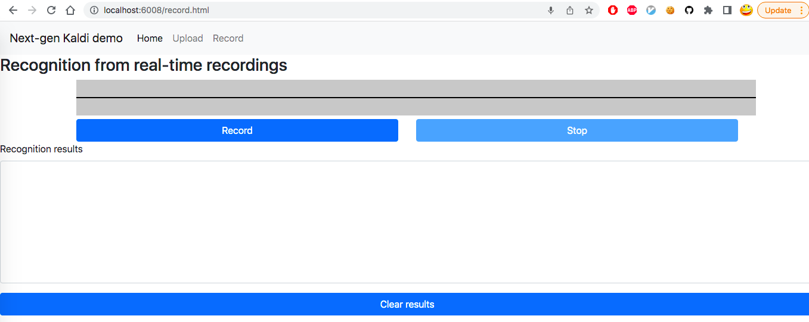

<div align="center">


</div>

[](https://k2-fsa.github.io/sherpa/)

**Documentation**: <https://k2-fsa.github.io/sherpa/>

Try `sherpa` from within your browser without installing anything:
<https://huggingface.co/spaces/k2-fsa/automatic-speech-recognition>

See <https://k2-fsa.github.io/sherpa/huggingface/> for more details.

## Introduction

An ASR server framework in **Python**, supporting both streaming
and non-streaming recognition.

CPU-bound tasks, such as neural network computation, are implemented in
C++; while IO-bound tasks, such as socket communication, are implemented
in Python.

**Caution**: For offline ASR, we assume the model is trained using pruned
stateless RNN-T from [icefall][icefall] and it is from a directory like
`pruned_transducer_statelessX` where `X` >=2. For streaming ASR, we
assume the model is using `pruned_stateless_emformer_rnnt2`.

For the offline ASR, we provide a Colab notebook, containing how to start the
server, how to start the client, and how to decode `test-clean` of LibriSpeech.

[](https://colab.research.google.com/drive/1JX5Ph2onYm1ZjNP_94eGqZ-DIRMLlIca?usp=sharing)

For the streaming ASR, we provide a YouTube demo, showing you how to use it.
See <https://www.youtube.com/watch?v=z7HgaZv5W0U>

## Installation

Please refer to
<https://k2-fsa.github.io/sherpa/python/installation/index.html>
for installation.

## Usage

First, check that `sherpa` has been installed successfully:

```bash
python3 -c "import sherpa; print(sherpa.__version__)"
```

It should print the version of `sherpa`.

Visit
<https://k2-fsa.github.io/sherpa/>
to see more tutorials of `sherpa`.

#### Streaming ASR with pruned stateless Emformer RNN-T

#### Start the server

To start the server, you need to first generate two files:

- (1) The torch script model file. You can use `export.py --jit=1` in
`pruned_stateless_emformer_rnnt2` from [icefall][icefall].

- (2) The BPE model file. You can find it in `data/lang_bpe_XXX/bpe.model`
in [icefall][icefall], where `XXX` is the number of BPE tokens used in
the training.

With the above two files ready, you can start the server with the
following command:

```bash
./sherpa/bin/pruned_stateless_emformer_rnnt2/streaming_server.py \
  --port 6006 \
  --max-batch-size 50 \
  --max-wait-ms 5 \
  --max-active-connections 500 \
  --nn-pool-size 1 \
  --nn-model-filename ./path/to/exp/cpu_jit.pt \
  --bpe-model-filename ./path/to/data/lang_bpe_500/bpe.model
```

You can use `./sherpa/bin/pruned_stateless_emformer_rnnt2/streaming_server.py --help`
to view the help message.

**Hint**: You can use the environment variable `CUDA_VISIBLE_DEVICES` to control
which GPU is used. For instance, to use GPU 3 in the server, just set
`export CUDA_VISIBLE_DEVICES="3"` before starting the server.

**Note**: To keep the server from OOM error, please tune `--max-batch-size`
and `--max-active-connections`.

We provide a pretrained model using the LibriSpeech dataset at
<https://huggingface.co/csukuangfj/icefall-asr-librispeech-pruned-stateless-emformer-rnnt2-2022-06-01>

The following shows how to use the above pretrained model to start the server.

```bash
git lfs install
git clone https://huggingface.co/csukuangfj/icefall-asr-librispeech-pruned-stateless-emformer-rnnt2-2022-06-01

./sherpa/bin/pruned_stateless_emformer_rnnt2/streaming_server.py \
  --port 6006 \
  --max-batch-size 50 \
  --max-wait-ms 5 \
  --nn-pool-size 1 \
  --nn-model-filename ./icefall-asr-librispeech-pruned-stateless-emformer-rnnt2-2022-06-01/exp/cpu_jit-epoch-39-avg-6-use-averaged-model-1.pt \
  --bpe-model-filename ./icefall-asr-librispeech-pruned-stateless-emformer-rnnt2-2022-06-01/data/lang_bpe_500/bpe.model
```
Here, before running the web client, you need to map your server ports to your local ports in the server terminal firstly with the following command:
```
ssh -R 6006:localhost:6006 -R 6008:localhost:6008 your_local_username@your_local_ip
```
**Note**:
(1) You only need to do this if the asr server is running on a machine different from the client.
(2) The command is run in the terminal on the server machine.
#### Start the client

We provide two clients at present:

 - (1) [./sherpa/bin/pruned_stateless_emformer_rnnt2/streaming_client.py](./sherpa/bin/pruned_stateless_emformer_rnnt2/streaming_client.py)
   It shows how to decode a single sound file.

 - (2) [./sherpa/bin/pruned_stateless_emformer_rnnt2/web](./sherpa/bin/pruned_stateless_emformer_rnnt2/web)
   You can record your speech in real-time within a browser and send it to the server for recognition.

##### streaming_client.py

```bash
./sherpa/bin/pruned_stateless_emformer_rnnt2/streaming_client.py --help

./sherpa/bin/pruned_stateless_emformer_rnnt2/streaming_client.py \
  --server-addr localhost \
  --server-port 6006 \
  ./icefall-asr-librispeech-pruned-stateless-emformer-rnnt2-2022-06-01/test_wavs/1221-135766-0001.wav
```

##### Web client

```bash
cd ./sherpa/bin/web
python3 -m http.server 6008
```

Then open your browser and go to `http://localhost:6008/record.html`. You will
see a UI like the following screenshot.



Click the button `Record`.

Now you can `speak` and you will get recognition results from the
server in real-time.

**Caution**: For the web client, we hard-code the server port to `6006`.
You can change the file [./sherpa/bin/web/record.js](./sherpa/bin/web/record.js)
to replace `6006` in it to whatever port the server is using.

**Caution**: `http://0.0.0.0:6008/record.html` or `http://127.0.0.1:6008/record.html`
won't work. You have to use `localhost`. Otherwise, you won't be able to use
your microphone in your browser since we are not using `https` which requires
a certificate.

### Offline ASR

#### Start the server

To start the server, you need to first generate two files:

- (1) The torch script model file. You can use `export.py --jit=1` in
`pruned_transducer_statelessX` from [icefall][icefall].

- (2) The BPE model file. You can find it in `data/lang_bpe_XXX/bpe.model`
in [icefall][icefall], where `XXX` is the number of BPE tokens used in
the training. If you use a dataset like aishell to train your model where
the modeling unit is Chinese characters, you need to provide a `tokens.txt`
file which can be found in `data/lang_char/tokens.txt` in [icefall][icefall].

With the above two files ready, you can start the server with the
following command:

```bash
# If you provide a bpe.model, e.g., for LibriSpeech,
# you can use the following command:
#
sherpa/bin/pruned_transducer_statelessX/offline_server.py \
  --port 6006 \
  --num-device 1 \
  --max-batch-size 10 \
  --max-wait-ms 5 \
  --max-active-connections 500 \
  --feature-extractor-pool-size 5 \
  --nn-pool-size 1 \
  --nn-model-filename ./path/to/exp/cpu_jit.pt \
  --bpe-model-filename ./path/to/data/lang_bpe_500/bpe.model
```

```bash
# If you provide a tokens.txt, e.g., for aishell,
# you can use the following command:
#
sherpa/bin/pruned_transducer_statelessX/offline_server.py \
  --port 6006 \
  --num-device 1 \
  --max-batch-size 10 \
  --max-wait-ms 5 \
  --max-active-connections 500 \
  --feature-extractor-pool-size 5 \
  --nn-pool-size 1 \
  --nn-model-filename ./path/to/exp/cpu_jit.pt \
  --token-filename ./path/to/data/lang_char/tokens.txt
```

You can use `./sherpa/bin/pruned_transducer_statelessX/offline_server.py --help` to view the help message.

**HINT**: If you don't have GPU, please set `--num-device` to `0`.

**Caution**: To keep the server from out-of-memory error, you can tune
`--max-batch-size` and `--max-active-connections`.

We provide pretrained models for the following two datasets:

- (1) LibriSpeech: <https://huggingface.co/csukuangfj/icefall-asr-librispeech-pruned-transducer-stateless3-2022-05-13>
      It uses a BPE model with vocabulary size 500.

- (2) aishell: <https://huggingface.co/csukuangfj/icefall-aishell-pruned-transducer-stateless3-2022-06-20>
      It uses Chinese characters as models units. The vocabulary size is 4336.

The following shows how to use the above pretrained models to start the server.

- **Use the pretrained model trained with the Librispeech dataset**

```bash
git lfs install
git clone https://huggingface.co/csukuangfj/icefall-asr-librispeech-pruned-transducer-stateless3-2022-05-13

sherpa/bin/pruned_transducer_statelessX/offline_server.py \
  --port 6006 \
  --num-device 1 \
  --max-batch-size 10 \
  --max-wait-ms 5 \
  --max-active-connections 500 \
  --feature-extractor-pool-size 5 \
  --nn-pool-size 1 \
  --nn-model-filename ./icefall-asr-librispeech-pruned-transducer-stateless3-2022-05-13/exp/cpu_jit.pt \
  --bpe-model-filename ./icefall-asr-librispeech-pruned-transducer-stateless3-2022-05-13/data/lang_bpe_500/bpe.model
```

- **For the pretrained model trained with the aishell dataset**

```bash
git lfs install
git clone https://huggingface.co/csukuangfj/icefall-aishell-pruned-transducer-stateless3-2022-06-20

sherpa/bin/pruned_transducer_statelessX/offline_server.py \
  --port 6006 \
  --num-device 1 \
  --max-batch-size 10 \
  --max-wait-ms 5 \
  --max-active-connections 500 \
  --feature-extractor-pool-size 5 \
  --nn-pool-size 1 \
  --nn-model-filename ./icefall-aishell-pruned-transducer-stateless3-2022-06-20/exp/cpu_jit-epoch-29-avg-5-torch-1.6.0.pt \
  --token-filename ./icefall-aishell-pruned-transducer-stateless3-2022-06-20/data/lang_char/tokens.txt
```

#### Start the client
After starting the server, you can use the following command to start the client:

```bash
./sherpa/bin/pruned_transducer_statelessX/offline_client.py \
    --server-addr localhost \
    --server-port 6006 \
    /path/to/foo.wav \
    /path/to/bar.wav
```

You can use `./sherpa/bin/pruned_transducer_statelessX/offline_client.py --help` to view the usage message.

The following shows how to use the client to send some test waves to the server
for recognition.

```bash
# If you use the pretrained model from the LibriSpeech dataset
sherpa/bin/pruned_transducer_statelessX/offline_client.py \
  --server-addr localhost \
  --server-port 6006 \
  icefall-asr-librispeech-pruned-transducer-stateless3-2022-05-13//test_wavs/1089-134686-0001.wav \
  icefall-asr-librispeech-pruned-transducer-stateless3-2022-05-13//test_wavs/1221-135766-0001.wav \
  icefall-asr-librispeech-pruned-transducer-stateless3-2022-05-13//test_wavs/1221-135766-0002.wav
```

```bash
# If you use the pretrained model from the aishell dataset
sherpa/bin/pruned_transducer_statelessX/offline_client.py \
  --server-addr localhost \
  --server-port 6006 \
  ./icefall-aishell-pruned-transducer-stateless3-2022-06-20/test_wavs/BAC009S0764W0121.wav \
  ./icefall-aishell-pruned-transducer-stateless3-2022-06-20/test_wavs/BAC009S0764W0122.wav \
  ./icefall-aishell-pruned-transducer-stateless3-2022-06-20/test_wavs/BAC009S0764W0123.wav
```

#### RTF test

We provide a demo [./sherpa/bin/pruned_transducer_statelessX/decode_manifest.py](./sherpa/bin/pruned_transducer_statelessX/decode_manifest.py)
to decode the `test-clean` dataset from the LibriSpeech corpus.

It creates 50 connections to the server using websockets and sends audio files
to the server for recognition.

At the end, it will display the RTF and the WER.

To give you an idea of the performance of the pretrained model,
the Colab notebook
[](https://colab.research.google.com/drive/1JX5Ph2onYm1ZjNP_94eGqZ-DIRMLlIca?usp=sharing)
shows the following results:

```
RTF: 0.0094
total_duration: 19452.481 seconds (5.40 hours)
processing time: 183.305 seconds (0.05 hours)
%WER = 2.06

Errors: 112 insertions, 93 deletions, 876 substitutions, over 52576 reference words (51607 correct)
```

If you have a GPU with a larger RAM (e.g., 32 GB), you can get an even **lower** RTF.

[icefall]: https://github.com/k2-fsa/icefall/


### Contributing

Contributions to `sherpa` are very welcomed. There are many possible ways to make contributions
and two of them are:
- To write documentation
- To write code:
  - To follow the code style in the repository
  - To write a new features (support new architectures, new beam search, etc)

### Follow the code style

We use the following tools to make the code style to be as consistent as possible:

  - [black](https://github.com/psf/black), to format the code
  - [flake8](https://github.com/PyCQA/flake8), to check the style and quality of the code
  - [isort](https://github.com/PyCQA/isort), to sort ``imports``

After running the following commands:

    $ git clone https://github.com/k2-fsa/sherpa
    $ cd sherpa
    $ pip install pre-commit
    $ pre-commit install

it will run the checks whenever you run ``git commit`` **automatically**
