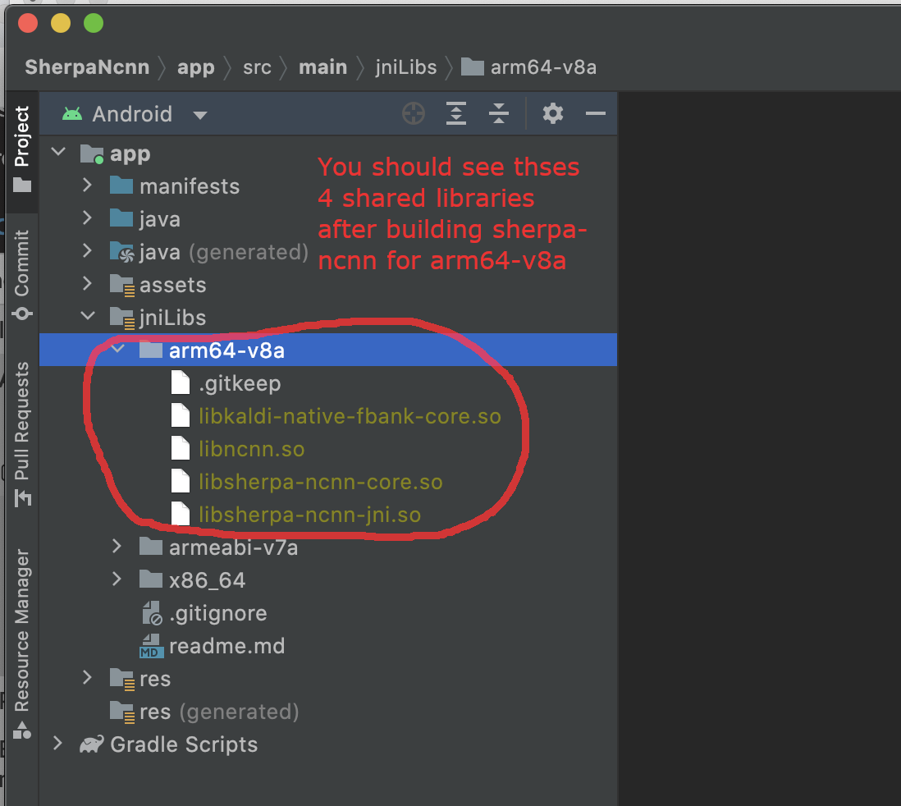
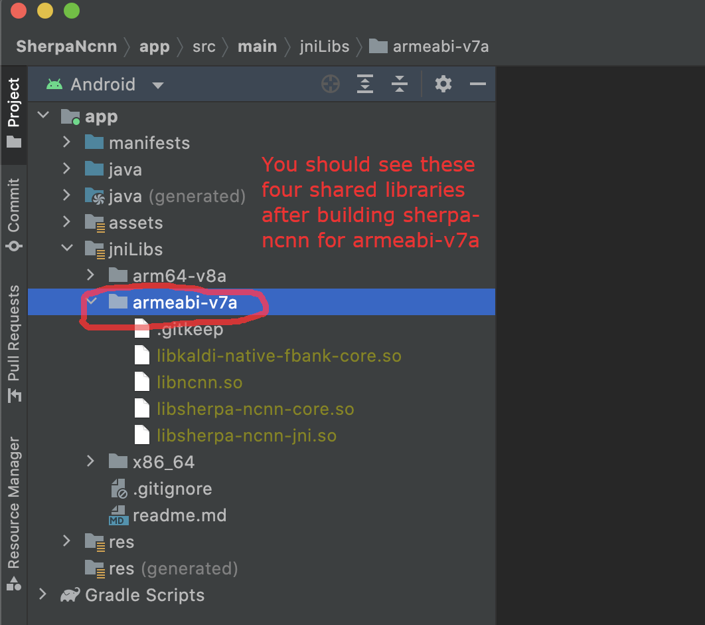
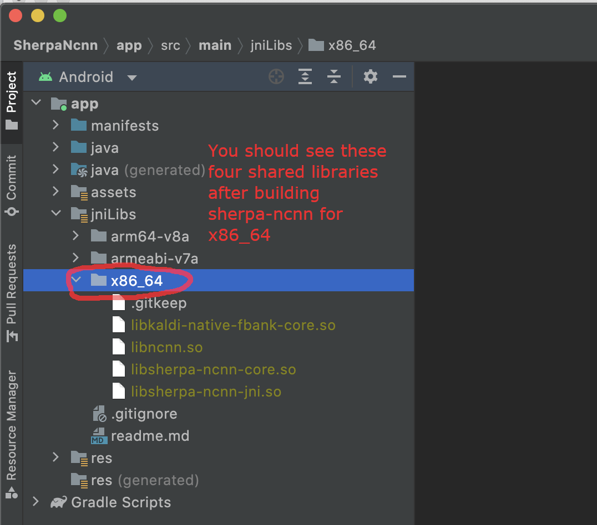
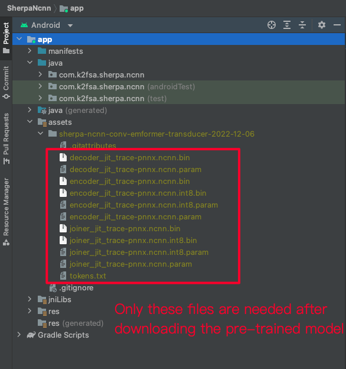
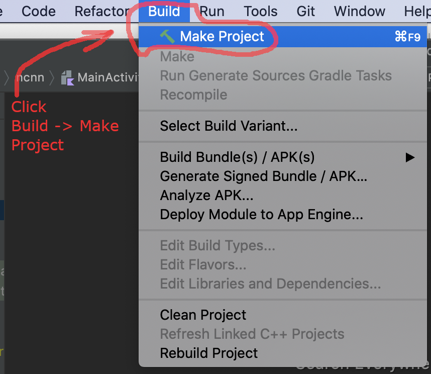
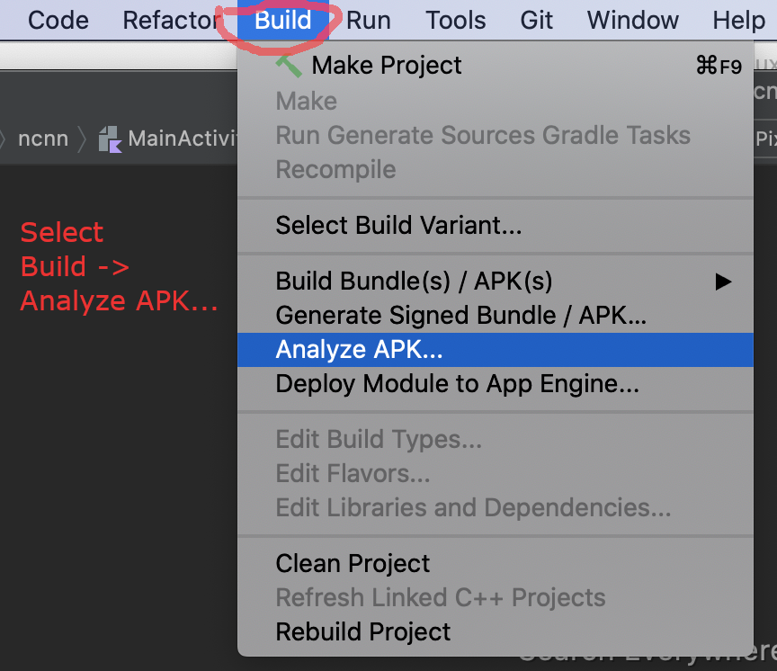
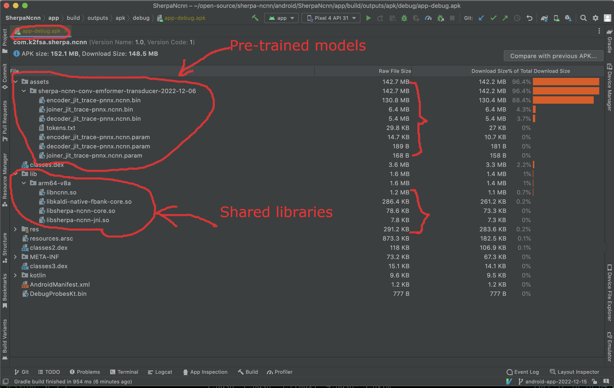

.. _sherpa-ncnn-install-android-studio:

Build sherpa-ncnn for Android
=============================

Install Android Studio
----------------------

The first step is to download and install Android Studio.

Please refer to `<https://developer.android.com/studio>`_ for how to install
Android Studio.

.. hint::

  Any recent version of Android Studio should work fine. Also, you can use
  the default settings of Android Studio during installation.

  For reference, we post the version we are using below:

  .. image:: ./pic/android-studio-version.png
     :alt: screenshot of my version of Android Studio
     :width: 600

Download sherpa-ncnn
--------------------

Next, download the source code of `sherpa-ncnn`_:

.. code-block:: bash

  git clone https://github.com/k2-fsa/sherpa-ncnn

Install NDK
-----------

Step 1, start Android Studio.

  .. figure:: ./pic/start-android-studio.png
     :alt: Start Android Studio
     :width: 600

     Step 1: Click ``Open`` to select ``sherpa-ncnn/android/SherpaNcnn``

Step 2, Open ``sherpa-ncnn/android/SherpaNcnn``.

  .. figure:: ./pic/open-sherpa-ncnn.png
     :alt: Open SherpaNCNN
     :width: 600

     Step 2: Open ``SherpaNcnn``.

Step 3, Select ``Tools -> SDK Manager``.

  .. figure:: ./pic/select-sdk-manager.png
     :alt: Select Tools -> SDK Manager
     :width: 600

     Step 3: Select ``Tools -> SDK Manager``.

Step 4, ``Install NDK``.

  .. figure:: ./pic/ndk-tools.png
     :alt: Install NDK
     :width: 600

     Step 4: Install NDK.

In the following, we assume ``Android SDK location`` was set to
``/Users/fangjun/software/my-android``. You can change it accordingly below.

After installing NDK, you can find it in

.. code-block::

  /Users/fangjun/software/my-android/ndk/22.1.7171670

.. warning::

    If you selected a different version of NDK, please replace ``22.1.7171670``
    accordingly.

Next, let us set the environment variable ``ANDROID_NDK`` for later use.

.. code-block:: bash

    export ANDROID_NDK=/Users/fangjun/software/my-android/ndk/22.1.7171670

.. note::

  Note from https://github.com/Tencent/ncnn/wiki/how-to-build#build-for-android

  (Important) remove the hardcoded debug flag in Android NDK to fix
  the android-ndk issue: https://github.com/android/ndk/issues/243

  1. open ``$ANDROID_NDK/build/cmake/android.toolchain.cmake`` for ndk < r23
  or ``$ANDROID_NDK/build/cmake/android-legacy.toolchain.cmake`` for ndk >= r23

  2. delete the line containing "-g"

    .. code-block::

      list(APPEND ANDROID_COMPILER_FLAGS
      -g
      -DANDROID

.. caution::

  If you don't delete the line containin ``-g`` above, the generated
  library ``libncnn.so`` can be as large as ``21 MB`` or even larger!

Build sherpa-ncnn (C++ code)
----------------------------

After installing ``NDK``, it is time to build the C++ code of `sherpa-ncnn`_.

In the following, we show how to build `sherpa-ncnn`_ for the following
Android ABIs:

  - ``arm64-v8a``
  - ``armeabi-v7a``
  - ``x86_64``

.. caution::

  You only need to select one and only one ABI. ``arm64-v8a`` is probably the
  most common one.

  If you want to test the app on an emulator, you probably need ``x86_64``.

.. hint::

   Building scripts for this section are for macOS and Linux. If you are
   using Windows or if you don't want to build the shared libraries by yourself,
   you can download pre-compiled shared libraries for this section by visiting

    `<https://github.com/k2-fsa/sherpa-ncnn/releases>`_

Build for arm64-v8a
^^^^^^^^^^^^^^^^^^^

.. code-block:: bash

  cd sherpa-ncnn # Go to the root repo
  ./build-android-arm64-v8a.sh

After building, you will find the following shared libraries:

.. code-block:: bash

  $ ls -lh build-android-arm64-v8a/install/lib/lib*.so
  -rwxr-xr-x  1 fangjun  staff   848K Dec 18 16:49 build-android-arm64-v8a/install/lib/libkaldi-native-fbank-core.so
  -rwxr-xr-x  1 fangjun  staff   3.4M Dec 18 16:49 build-android-arm64-v8a/install/lib/libncnn.so
  -rwxr-xr-x  1 fangjun  staff   195K Dec 18 16:49 build-android-arm64-v8a/install/lib/libsherpa-ncnn-core.so
  -rwxr-xr-x  1 fangjun  staff    19K Dec 18 16:49 build-android-arm64-v8a/install/lib/libsherpa-ncnn-jni.so

Please copy them to ``android/SherpaNcnn/app/src/main/jniLibs/arm64-v8a/``:

.. code-block:: bash

  $ cp build-android-arm64-v8a/install/lib/lib*.so  android/SherpaNcnn/app/src/main/jniLibs/arm64-v8a/

You should see the following screen shot after running the above copy ``cp`` command.

.. note::

  If you have ``Android >= 7.0`` and want to run `sherpa-ncnn`_ on GPU, please replace
  ``./build-android-arm64-v8a.sh`` with ``./build-android-arm64-v8a-with-vulkan.sh``
  and replace ``build-android-arm64-v8a/install/lib/lib*.so`` with
  ``./build-android-arm64-v8a-with-vulkan/install/lib/lib*.so``. That is all
  you need to do and you don't need to change any code.

  Also, you need to install Vulkan sdk. Please see
  `<https://github.com/k2-fsa/sherpa-ncnn/blob/master/install-vulkan-macos.md>`_
  for details.

Build for armeabi-v7a
^^^^^^^^^^^^^^^^^^^^^

.. code-block:: bash

  cd sherpa-ncnn # Go to the root repo
  ./build-android-armv7-eabi.sh

After building, you will find the following shared libraries:

.. code-block:: bash

  $ ls -lh build-android-armv7-eabi/install/lib/lib*.so
  -rwxr-xr-x  1 fangjun  staff   513K Dec 18 17:04 build-android-armv7-eabi/install/lib/libkaldi-native-fbank-core.so
  -rwxr-xr-x  1 fangjun  staff   1.9M Dec 18 17:04 build-android-armv7-eabi/install/lib/libncnn.so
  -rwxr-xr-x  1 fangjun  staff   163K Dec 18 17:04 build-android-armv7-eabi/install/lib/libsherpa-ncnn-core.so
  -rwxr-xr-x  1 fangjun  staff    28K Dec 18 17:04 build-android-armv7-eabi/install/lib/libsherpa-ncnn-jni.so

Please copy them to ``android/SherpaNcnn/app/src/main/jniLibs/armeabi-v7a/``:

.. code-block:: bash

  cp build-android-armv7-eabi/install/lib/lib*.so android/SherpaNcnn/app/src/main/jniLibs/armeabi-v7a/

You should see the following screen shot after running the above copy ``cp`` command.

Build for x86_64
^^^^^^^^^^^^^^^^

.. code-block:: bash

  cd sherpa-ncnn # Go to the root repo
  ./build-android-x86-64.sh

After building, you will find the following shared libraries:

.. code-block:: bash

  $ ls -lh build-android-x86-64/install/lib/lib*.so
  -rwxr-xr-x  1 fangjun  staff   901K Dec 18 17:14 build-android-x86-64/install/lib/libkaldi-native-fbank-core.so
  -rwxr-xr-x  1 fangjun  staff   6.9M Dec 18 17:14 build-android-x86-64/install/lib/libncnn.so
  -rwxr-xr-x  1 fangjun  staff   208K Dec 18 17:14 build-android-x86-64/install/lib/libsherpa-ncnn-core.so
  -rwxr-xr-x  1 fangjun  staff    19K Dec 18 17:14 build-android-x86-64/install/lib/libsherpa-ncnn-jni.so

Please copy them to ``android/SherpaNcnn/app/src/main/jniLibs/x86_64/``:

.. code-block:: bash

  cp build-android-x86-64/install/lib/lib*.so android/SherpaNcnn/app/src/main/jniLibs/x86_64/

You should see the following screen shot after running the above copy ``cp`` command.

Download pre-trained models
---------------------------

Please read :ref:`sherpa-ncnn-pre-trained-models` for all available pre-trained
models.

In the following, we use a pre-trained model from
`<https://huggingface.co/csukuangfj/sherpa-ncnn-conv-emformer-transducer-2022-12-06>`_,
which supports both Chinese and English.

.. hint::

  The model is trained using `icefall`_ and the original torchscript model
  is from `<https://huggingface.co/ptrnull/icefall-asr-conv-emformer-transducer-stateless2-zh>`_.

Use the following command to download the pre-trained model and place it into
``android/SherpaNcnn/app/src/main/assets/``:

.. code-block:: bash

  cd android/SherpaNcnn/app/src/main/assets/

  sudo apt-get install git-lfs

  GIT_LFS_SKIP_SMUDGE=1 git clone https://huggingface.co/csukuangfj/sherpa-ncnn-conv-emformer-transducer-2022-12-06
  cd sherpa-ncnn-conv-emformer-transducer-2022-12-06
  git lfs pull --include "*.bin"

  # Now, remove extra files to reduce the file size of the generated apk
  rm -rf .git test_wavs scripts/
  rm export-for-ncnn.sh *.png README.md

In the end, you should have the following files:

.. code-block:: bash

  $ ls -lh
  total 525224
  -rw-r--r--  1 fangjun  staff   5.9M Dec 18 17:40 decoder_jit_trace-pnnx.ncnn.bin
  -rw-r--r--  1 fangjun  staff   439B Dec 18 17:39 decoder_jit_trace-pnnx.ncnn.param
  -rw-r--r--  1 fangjun  staff   141M Dec 18 17:40 encoder_jit_trace-pnnx.ncnn.bin
  -rw-r--r--  1 fangjun  staff    99M Dec 18 17:40 encoder_jit_trace-pnnx.ncnn.int8.bin
  -rw-r--r--  1 fangjun  staff    78K Dec 18 17:40 encoder_jit_trace-pnnx.ncnn.int8.param
  -rw-r--r--  1 fangjun  staff    79K Dec 18 17:39 encoder_jit_trace-pnnx.ncnn.param
  -rw-r--r--  1 fangjun  staff   6.9M Dec 18 17:40 joiner_jit_trace-pnnx.ncnn.bin
  -rw-r--r--  1 fangjun  staff   3.5M Dec 18 17:40 joiner_jit_trace-pnnx.ncnn.int8.bin
  -rw-r--r--  1 fangjun  staff   498B Dec 18 17:40 joiner_jit_trace-pnnx.ncnn.int8.param
  -rw-r--r--  1 fangjun  staff   490B Dec 18 17:39 joiner_jit_trace-pnnx.ncnn.param
  -rw-r--r--  1 fangjun  staff    53K Dec 18 17:39 tokens.txt

  $ du -h -d1 .
  256M    .

You should see the following screen shot after downloading the pre-trained model:

.. hint::

  If you select a different pre-trained model, make sure that you also change the
  corresponding code listed in the following screen shot:

  .. figure:: ./pic/type-for-pre-trained-model-2022-12-06.png
     :alt: Change code if you select a different model
     :width: 600

Generate APK
------------

Finally, it is time to build `sherpa-ncnn`_ to generate an APK package.

Select ``Build -> Make Project``, as shown in the following screen shot.

You can find the generated APK in ``android/SherpaNcnn/app/build/outputs/apk/debug/app-debug.apk``:

.. code-block:: bash

  $ ls -lh android/SherpaNcnn/app/build/outputs/apk/debug/app-debug.apk
  -rw-r--r--  1 fangjun  staff   152M Dec 18 17:53 android/SherpaNcnn/app/build/outputs/apk/debug/app-debug.apk

Congratulations! You have successfully built an APK for Android.

Read below to learn more.

.. _sherpa-ncnn-analyze-apk-result:

Analyze the APK
---------------

Select ``Build -> Analyze APK ...`` in the above screen shot, in the
popped-up dialog select the generated APK ``app-debug.apk``,
and you will see the following screen shot:

You can see from the above screen shot that most part of the APK
is occupied by the pre-trained model, while the runtime, including the shared
libraries, is only ``1.7 MB``.

.. hint::

  We have pre-built APKs that can be downloaded from
  `<https://huggingface.co/csukuangfj/sherpa-ncnn-apk>`_

  Please refer to demo videos about using the above
  APKs: :ref:`sherpa-ncnn-android-video-demos`.
