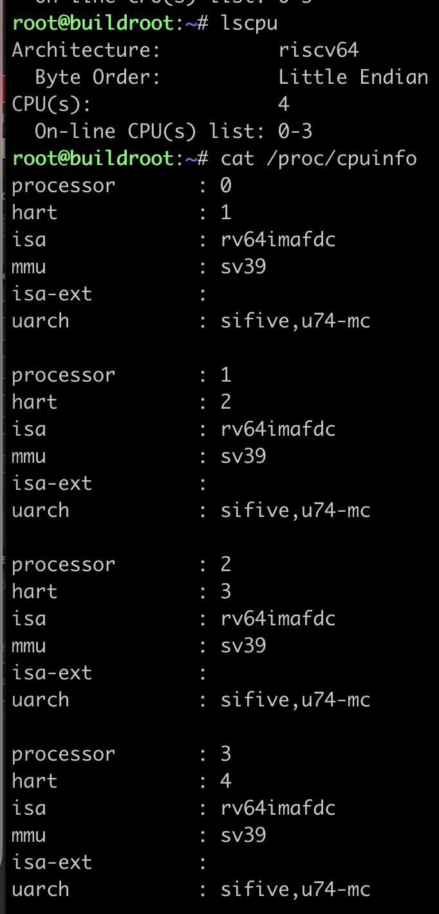
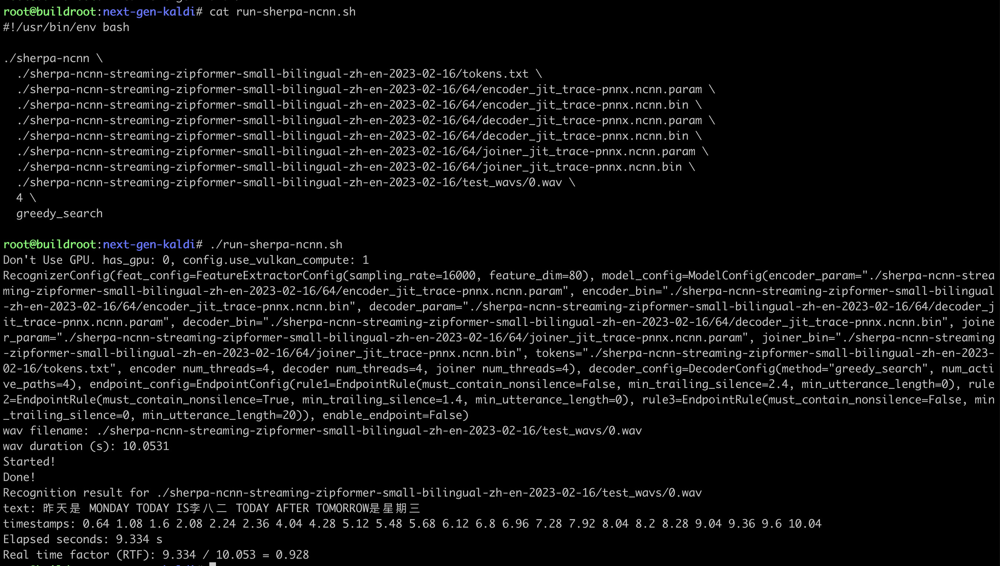
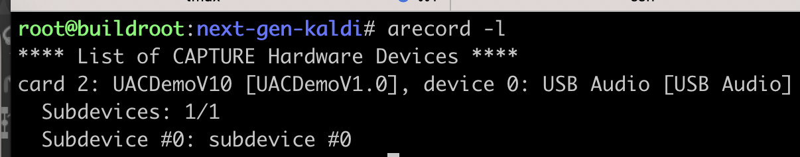
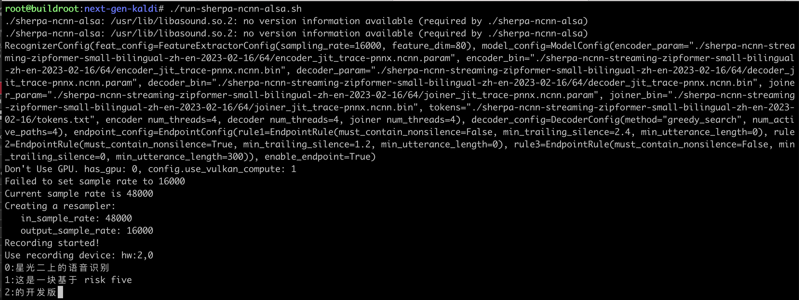

VisionFive 2
============

This page describes how to run `sherpa-ncnn`_ on `VisionFive2`_, which is a
64-bit RISC-V board with 4 CPUs.

.. hint::

   You can find pre-compiled binaries used in this example at

    `<https://huggingface.co/csukuangfj/sherpa-ncnn-pre-compiled-binaries/tree/main/riscv64>`_

.. caution::

   The latest debian image from `<https://doc-en.rvspace.org/VisionFive2/Quick_Start_Guide/VisionFive2_QSG/flashing_with_mac_linux.html>`_ does not work since it does not support USB devices.

   That is, you cannot use USB microphones on the board with the above debian image.

.. note::

   We have compiled `<https://github.com/starfive-tech/VisionFive2>`_ and
   the resulting ``sdcard.img`` is available at `<https://huggingface.co/csukuangfj/visionfive2-sd-card-img>`_.

   Please use this image for testing. It supports USB microphones.

   The username for this image is ``root`` and the password is ``starfive``.

Board info
----------

RTF (4 threads)
---------------

We use :ref:`sherpa_ncnn_streaming_zipformer_small_bilingual_zh_en_2023_02_16`
for testing. The RTF is given below:

You can see that the RTF is less than 1, which means it is able to
perform streaming (i.e., real-time) speech recognition.

The following posts the commands used for testing so that you can
copy and paste them if you want to test it by yourself.

.. code-block:: bash

  ./sherpa-ncnn \
    ./sherpa-ncnn-streaming-zipformer-small-bilingual-zh-en-2023-02-16/tokens.txt \
    ./sherpa-ncnn-streaming-zipformer-small-bilingual-zh-en-2023-02-16/64/encoder_jit_trace-pnnx.ncnn.param \
    ./sherpa-ncnn-streaming-zipformer-small-bilingual-zh-en-2023-02-16/64/encoder_jit_trace-pnnx.ncnn.bin \
    ./sherpa-ncnn-streaming-zipformer-small-bilingual-zh-en-2023-02-16/64/decoder_jit_trace-pnnx.ncnn.param \
    ./sherpa-ncnn-streaming-zipformer-small-bilingual-zh-en-2023-02-16/64/decoder_jit_trace-pnnx.ncnn.bin \
    ./sherpa-ncnn-streaming-zipformer-small-bilingual-zh-en-2023-02-16/64/joiner_jit_trace-pnnx.ncnn.param \
    ./sherpa-ncnn-streaming-zipformer-small-bilingual-zh-en-2023-02-16/64/joiner_jit_trace-pnnx.ncnn.bin \
    ./sherpa-ncnn-streaming-zipformer-small-bilingual-zh-en-2023-02-16/test_wavs/0.wav \
    4 \
    greedy_search

Real-time speech recognition with a microphone
----------------------------------------------

Since the board does not have microphones, we use a USB microphone for testing.

.. caution::

   We use the image from `<https://huggingface.co/csukuangfj/visionfive2-sd-card-img/tree/main>`_,
   which provides support for USB microphones.

After connecting a USB microphone to the board, use the following command to check it:

The output shows ``Card 2`` and ``device 0``, so the device name is ``hw:2,0``.

The command to start the program for real-time speech recognition is

.. code-block:: bash

  ./sherpa-ncnn-alsa \
    ./sherpa-ncnn-streaming-zipformer-small-bilingual-zh-en-2023-02-16/tokens.txt \
    ./sherpa-ncnn-streaming-zipformer-small-bilingual-zh-en-2023-02-16/64/encoder_jit_trace-pnnx.ncnn.param \
    ./sherpa-ncnn-streaming-zipformer-small-bilingual-zh-en-2023-02-16/64/encoder_jit_trace-pnnx.ncnn.bin \
    ./sherpa-ncnn-streaming-zipformer-small-bilingual-zh-en-2023-02-16/64/decoder_jit_trace-pnnx.ncnn.param \
    ./sherpa-ncnn-streaming-zipformer-small-bilingual-zh-en-2023-02-16/64/decoder_jit_trace-pnnx.ncnn.bin \
    ./sherpa-ncnn-streaming-zipformer-small-bilingual-zh-en-2023-02-16/64/joiner_jit_trace-pnnx.ncnn.param \
    ./sherpa-ncnn-streaming-zipformer-small-bilingual-zh-en-2023-02-16/64/joiner_jit_trace-pnnx.ncnn.bin \
    hw:2,0 \
    4 \
    greedy_search

A screenshot is given below:

