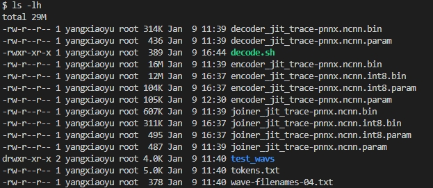
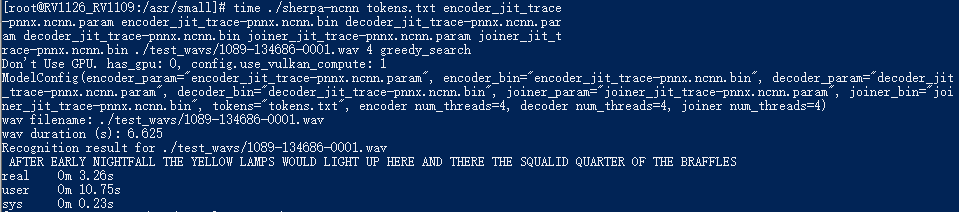
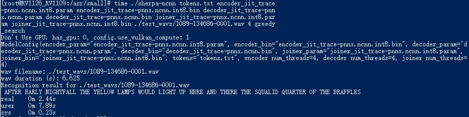

Conv-Emformer-transducer-based Models
=====================================

marcoyang/sherpa-ncnn-conv-emformer-transducer-small-2023-01-09 (English)
-------------------------------------------------------------------------

This model is a small version of `conv-emformer-transducer <https://github.com/k2-fsa/icefall/tree/master/egs/librispeech/ASR/conv_emformer_transducer_stateless2>`_
trained in `icefall`_.

It only has ``8.8 million parameters`` and can be deployed on ``embedded devices``
for real-time speech recognition. You can find the models in ``fp16`` and ``int8`` format
at `<https://huggingface.co/marcoyang/sherpa-ncnn-conv-emformer-transducer-small-2023-01-09>`_.

This model is trained using `LibriSpeech`_ and thus it supports only English.

In the following, we show you how to download it and
deploy it with `sherpa-ncnn`_ on an embedded device, whose CPU is
`RV1126 <https://www.rock-chips.com/a/en/products/RV11_Series/2020/0427/1076.html>`_
(Quad core ARM Cortex-A7)

Please use the following commands to download it.

.. code-block:: bash

   cd /path/to/sherpa-ncnn

   GIT_LFS_SKIP_SMUDGE=1 git clone https://huggingface.co/marcoyang/sherpa-ncnn-conv-emformer-transducer-small-2023-01-09

   cd sherpa-ncnn-conv-emformer-transducer-small-2023-01-09
   git lfs pull --include "*.bin"

Please check that the file size of the pre-trained models is correct (see the
screen shot below):

.. note::

  Please refer to :ref:`sherpa-ncnn-embedded-linux-arm-install` for how to
  compile `sherpa-ncnn`_ for a 32-bit ARM platform. In the following, we
  test the pre-trained model on an embedded device, whose CPU is
  `RV1126 <https://www.rock-chips.com/a/en/products/RV11_Series/2020/0427/1076.html>`_
  (Quad core ARM Cortex-A7).

Decode a single wave file with ./build/bin/sherpa-ncnn
::::::::::::::::::::::::::::::::::::::::::::::::::::::

.. hint::

   It supports decoding only wave files with a single channel and the sampling rate
   should be 16 kHz.

.. code-block:: bash

  cd /path/to/sherpa-ncnn

  ./build/bin/sherpa-ncnn \
    ./sherpa-ncnn-conv-emformer-transducer-small-2023-01-09/tokens.txt \
    ./sherpa-ncnn-conv-emformer-transducer-small-2023-01-09/encoder_jit_trace-pnnx.ncnn.param \
    ./sherpa-ncnn-conv-emformer-transducer-small-2023-01-09/encoder_jit_trace-pnnx.ncnn.bin \
    ./sherpa-ncnn-conv-emformer-transducer-small-2023-01-09/decoder_jit_trace-pnnx.ncnn.param \
    ./sherpa-ncnn-conv-emformer-transducer-small-2023-01-09/decoder_jit_trace-pnnx.ncnn.bin \
    ./sherpa-ncnn-conv-emformer-transducer-small-2023-01-09/joiner_jit_trace-pnnx.ncnn.param \
    ./sherpa-ncnn-conv-emformer-transducer-small-2023-01-09/joiner_jit_trace-pnnx.ncnn.bin \
    ./sherpa-ncnn-conv-emformer-transducer-small-2023-01-09/test_wavs/1089-134686-0001.wav \

The outputs are shown below. The CPU used for decoding is RV1126 (Quad core ARM Cortex-A7).

.. note::

   The default option uses 4 threads and ``greedy_search`` for decoding.

.. note::

   Please use ``./build/bin/Release/sherpa-ncnn.exe`` for Windows.

.. caution::

   If you use Windows and get encoding issues, please run:

      .. code-block:: bash

          CHCP 65001

   in your commandline.

Decode a single wave file with ./build/bin/sherpa-ncnn (with int8 quantization)
:::::::::::::::::::::::::::::::::::::::::::::::::::::::::::::::::::::::::::::::

.. note::

   We also support int8 quantization to compresss the model and speed up inference.
   Currently, only encoder and joiner are quantized.

To decode the int8-quantized model, use the following command:

.. code-block:: bash

  cd /path/to/sherpa-ncnn

  ./build/bin/sherpa-ncnn \
    ./sherpa-ncnn-conv-emformer-transducer-small-2023-01-09/tokens.txt \
    ./sherpa-ncnn-conv-emformer-transducer-small-2023-01-09/encoder_jit_trace-pnnx.ncnn.int8.param \
    ./sherpa-ncnn-conv-emformer-transducer-small-2023-01-09/encoder_jit_trace-pnnx.ncnn.int8.bin \
    ./sherpa-ncnn-conv-emformer-transducer-small-2023-01-09/decoder_jit_trace-pnnx.ncnn.param \
    ./sherpa-ncnn-conv-emformer-transducer-small-2023-01-09/decoder_jit_trace-pnnx.ncnn.bin \
    ./sherpa-ncnn-conv-emformer-transducer-small-2023-01-09/joiner_jit_trace-pnnx.ncnn.int8.param \
    ./sherpa-ncnn-conv-emformer-transducer-small-2023-01-09/joiner_jit_trace-pnnx.ncnn.int8.bin \
    ./sherpa-ncnn-conv-emformer-transducer-small-2023-01-09/test_wavs/1089-134686-0001.wav \

The outputs are shown below. The CPU used for decoding is RV1126 (Quad core ARM Cortex-A7).

Compared to the original model in ``fp16`` format,
the decoding speed is significantly improved. The decoding time is changed from
``3.26 s`` to ``2.44 s``.

.. note::

  When the model's weights are quantized to ``float16``, it is converted
  to ``float32`` during computation.

  When the model's weights are quantized to ``int8``, it is using ``int8``
  during computation.

.. hint::

  Even if we use only 1 thread for the ``int8`` model, the resulting real
  time factor (RTF) is still less than ``1``.

.. _sherpa-ncnn-mixed-english-chinese-conv-emformer-model:

csukuangfj/sherpa-ncnn-conv-emformer-transducer-2022-12-06 (Chinese + English)
------------------------------------------------------------------------------

This model is converted from `<https://huggingface.co/ptrnull/icefall-asr-conv-emformer-transducer-stateless2-zh>`_,
which supports both Chinese and English.

.. hint::

  If you want to train your own model that is able to support both Chinese and
  English, please refer to our training code:

    `<https://github.com/k2-fsa/icefall/tree/master/egs/tal_csasr/ASR>`_

  You can also try the pre-trained models in your browser without installing anything
  by visiting:

    `<https://huggingface.co/spaces/k2-fsa/automatic-speech-recognition>`_

In the following, we describe how to download and use it with `sherpa-ncnn`_.

Please use the following commands to download it.

.. code-block:: bash

  cd /path/to/sherpa-ncnn

  GIT_LFS_SKIP_SMUDGE=1 git clone https://huggingface.co/csukuangfj/sherpa-ncnn-conv-emformer-transducer-2022-12-06
  cd sherpa-ncnn-conv-emformer-transducer-2022-12-06
  git lfs pull --include "*.bin"

Please check that the file size of the pre-trained models is correct (see the
screen shot below):

.. figure:: ./pic/2022-12-06-filesize.png
   :alt: File size for sherpa-ncnn-2022-12-06
   :width: 800

Decode a single wave file with ./build/bin/sherpa-ncnn
::::::::::::::::::::::::::::::::::::::::::::::::::::::

.. hint::

   It supports decoding only wave files with a single channel and the sampling rate
   should be 16 kHz.

.. code-block:: bash

  cd /path/to/sherpa-ncnn

  ./build/bin/sherpa-ncnn \
    ./sherpa-ncnn-conv-emformer-transducer-2022-12-06/tokens.txt \
    ./sherpa-ncnn-conv-emformer-transducer-2022-12-06/encoder_jit_trace-pnnx.ncnn.param \
    ./sherpa-ncnn-conv-emformer-transducer-2022-12-06/encoder_jit_trace-pnnx.ncnn.bin \
    ./sherpa-ncnn-conv-emformer-transducer-2022-12-06/decoder_jit_trace-pnnx.ncnn.param \
    ./sherpa-ncnn-conv-emformer-transducer-2022-12-06/decoder_jit_trace-pnnx.ncnn.bin \
    ./sherpa-ncnn-conv-emformer-transducer-2022-12-06/joiner_jit_trace-pnnx.ncnn.param \
    ./sherpa-ncnn-conv-emformer-transducer-2022-12-06/joiner_jit_trace-pnnx.ncnn.bin \
    ./sherpa-ncnn-conv-emformer-transducer-2022-12-06/test_wavs/0.wav \

.. note::

   Please use ``./build/bin/Release/sherpa-ncnn.exe`` for Windows.

.. caution::

   If you use Windows and get encoding issues, please run:

      .. code-block:: bash

          CHCP 65001

   in your commandline.

Real-time speech recognition from a microphone with build/bin/sherpa-ncnn-microphone
::::::::::::::::::::::::::::::::::::::::::::::::::::::::::::::::::::::::::::::::::::

.. code-block:: bash

  cd /path/to/sherpa-ncnn
  ./build/bin/sherpa-ncnn-microphone \
    ./sherpa-ncnn-conv-emformer-transducer-2022-12-06/tokens.txt \
    ./sherpa-ncnn-conv-emformer-transducer-2022-12-06/encoder_jit_trace-pnnx.ncnn.param \
    ./sherpa-ncnn-conv-emformer-transducer-2022-12-06/encoder_jit_trace-pnnx.ncnn.bin \
    ./sherpa-ncnn-conv-emformer-transducer-2022-12-06/decoder_jit_trace-pnnx.ncnn.param \
    ./sherpa-ncnn-conv-emformer-transducer-2022-12-06/decoder_jit_trace-pnnx.ncnn.bin \
    ./sherpa-ncnn-conv-emformer-transducer-2022-12-06/joiner_jit_trace-pnnx.ncnn.param \
    ./sherpa-ncnn-conv-emformer-transducer-2022-12-06/joiner_jit_trace-pnnx.ncnn.bin

.. note::

   Please use ``./build/bin/Release/sherpa-ncnn-microphone.exe`` for Windows.

It will print something like below:

.. code-block::

  Number of threads: 4
  num devices: 4
  Use default device: 2
    Name: MacBook Pro Microphone
    Max input channels: 1
  Started

Speak and it will show you the recognition result in real-time.

.. caution::

   If you use Windows and get encoding issues, please run:

      .. code-block:: bash

          CHCP 65001

   in your commandline.

csukuangfj/sherpa-ncnn-conv-emformer-transducer-2022-12-08 (Chinese)
--------------------------------------------------------------------

.. hint::

  This is a very small model that can be run in real-time on embedded sytems.

This model is trained using `WenetSpeech`_ dataset and it supports only Chinese.

In the following, we describe how to download and use it with `sherpa-ncnn`_.

Please use the following commands to download it.

.. code-block:: bash

  cd /path/to/sherpa-ncnn

  GIT_LFS_SKIP_SMUDGE=1 git clone https://huggingface.co/csukuangfj/sherpa-ncnn-conv-emformer-transducer-2022-12-08
  cd sherpa-ncnn-conv-emformer-transducer-2022-12-08
  cd v2
  git lfs pull --include "*.bin"

Please check that the file size of the pre-trained models is correct (see the
screen shot below):

.. figure:: ./pic/2022-12-08-filesize.png
   :alt: File size for sherpa-ncnn-2022-12-08
   :width: 800

Decode a single wave file with ./build/bin/sherpa-ncnn
::::::::::::::::::::::::::::::::::::::::::::::::::::::

.. hint::

   It supports decoding only wave files with a single channel and the sampling rate
   should be 16 kHz.

.. code-block:: bash

  cd /path/to/sherpa-ncnn

  ./build/bin/sherpa-ncnn \
    ./sherpa-ncnn-conv-emformer-transducer-2022-12-08/v2/tokens.txt \
    ./sherpa-ncnn-conv-emformer-transducer-2022-12-08/v2/encoder_jit_trace-pnnx-epoch-15-avg-3.ncnn.param \
    ./sherpa-ncnn-conv-emformer-transducer-2022-12-08/v2/encoder_jit_trace-pnnx-epoch-15-avg-3.ncnn.bin \
    ./sherpa-ncnn-conv-emformer-transducer-2022-12-08/v2/decoder_jit_trace-pnnx-epoch-15-avg-3.ncnn.param \
    ./sherpa-ncnn-conv-emformer-transducer-2022-12-08/v2/decoder_jit_trace-pnnx-epoch-15-avg-3.ncnn.bin \
    ./sherpa-ncnn-conv-emformer-transducer-2022-12-08/v2/joiner_jit_trace-pnnx-epoch-15-avg-3.ncnn.param \
    ./sherpa-ncnn-conv-emformer-transducer-2022-12-08/v2/joiner_jit_trace-pnnx-epoch-15-avg-3.ncnn.bin \
    ./sherpa-ncnn-conv-emformer-transducer-2022-12-08/test_wavs/0.wav

.. note::

   Please use ``./build/bin/Release/sherpa-ncnn.exe`` for Windows.

.. caution::

   If you use Windows and get encoding issues, please run:

      .. code-block:: bash

          CHCP 65001

   in your commandline.

Real-time speech recognition from a microphone with build/bin/sherpa-ncnn-microphone
::::::::::::::::::::::::::::::::::::::::::::::::::::::::::::::::::::::::::::::::::::

.. code-block:: bash

  cd /path/to/sherpa-ncnn
  ./build/bin/sherpa-ncnn-microphone \
    ./sherpa-ncnn-conv-emformer-transducer-2022-12-08/v2/tokens.txt \
    ./sherpa-ncnn-conv-emformer-transducer-2022-12-08/v2/encoder_jit_trace-pnnx-epoch-15-avg-3.ncnn.param \
    ./sherpa-ncnn-conv-emformer-transducer-2022-12-08/v2/encoder_jit_trace-pnnx-epoch-15-avg-3.ncnn.bin \
    ./sherpa-ncnn-conv-emformer-transducer-2022-12-08/v2/decoder_jit_trace-pnnx-epoch-15-avg-3.ncnn.param \
    ./sherpa-ncnn-conv-emformer-transducer-2022-12-08/v2/decoder_jit_trace-pnnx-epoch-15-avg-3.ncnn.bin \
    ./sherpa-ncnn-conv-emformer-transducer-2022-12-08/v2/joiner_jit_trace-pnnx-epoch-15-avg-3.ncnn.param \
    ./sherpa-ncnn-conv-emformer-transducer-2022-12-08/v2/joiner_jit_trace-pnnx-epoch-15-avg-3.ncnn.bin

.. note::

   Please use ``./build/bin/Release/sherpa-ncnn-microphone.exe`` for Windows.

It will print something like below:

.. code-block::

  Number of threads: 4
  num devices: 4
  Use default device: 2
    Name: MacBook Pro Microphone
    Max input channels: 1
  Started

Speak and it will show you the recognition result in real-time.

.. caution::

   If you use Windows and get encoding issues, please run:

      .. code-block:: bash

          CHCP 65001

   in your commandline.

csukuangfj/sherpa-ncnn-conv-emformer-transducer-2022-12-04 (English)
--------------------------------------------------------------------

This model is trained using `GigaSpeech`_ and `LibriSpeech`_. It supports only English.

In the following, we describe how to download and use it with `sherpa-ncnn`_.

Please use the following commands to download it.

.. code-block:: bash

  cd /path/to/sherpa-ncnn

  GIT_LFS_SKIP_SMUDGE=1 git clone https://huggingface.co/csukuangfj/sherpa-ncnn-conv-emformer-transducer-2022-12-04
  cd sherpa-ncnn-conv-emformer-transducer-2022-12-04
  git lfs pull --include "*.bin"

Please check that the file size of the pre-trained models is correct (see the
screen shot below):

.. figure:: ./pic/2022-12-04-filesize.png
   :alt: File size for sherpa-ncnn-2022-12-04
   :width: 800

Decode a single wave file with ./build/bin/sherpa-ncnn
::::::::::::::::::::::::::::::::::::::::::::::::::::::

.. hint::

   It supports decoding only wave files with a single channel and the sampling rate
   should be 16 kHz.

.. code-block:: bash

  cd /path/to/sherpa-ncnn

  ./build/bin/sherpa-ncnn \
    ./sherpa-ncnn-conv-emformer-transducer-2022-12-04/tokens.txt \
    ./sherpa-ncnn-conv-emformer-transducer-2022-12-04/encoder_jit_trace-epoch-30-avg-10-pnnx.ncnn.param \
    ./sherpa-ncnn-conv-emformer-transducer-2022-12-04/encoder_jit_trace-epoch-30-avg-10-pnnx.ncnn.bin \
    ./sherpa-ncnn-conv-emformer-transducer-2022-12-04/decoder_jit_trace-epoch-30-avg-10-pnnx.ncnn.param \
    ./sherpa-ncnn-conv-emformer-transducer-2022-12-04/decoder_jit_trace-epoch-30-avg-10-pnnx.ncnn.bin \
    ./sherpa-ncnn-conv-emformer-transducer-2022-12-04/joiner_jit_trace-epoch-30-avg-10-pnnx.ncnn.bin \
    ./sherpa-ncnn-conv-emformer-transducer-2022-12-04/joiner_jit_trace-epoch-30-avg-10-pnnx.ncnn.param \
    ./sherpa-ncnn-conv-emformer-transducer-2022-12-04/test_wavs/1089-134686-0001.wav

.. note::

   Please use ``./build/bin/Release/sherpa-ncnn.exe`` for Windows.

.. caution::

   If you use Windows and get encoding issues, please run:

      .. code-block:: bash

          CHCP 65001

   in your commandline.

Real-time speech recognition from a microphone with build/bin/sherpa-ncnn-microphone
::::::::::::::::::::::::::::::::::::::::::::::::::::::::::::::::::::::::::::::::::::

.. code-block:: bash

  cd /path/to/sherpa-ncnn
  ./build/bin/sherpa-ncnn-microphone \
    ./sherpa-ncnn-conv-emformer-transducer-2022-12-04/tokens.txt \
    ./sherpa-ncnn-conv-emformer-transducer-2022-12-04/encoder_jit_trace-epoch-30-avg-10-pnnx.ncnn.param \
    ./sherpa-ncnn-conv-emformer-transducer-2022-12-04/encoder_jit_trace-epoch-30-avg-10-pnnx.ncnn.bin \
    ./sherpa-ncnn-conv-emformer-transducer-2022-12-04/decoder_jit_trace-epoch-30-avg-10-pnnx.ncnn.param \
    ./sherpa-ncnn-conv-emformer-transducer-2022-12-04/decoder_jit_trace-epoch-30-avg-10-pnnx.ncnn.bin \
    ./sherpa-ncnn-conv-emformer-transducer-2022-12-04/joiner_jit_trace-epoch-30-avg-10-pnnx.ncnn.bin \
    ./sherpa-ncnn-conv-emformer-transducer-2022-12-04/joiner_jit_trace-epoch-30-avg-10-pnnx.ncnn.param

.. note::

   Please use ``./build/bin/Release/sherpa-ncnn-microphone.exe`` for Windows.

It will print something like below:

.. code-block::

  Number of threads: 4
  num devices: 4
  Use default device: 2
    Name: MacBook Pro Microphone
    Max input channels: 1
  Started

Speak and it will show you the recognition result in real-time.

.. caution::

   If you use Windows and get encoding issues, please run:

      .. code-block:: bash

          CHCP 65001

   in your commandline.
