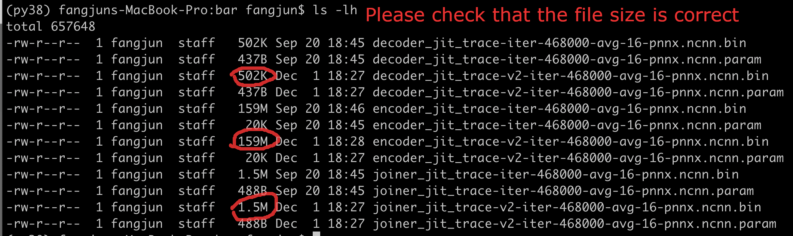
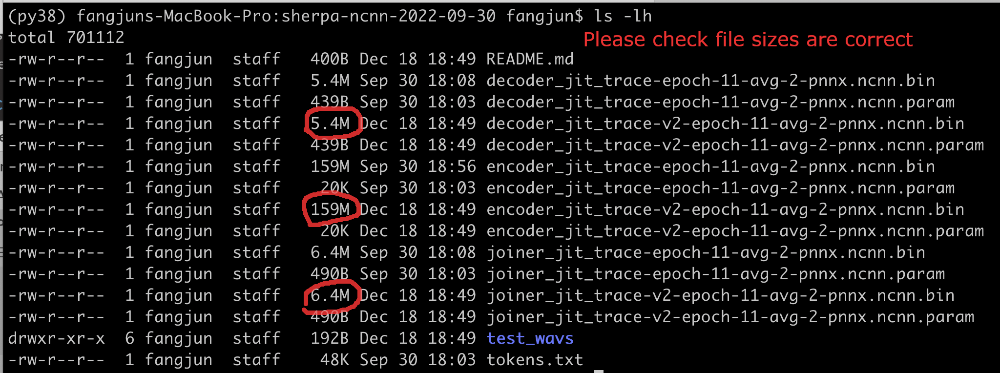

LSTM-transducer-based Models
=============================

csukuangfj/sherpa-ncnn-2022-09-05 (English)
-------------------------------------------

This is a model trained using the `GigaSpeech`_ and the `LibriSpeech`_ dataset.

Please see `<https://github.com/k2-fsa/icefall/pull/558>`_ for how the model
is trained.

In the following, we describe how to download and use it with `sherpa-ncnn`_.

Please use the following commands to download it.

.. code-block:: bash

  cd /path/to/sherpa-ncnn

  GIT_LFS_SKIP_SMUDGE=1 git clone https://huggingface.co/csukuangfj/sherpa-ncnn-2022-09-05
  cd sherpa-ncnn-2022-09-05/bar
  git lfs pull --include "*.bin"

Please check that the file size of the pre-trained models is correct (see the
screen shot below):

Decode a single wave file with ./build/bin/sherpa-ncnn
::::::::::::::::::::::::::::::::::::::::::::::::::::::

.. hint::

   It supports decoding only wave files with a single channel and the sampling rate
   should be 16 kHz.

.. code-block:: bash

  cd /path/to/sherpa-ncnn

  ./build/bin/sherpa-ncnn \
    ./sherpa-ncnn-2022-09-05/tokens.txt \
    ./sherpa-ncnn-2022-09-05/bar/encoder_jit_trace-v2-iter-468000-avg-16-pnnx.ncnn.param \
    ./sherpa-ncnn-2022-09-05/bar/encoder_jit_trace-v2-iter-468000-avg-16-pnnx.ncnn.bin \
    ./sherpa-ncnn-2022-09-05/bar/decoder_jit_trace-v2-iter-468000-avg-16-pnnx.ncnn.param \
    ./sherpa-ncnn-2022-09-05/bar/decoder_jit_trace-v2-iter-468000-avg-16-pnnx.ncnn.bin \
    ./sherpa-ncnn-2022-09-05/bar/joiner_jit_trace-v2-iter-468000-avg-16-pnnx.ncnn.param \
    ./sherpa-ncnn-2022-09-05/bar/joiner_jit_trace-v2-iter-468000-avg-16-pnnx.ncnn.bin \
    ./sherpa-ncnn-2022-09-05/test_wavs/1089-134686-0001.wav

.. note::

   Please use ``./build/bin/Release/sherpa-ncnn.exe`` for Windows.

Real-time speech recognition from a microphone with build/bin/sherpa-ncnn-microphone
::::::::::::::::::::::::::::::::::::::::::::::::::::::::::::::::::::::::::::::::::::

.. code-block:: bash

  cd /path/to/sherpa-ncnn

  ./build/bin/sherpa-ncnn-microphone \
    ./sherpa-ncnn-2022-09-05/tokens.txt \
    ./sherpa-ncnn-2022-09-05/bar/encoder_jit_trace-v2-iter-468000-avg-16-pnnx.ncnn.param \
    ./sherpa-ncnn-2022-09-05/bar/encoder_jit_trace-v2-iter-468000-avg-16-pnnx.ncnn.bin \
    ./sherpa-ncnn-2022-09-05/bar/decoder_jit_trace-v2-iter-468000-avg-16-pnnx.ncnn.param \
    ./sherpa-ncnn-2022-09-05/bar/decoder_jit_trace-v2-iter-468000-avg-16-pnnx.ncnn.bin \
    ./sherpa-ncnn-2022-09-05/bar/joiner_jit_trace-v2-iter-468000-avg-16-pnnx.ncnn.param \
    ./sherpa-ncnn-2022-09-05/bar/joiner_jit_trace-v2-iter-468000-avg-16-pnnx.ncnn.bin

.. note::

   Please use ``./build/bin/Release/sherpa-ncnn-microphone.exe`` for Windows.

It will print something like below:

.. code-block::

  Number of threads: 4
  num devices: 4
  Use default device: 2
    Name: MacBook Pro Microphone
    Max input channels: 1
  Started

Speak and it will show you the recognition result in real-time.

You can find a demo below:

..  youtube:: m6ynSxycpX0
   :width: 120%

csukuangfj/sherpa-ncnn-2022-09-30 (Chinese)
-------------------------------------------

This is a model trained using the `WenetSpeech`_ dataset.

Please see `<https://github.com/k2-fsa/icefall/pull/595>`_ for how the model
is trained.

In the following, we describe how to download and use it with `sherpa-ncnn`_.

Please use the following commands to download it.

.. code-block:: bash

  cd /path/to/sherpa-ncnn

  GIT_LFS_SKIP_SMUDGE=1 git clone https://huggingface.co/csukuangfj/sherpa-ncnn-2022-09-30
  cd sherpa-ncnn-2022-09-30
  git lfs pull --include "*.bin"

Please check that the file size of the pre-trained models is correct (see the
screen shot below):

Decode a single wave file with ./build/bin/sherpa-ncnn
::::::::::::::::::::::::::::::::::::::::::::::::::::::

.. hint::

   It supports decoding only wave files with a single channel and the sampling rate
   should be 16 kHz.

.. code-block:: bash

   cd /path/to/sherpa-ncnn

   ./build/bin/sherpa-ncnn \
    ./sherpa-ncnn-2022-09-30/tokens.txt \
    ./sherpa-ncnn-2022-09-30/encoder_jit_trace-v2-epoch-11-avg-2-pnnx.ncnn.param \
    ./sherpa-ncnn-2022-09-30/encoder_jit_trace-v2-epoch-11-avg-2-pnnx.ncnn.bin \
    ./sherpa-ncnn-2022-09-30/decoder_jit_trace-v2-epoch-11-avg-2-pnnx.ncnn.param \
    ./sherpa-ncnn-2022-09-30/decoder_jit_trace-v2-epoch-11-avg-2-pnnx.ncnn.bin \
    ./sherpa-ncnn-2022-09-30/joiner_jit_trace-v2-epoch-11-avg-2-pnnx.ncnn.param \
    ./sherpa-ncnn-2022-09-30/joiner_jit_trace-v2-epoch-11-avg-2-pnnx.ncnn.bin \
    ./sherpa-ncnn-2022-09-30/test_wavs/0.wav

.. caution::

   If you use Windows and get encoding issues, please run:

      .. code-block:: bash

          CHCP 65001

   in your commandline.

Real-time speech recognition from a microphone with build/bin/sherpa-ncnn-microphone
::::::::::::::::::::::::::::::::::::::::::::::::::::::::::::::::::::::::::::::::::::

.. code-block:: bash

   cd /path/to/sherpa-ncnn

   ./build/bin/sherpa-ncnn-microphone \
    ./sherpa-ncnn-2022-09-30/tokens.txt \
    ./sherpa-ncnn-2022-09-30/encoder_jit_trace-v2-epoch-11-avg-2-pnnx.ncnn.param \
    ./sherpa-ncnn-2022-09-30/encoder_jit_trace-v2-epoch-11-avg-2-pnnx.ncnn.bin \
    ./sherpa-ncnn-2022-09-30/decoder_jit_trace-v2-epoch-11-avg-2-pnnx.ncnn.param \
    ./sherpa-ncnn-2022-09-30/decoder_jit_trace-v2-epoch-11-avg-2-pnnx.ncnn.bin \
    ./sherpa-ncnn-2022-09-30/joiner_jit_trace-v2-epoch-11-avg-2-pnnx.ncnn.param \
    ./sherpa-ncnn-2022-09-30/joiner_jit_trace-v2-epoch-11-avg-2-pnnx.ncnn.bin

.. note::

   Please use ``./build/bin/Release/sherpa-ncnn-microphone.exe`` for Windows.

.. caution::

   If you use Windows and get encoding issues, please run:

      .. code-block:: bash

          CHCP 65001

   in your commandline.

You can find a demo below:

..  youtube:: bbQfoRT75oM
   :width: 120%
