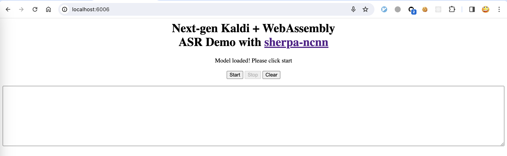
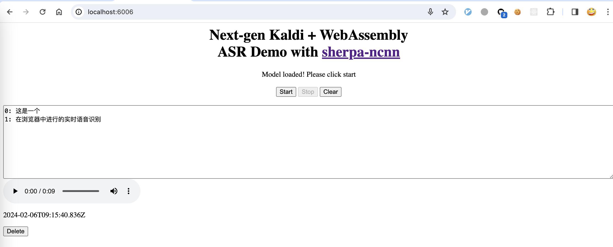

Build
=====

After installing `emscripten`_, we can build `sherpa-ncnn`_ for `WebAssembly`_ now.

Please use the following command to build it:

.. code-block:: bash

  git clone https://github.com/k2-fsa/sherpa-ncnn
  cd sherpa-ncnn

  cd wasm/assets
  wget -q https://github.com/k2-fsa/sherpa-ncnn/releases/download/models/sherpa-ncnn-streaming-zipformer-bilingual-zh-en-2023-02-13.tar.bz2
  tar xvf sherpa-ncnn-streaming-zipformer-bilingual-zh-en-2023-02-13.tar.bz2
  mv -v sherpa-ncnn-streaming-zipformer-bilingual-zh-en-2023-02-13/*pnnx.ncnn.param .
  mv -v sherpa-ncnn-streaming-zipformer-bilingual-zh-en-2023-02-13/*pnnx.ncnn.bin .
  mv -v sherpa-ncnn-streaming-zipformer-bilingual-zh-en-2023-02-13/tokens.txt .
  rm -rf sherpa-ncnn-streaming-zipformer-bilingual-zh-en-2023-02-13
  rm -v sherpa-ncnn-streaming-zipformer-bilingual-zh-en-2023-02-13.tar.bz2
  cd ../..

  ./build-wasm-simd.sh

.. hint::

   You can visit `<https://github.com/k2-fsa/sherpa-ncnn/releases/tag/models>`_
   to download a different model.

After building, you should see the following output:

.. code-block:: bash

  Install the project...
  -- Install configuration: "Release"
  -- Installing: /Users/fangjun/open-source/sherpa-ncnn/build-wasm-simd/install/lib/libkaldi-native-fbank-core.a
  -- Installing: /Users/fangjun/open-source/sherpa-ncnn/build-wasm-simd/install/lib/libncnn.a
  -- Installing: /Users/fangjun/open-source/sherpa-ncnn/build-wasm-simd/install/./sherpa-ncnn.pc
  -- Installing: /Users/fangjun/open-source/sherpa-ncnn/build-wasm-simd/install/lib/libsherpa-ncnn-core.a
  -- Installing: /Users/fangjun/open-source/sherpa-ncnn/build-wasm-simd/install/lib/libsherpa-ncnn-c-api.a
  -- Installing: /Users/fangjun/open-source/sherpa-ncnn/build-wasm-simd/install/include/sherpa-ncnn/c-api/c-api.h
  -- Installing: /Users/fangjun/open-source/sherpa-ncnn/build-wasm-simd/install/bin/wasm/sherpa-ncnn-wasm-main.js
  -- Installing: /Users/fangjun/open-source/sherpa-ncnn/build-wasm-simd/install/bin/wasm/sherpa-ncnn.js
  -- Installing: /Users/fangjun/open-source/sherpa-ncnn/build-wasm-simd/install/bin/wasm/app.js
  -- Installing: /Users/fangjun/open-source/sherpa-ncnn/build-wasm-simd/install/bin/wasm/index.html
  -- Up-to-date: /Users/fangjun/open-source/sherpa-ncnn/build-wasm-simd/install/bin/wasm/sherpa-ncnn-wasm-main.js
  -- Installing: /Users/fangjun/open-source/sherpa-ncnn/build-wasm-simd/install/bin/wasm/sherpa-ncnn-wasm-main.wasm
  -- Installing: /Users/fangjun/open-source/sherpa-ncnn/build-wasm-simd/install/bin/wasm/sherpa-ncnn-wasm-main.data
  + ls -lh install/bin/wasm
  total 280152
  -rw-r--r--  1 fangjun  staff   9.0K Feb  6 15:42 app.js
  -rw-r--r--  1 fangjun  staff   936B Feb  6 15:42 index.html
  -rw-r--r--  1 fangjun  staff   135M Feb  6 17:06 sherpa-ncnn-wasm-main.data
  -rw-r--r--  1 fangjun  staff    79K Feb  6 17:06 sherpa-ncnn-wasm-main.js
  -rw-r--r--  1 fangjun  staff   1.7M Feb  6 17:06 sherpa-ncnn-wasm-main.wasm
  -rw-r--r--  1 fangjun  staff   6.9K Feb  6 15:42 sherpa-ncnn.js

Now you can use the following command to run it:

.. code-block:: bash

  cd build-wasm-simd/install/bin/wasm/
  python3 -m http.server 6006

Start your browser and visit `<http://localhost:6006/>`_; you should see the following
page:

Now click start and speak! You should see the recognition results in the text box.

.. warning::

   We are using a bilingual model (Chinese + English) in the above example, which means
   you can only speak Chinese or English in this case.

A screenshot is given below:

Congratulations! You have successfully run real-time speech recognition with `WebAssembly`_
in your browser.
