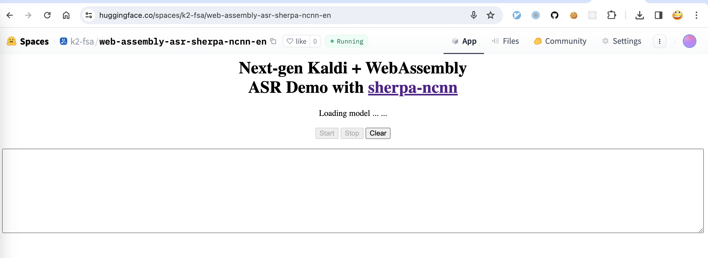

.. _try sherpa ncnn wasm with huggingface:

Huggingface Spaces (WebAssembly)
================================

We provide two `Huggingface`_ spaces so that you can try real-time
speech recognition with `WebAssembly`_ in your browser.

English only
------------

`<https://huggingface.co/spaces/k2-fsa/web-assembly-asr-sherpa-ncnn-en>`_

.. hint::

   If you don't have access to `Huggingface`_, please visit the following mirror:

    `<https://modelscope.cn/studios/k2-fsa/web-assembly-asr-sherpa-ncnn-en/summary>`_

.. note::

   The script for building this space can be found at
   `<https://github.com/k2-fsa/sherpa-ncnn/blob/master/.github/workflows/wasm-simd-hf-space-en.yaml>`_

Chinese + English
-----------------

`<https://huggingface.co/spaces/k2-fsa/web-assembly-asr-sherpa-ncnn-zh-en>`_

.. hint::

   If you don't have access to `Huggingface`_, please visit the following mirror:

    `<https://modelscope.cn/studios/k2-fsa/web-assembly-asr-sherpa-ncnn-zh-en/summary>`_

.. figure:: ./pic/wasm-hf-zh-en.png
   :alt: start page of wasm
   :width: 800
   :target: https://huggingface.co/spaces/k2-fsa/web-assembly-asr-sherpa-ncnn-zh-en

.. note::

   The script for building this space can be found at
   `<https://github.com/k2-fsa/sherpa-ncnn/blob/master/.github/workflows/wasm-simd-hf-space-zh-en.yaml>`_
