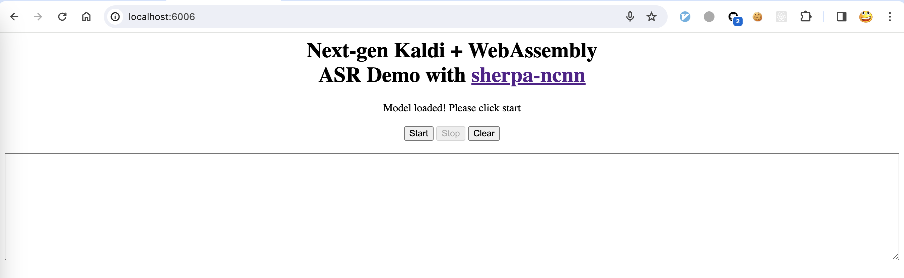
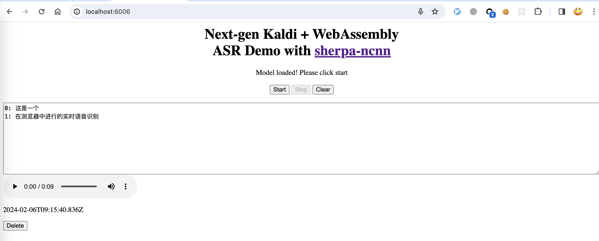

Use pre-built WebAssembly library
=================================

In this section, we describe how to use the pre-built `WebAssembly`_ library
of `sherpa-ncnn`_ for real-time speech recognition.

.. note::

  Note that the pre-built library used in this section
  uses a bilingual model (Chinese + English),
  which is from :ref:`sherpa_ncnn_streaming_zipformer_bilingual_zh_en_2023_02_13`.

Download
--------

Please use the following command to download the pre-built library for version
``v2.1.7``, which is the latest release as of 2024.02.06.

.. hint::

   Please always use the latest release. You can visit
   `<https://github.com/k2-fsa/sherpa-ncnn/releases>`_ to find the latest release.

.. code-block::

   wget -q https://github.com/k2-fsa/sherpa-ncnn/releases/download/v2.1.7/sherpa-ncnn-wasm-simd-v2.1.7.tar.bz2
   tar xvf sherpa-ncnn-wasm-simd-v2.1.7.tar.bz2
   rm sherpa-ncnn-wasm-simd-v2.1.7.tar.bz2
   cd sherpa-ncnn-wasm-simd-v2.1.7

   python3 -m http.server 6006

Start your browser and visit `<http://localhost:6006/>`_; you should see the following
page:

Now click start and speak! You should see the recognition results in the text box.

.. warning::

   We are using a bilingual model (Chinese + English) in the above example, which means
   you can only speak Chinese or English in this case.

A screenshot is given below:

Congratulations! You have successfully run real-time speech recognition with `WebAssembly`_
in your browser.
