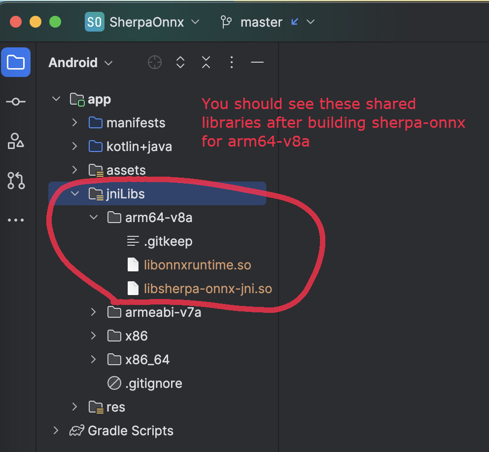
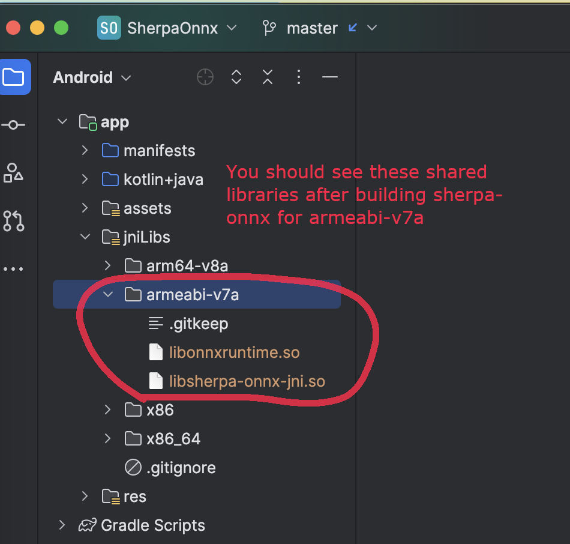
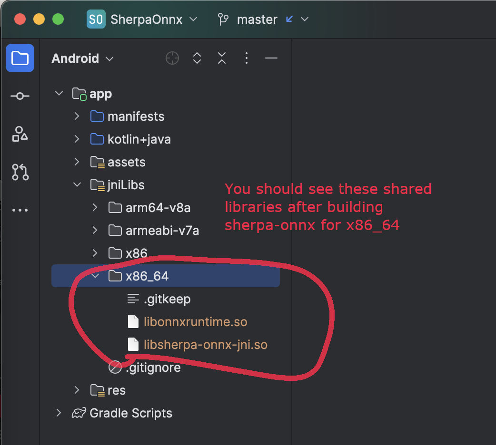
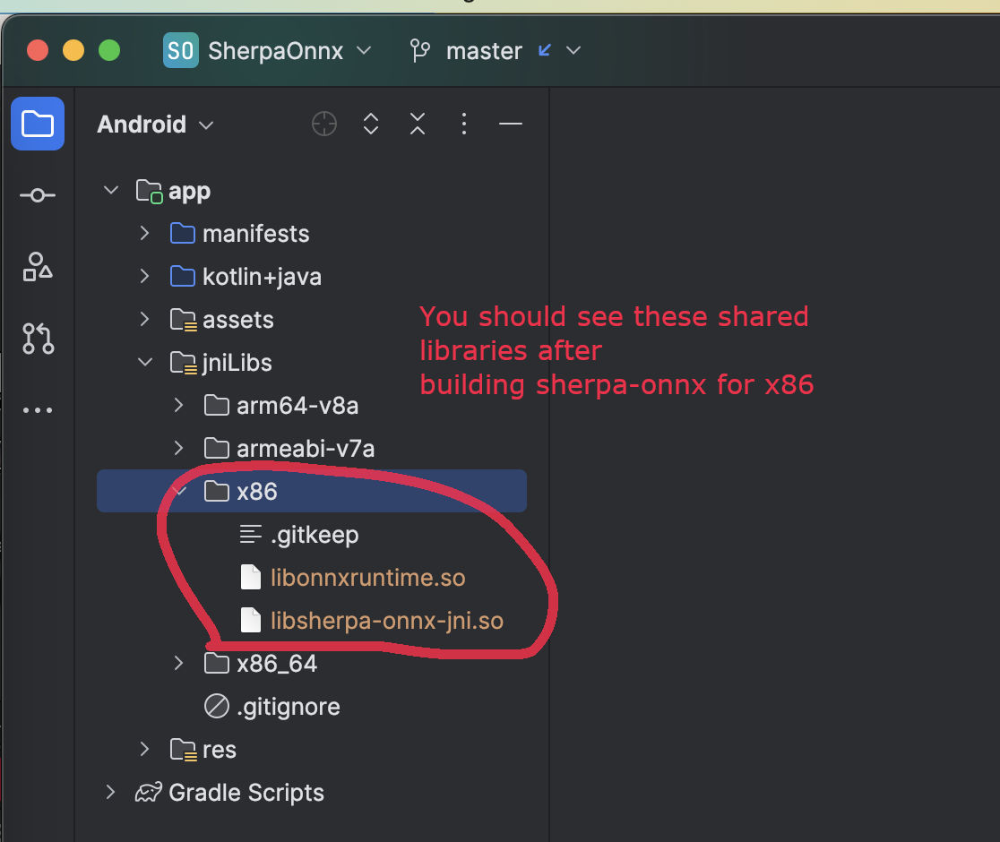
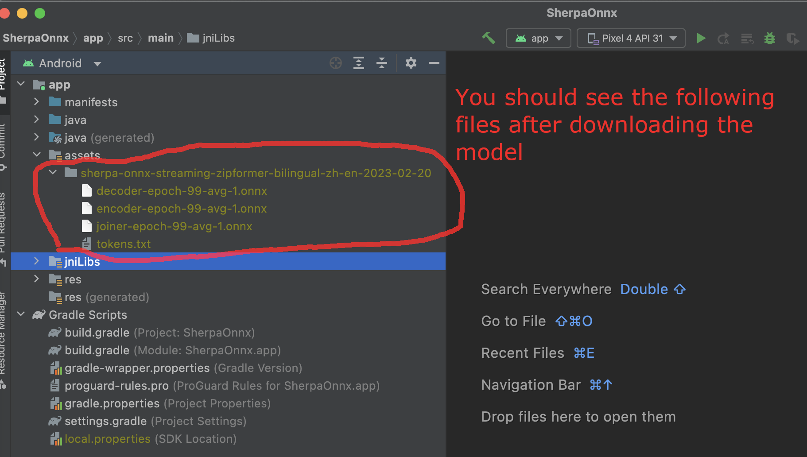
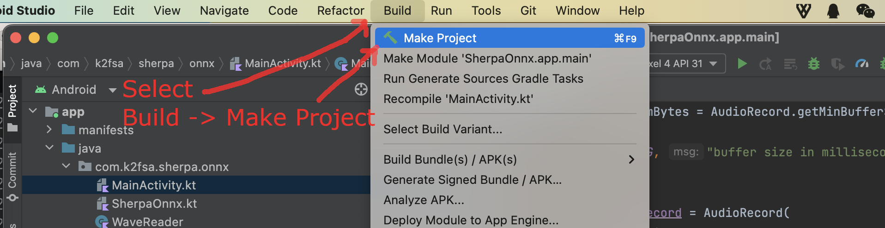
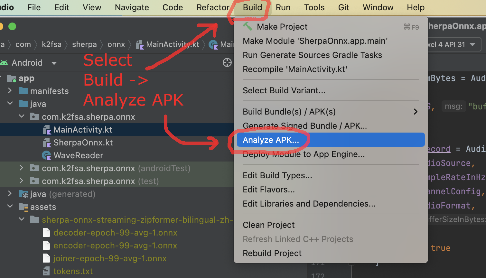
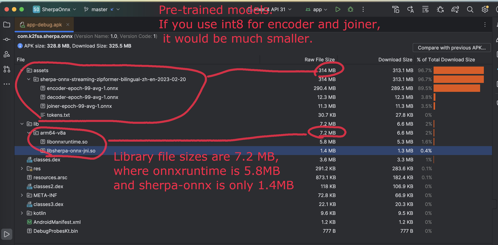

.. _sherpa-onnx-install-android-studio:

Build sherpa-onnx for Android
=============================

You can use this section for both ``speech-to-text`` (STT, ASR)
and ``text-to-speech`` (TTS).

.. hint::

   The build scripts mentioned in this section run on both Linux and macOS.

   If you are using Windows or if you don't want to build the shared libraries,
   you can download pre-built shared libraries by visiting the release page
   `<https://github.com/k2-fsa/sherpa-onnx/releases/>`_

   For instance, for the relase ``v1.10.19``, you can visit
   `<https://github.com/k2-fsa/sherpa-onnx/releases/tag/v1.10.19>`_
   and download the file ``sherpa-onnx-v1.10.19-android.tar.bz2``
   using the following command:

    .. code-block:: bash

      wget https://github.com/k2-fsa/sherpa-onnx/releases/download/v1.10.19/sherpa-onnx-v1.10.19-android.tar.bz2

   Please always use the latest release.

.. hint::

   This section is originally written for speech-to-text. However, it is
   also applicable to other folders in `<https://github.com/k2-fsa/sherpa-onnx/tree/master/android>`_.

   For instance, you can replace ``SherpaOnnx`` in this section with

    - ``SherpaOnnx2Pass``
    - ``SherpaOnnxTts``  (this is for text-to-speech)
    - ``SherpaOnnxTtsEngine``  (this is for text-to-speech)
    - ``SherpaOnnxVad``
    - ``SherpaOnnxVadAsr``
    - ``SherpaOnnxSpeakerIdentification``
    - ``SherpaOnnxAudioTagging``
    - ``SherpaOnnxAudioTaggingWearOs``

Install Android Studio
----------------------

The first step is to download and install Android Studio.

Please refer to `<https://developer.android.com/studio>`_ for how to install
Android Studio.

.. hint::

  Any recent version of Android Studio should work fine. Also, you can use
  the default settings of Android Studio during installation.

  For reference, we post the version we are using below:

  .. image:: ./pic/android-studio-version.png
     :align: center
     :alt: screenshot of my version of Android Studio
     :width: 600

Download sherpa-onnx
--------------------

Next, download the source code of `sherpa-onnx`_:

.. code-block:: bash

  git clone https://github.com/k2-fsa/sherpa-onnx

Install NDK
-----------

Step 1, start Android Studio.

  .. figure:: ./pic/start-android-studio.png
     :alt: Start Android Studio
     :width: 600

     Step 1: Click ``Open`` to select ``sherpa-onnx/android/SherpaOnnx``

Step 2, Open ``sherpa-onnx/android/SherpaOnnx``.

  .. figure:: ./pic/open-sherpa-onnx.png
     :alt: Open SherpaOnnx
     :width: 600

     Step 2: Open ``SherpaOnnx``.

Step 3, Select ``Tools -> SDK Manager``.

  .. figure:: ./pic/select-sdk-manager.png
     :alt: Select Tools -> SDK Manager
     :width: 600

     Step 3: Select ``Tools -> SDK Manager``.

Step 4, ``Install NDK``.

  .. figure:: ./pic/ndk-tools.png
     :alt: Install NDK
     :width: 600

     Step 4: Install NDK.

In the following, we assume ``Android SDK location`` was set to
``/Users/fangjun/software/my-android``. You can change it accordingly below.

After installing NDK, you can find it in

.. code-block::

  /Users/fangjun/software/my-android/ndk/22.1.7171670

.. warning::

    If you selected a different version of NDK, please replace ``22.1.7171670``
    accordingly.

Next, let us set the environment variable ``ANDROID_NDK`` for later use.

.. code-block:: bash

    export ANDROID_NDK=/Users/fangjun/software/my-android/ndk/22.1.7171670

.. note::

  Note from https://github.com/Tencent/ncnn/wiki/how-to-build#build-for-android

  (Important) remove the hardcoded debug flag in Android NDK to fix
  the android-ndk issue: https://github.com/android/ndk/issues/243

  1. open ``$ANDROID_NDK/build/cmake/android.toolchain.cmake`` for ndk < r23
  or ``$ANDROID_NDK/build/cmake/android-legacy.toolchain.cmake`` for ndk >= r23

  2. delete the line containing "-g"

    .. code-block::

      list(APPEND ANDROID_COMPILER_FLAGS
      -g
      -DANDROID

Build sherpa-onnx (C++ code)
----------------------------

After installing ``NDK``, it is time to build the C++ code of `sherpa-onnx`_.

In the following, we show how to build `sherpa-onnx`_ for the following
Android ABIs:

  - ``arm64-v8a``
  - ``armv7-eabi``
  - ``x86_64``
  - ``x86``

.. caution::

  You only need to select one and only one ABI. ``arm64-v8a`` is probably the
  most common one.

  If you want to test the app on an emulator, you probably need ``x86_64``.

.. hint::

   Building scripts for this section are for macOS and Linux. If you are
   using Windows or if you don't want to build the shared libraries by yourself,
   you can download pre-compiled shared libraries for this section by visiting

    `<https://github.com/k2-fsa/sherpa-onnx/releases>`_

.. hint::

   We provide a colab notebook
   |build sherpa-onnx for android colab notebook|
   for you to try this section step by step.

   If you are using Windows or you don't want to setup your local environment
   to build the C++ libraries, please use the above colab notebook.

.. |build sherpa-onnx for android colab notebook| image:: https://colab.research.google.com/assets/colab-badge.svg
   :target: https://github.com/k2-fsa/colab/blob/master/sherpa-onnx/build_sherpa_onnx_for_android.ipynb

Build for arm64-v8a
^^^^^^^^^^^^^^^^^^^

.. code-block:: bash

  cd sherpa-onnx # Go to the root repo
  ./build-android-arm64-v8a.sh

After building, you will find the following shared libraries:

.. code-block:: bash

  ls -lh build-android-arm64-v8a/install/lib/

  -rw-r--r--  1 fangjun  staff    15M Jul 28 12:54 libonnxruntime.so
  -rwxr-xr-x  1 fangjun  staff   3.7M Jul 28 12:54 libsherpa-onnx-jni.so

Please copy them to ``android/SherpaOnnx/app/src/main/jniLibs/arm64-v8a/``:

.. code-block:: bash

  cp build-android-arm64-v8a/install/lib/lib*.so  android/SherpaOnnx/app/src/main/jniLibs/arm64-v8a/

You should see the following screen shot after running the above copy ``cp`` command.

Build for armv7-eabi
^^^^^^^^^^^^^^^^^^^^

.. code-block:: bash

  cd sherpa-onnx # Go to the root repo
  ./build-android-armv7-eabi.sh

After building, you will find the following shared libraries:

.. code-block:: bash

  ls -lh build-android-armv7-eabi/install/lib

  -rw-r--r--  1 fangjun  staff    10M Jul 28 13:18 libonnxruntime.so
  -rwxr-xr-x  1 fangjun  staff   2.1M Jul 28 13:18 libsherpa-onnx-jni.so

Please copy them to ``android/SherpaOnnx/app/src/main/jniLibs/armeabi-v7a``:

.. code-block:: bash

   cp build-android-armv7-eabi/install/lib/lib*.so android/SherpaOnnx/app/src/main/jniLibs/armeabi-v7a/

You should see the following screen shot after running the above copy ``cp`` command.

Build for x86_64
^^^^^^^^^^^^^^^^

.. code-block:: bash

  cd sherpa-onnx # Go to the root repo
  ./build-android-x86-64.sh

After building, you will find the following shared libraries:

.. code-block:: bash

  ls -lh build-android-x86-64/install/lib/

  -rw-r--r--  1 fangjun  staff    17M Jul 28 13:26 libonnxruntime.so
  -rwxr-xr-x  1 fangjun  staff   4.0M Jul 28 13:26 libsherpa-onnx-jni.so

Please copy them to ``android/SherpaOnnx/app/src/main/jniLibs/x86_64/``:

.. code-block:: bash

   cp build-android-x86-64/install/lib/lib*.so android/SherpaOnnx/app/src/main/jniLibs/x86_64/

You should see the following screen shot after running the above copy ``cp`` command.

Build for x86
^^^^^^^^^^^^^

.. code-block:: bash

  cd sherpa-onnx # Go to the root repo
  ./build-android-x86.sh

After building, you will find the following shared libraries:

.. code-block:: bash

  ls -lh build-android-x86/install/lib/

  -rw-r--r--  1 fangjun  staff    17M Jul 28 13:28 libonnxruntime.so
  -rwxr-xr-x  1 fangjun  staff   3.9M Jul 28 13:28 libsherpa-onnx-jni.so

Please copy them to ``android/SherpaOnnx/app/src/main/jniLibs/x86/``:

.. code-block:: bash

   cp build-android-x86/install/lib/lib*.so android/SherpaOnnx/app/src/main/jniLibs/x86/

You should see the following screen shot after running the above copy ``cp`` command.

Download pre-trained models
---------------------------

Please read :ref:`sherpa-onnx-pre-trained-models` for all available pre-trained
models.

In the following, we use a pre-trained model :ref:`sherpa-onnx-streaming-zipformer-bilingual-zh-en-2023-02-20`,
which supports both Chinese and English.

.. hint::

  The model is trained using `icefall`_ and the original torchscript model
  is from `<https://huggingface.co/pfluo/k2fsa-zipformer-chinese-english-mixed>`_.

Use the following command to download the pre-trained model and place it into
``android/SherpaOnnx/app/src/main/assets/``:

.. code-block:: bash

  cd android/SherpaOnnx/app/src/main/assets/

  wget https://github.com/k2-fsa/sherpa-onnx/releases/download/asr-models/sherpa-onnx-streaming-zipformer-bilingual-zh-en-2023-02-20.tar.bz2

  tar xvf sherpa-onnx-streaming-zipformer-bilingual-zh-en-2023-02-20.tar.bz2
  rm sherpa-onnx-streaming-zipformer-bilingual-zh-en-2023-02-20.tar.bz2

  cd sherpa-onnx-streaming-zipformer-bilingual-zh-en-2023-02-20

  # Now, remove extra files to reduce the file size of the generated apk
  rm -rf test_wavs
  rm -f *.sh README.md
  rm -f bpe.model

  rm -f encoder-epoch-99-avg-1.int8.onnx
  rm -f joiner-epoch-99-avg-1.int8.onnx
  rm -f decoder-epoch-99-avg-1.int8.onnx
  rm -f bpe.vocab

In the end, you should have the following files:

.. code-block:: bash

  ls -lh

  -rw-r--r--@ 1 fangjun  staff    13M Jul 28 13:51 decoder-epoch-99-avg-1.onnx
  -rw-r--r--@ 1 fangjun  staff   315M Jul 28 13:51 encoder-epoch-99-avg-1.onnx
  -rw-r--r--@ 1 fangjun  staff    12M Jul 28 13:51 joiner-epoch-99-avg-1.onnx
  -rw-r--r--@ 1 fangjun  staff    55K Nov 21  2023 tokens.txt

You should see the following screen shot after downloading the pre-trained model:

.. hint::

  If you select a different pre-trained model, make sure that you also change the
  corresponding code listed in the following screen shot:

  .. figure:: ./pic/type-for-pre-trained-model-2023-02-20.png
     :alt: Change code if you select a different model
     :width: 600

Generate APK
------------

Finally, it is time to build `sherpa-onnx`_ to generate an APK package.

Select ``Build -> Make Project``, as shown in the following screen shot.

You can find the generated APK in ``android/SherpaOnnx/app/build/outputs/apk/debug/app-debug.apk``:

.. code-block:: bash

  ls -lh android/SherpaOnnx/app/build/outputs/apk/debug/app-debug.apk

  -rw-r--r--@ 1 fangjun  staff   329M Jul 28 13:56 android/SherpaOnnx/app/build/outputs/apk/debug/app-debug.apk

Congratulations! You have successfully built an APK for Android.

Read below to learn more.

Analyze the APK
---------------

Select ``Build -> Analyze APK ...`` in the above screen shot, in the
popped-up dialog select the generated APK ``app-debug.apk``,
and you will see the following screen shot:

You can see from the above screen shot that most part of the APK
is occupied by the pre-trained model, while the runtime, including the shared
libraries, is only ``7.2 MB``.

.. caution::

  You can see that ``libonnxruntime.so`` alone occupies ``5.8MB`` out of ``7.2MB``.

  We use a so-called ``Full build`` instead of ``Mobile build``, so the file
  size of the library is somewhat a bit larger.

  ``libonnxruntime.so`` is donwloaded from

    `<https://mvnrepository.com/artifact/com.microsoft.onnxruntime/onnxruntime-android/1.17.1>`_

  Please refer to `<https://onnxruntime.ai/docs/build/custom.html>`_ for a
  custom build to reduce the file size of ``libonnxruntime.so``.

  Note that we are constantly updating the version of ``onnxruntime``. By
  the time you are reading this section, we may be using the latest version
  of ``onnxruntime``.

.. hint::

  We recommend you to use `sherpa-ncnn`_. Please see
  :ref:`sherpa-ncnn-analyze-apk-result` for `sherpa-ncnn`_. The total runtime of
  `sherpa-ncnn`_ is only ``1.6 MB``, which is much smaller than `sherpa-onnx`_.
