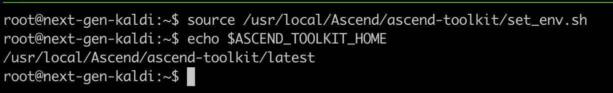
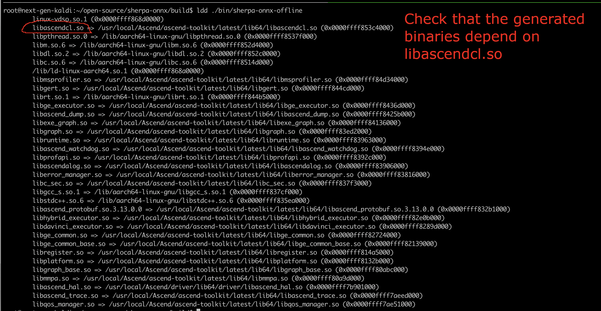

Install
=======

You need to build `sherpa-onnx`_ from source for Ascend NPU.

Install CANN
-------------

Before you continue, make sure you have installed ``CANN``. The following
is an example to check that.

Build sherpa-onnx
------------------

.. code-block:: bash

  git clone https://github.com/k2-fsa/sherpa-onnx
  cd sherpa-onnx
  mkdir build
  cd build
  cmake -DSHERPA_ONNX_ENABLE_ASCEND_NPU=ON ..

  make

After building, check that the generated binaries depend on ``libascendcl.so``

