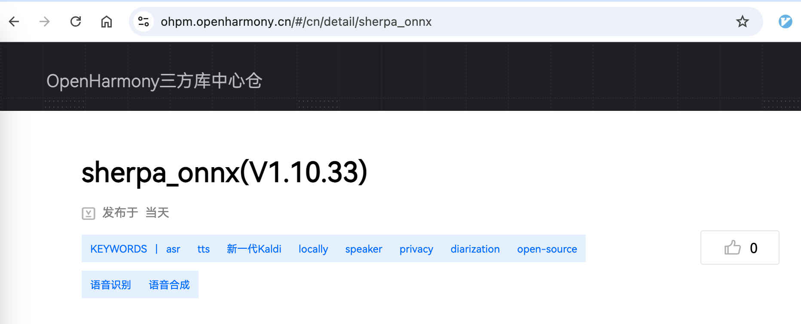
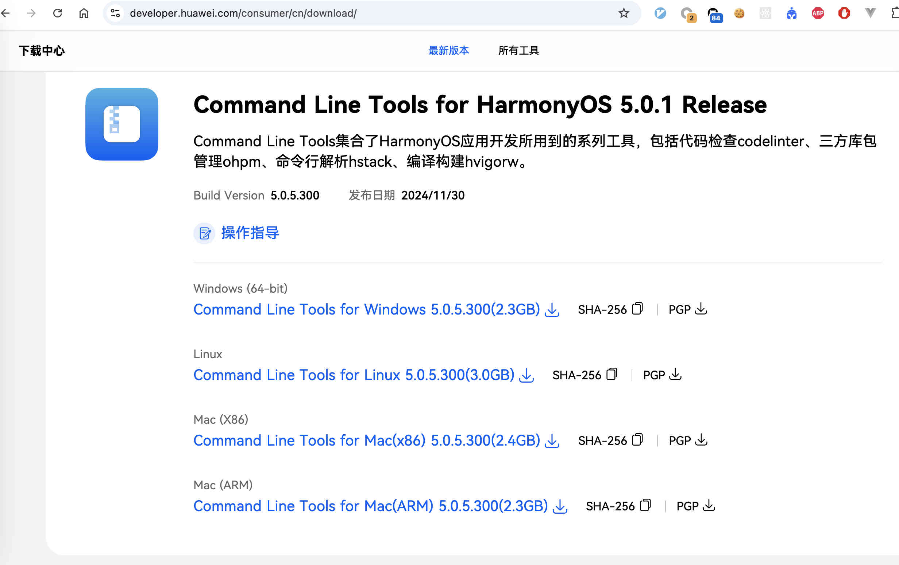
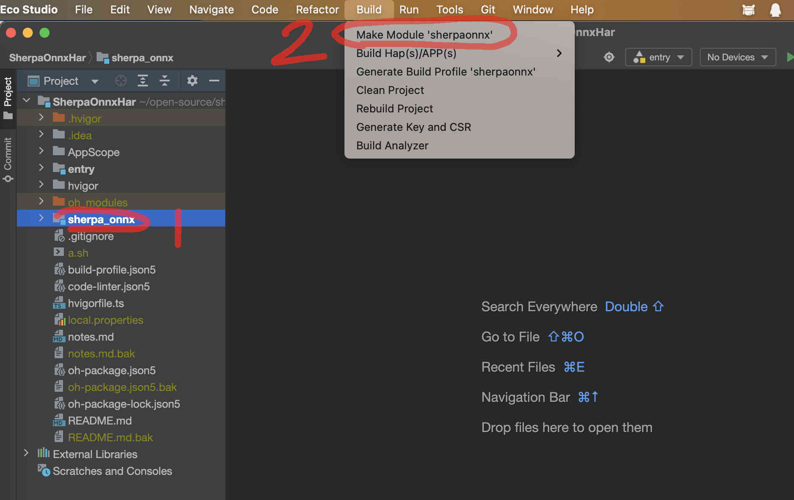
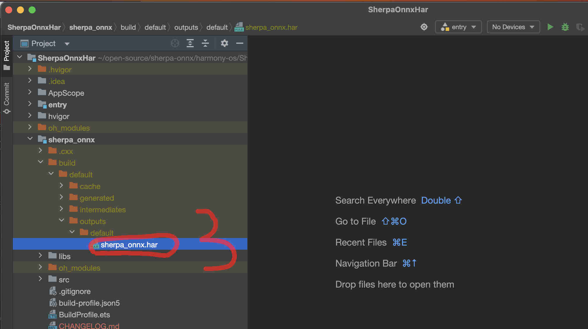
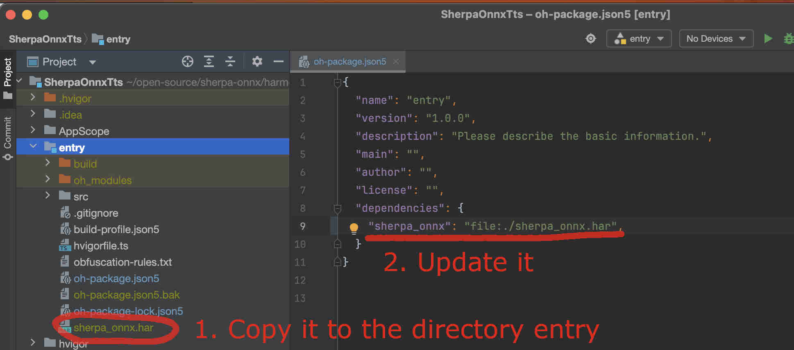

How to build sherpa_onnx.har
============================

This page describes how to build ``sherpa_onnx.har`` from source.

Note that we have already published `sherpa-onnx`_ at the following address:

  `<https://ohpm.openharmony.cn/#/cn/detail/sherpa_onnx>`_

   The `sherpa_onnx <https://ohpm.openharmony.cn/#/cn/detail/sherpa_onnx>`_ package.

You can use it directly in your project by modifying ``oh-package.json5`` to add
the following lines:

.. code-block::

    "dependencies": {
       // please always use the latest version
      "sherpa_onnx": "1.10.33",
    },

or use:

.. code-block::

   ohpm install sherpa_onnx

.. hint::

  If you don't want to change any C++ code of `sherpa-onnx`_, then please
  use our provided ``sherpa_onnx.har`` package and you can safely ignore this
  document.

.. hint::

  If you don't want to change any C++ code of `sherpa-onnx`_, then please
  use our provided ``sherpa_onnx.har`` package and you can safely ignore this
  document.

.. hint::

  If you don't want to change any C++ code of `sherpa-onnx`_, then please
  use our provided ``sherpa_onnx.har`` package and you can safely ignore this
  document.

If you want to modify the source code of `sherpa-onnx`_, then you can follow
this document to build a new ``sherpa_onnx.har`` package.

Download commandline-tools
--------------------------

The first step is to download commandline tools for building `sherpa-onnx`_.

Please visit `<https://developer.huawei.com/consumer/cn/download/>`_
to download it. Note that you need a Huawei account to download it.

   Download commandline-tools.

Alternatively, you can download it from the following huggingface repo

  `<https://huggingface.co/csukuangfj/harmonyos-commandline-tools>`_

with the following command:

.. code-block:: bash

   # Please use any directory you like.
   # The following one is just an example.
   mkdir -p /Users/fangjun/software/

   cd  /Users/fangjun/software/

   # If you use other systems, please change it accordingly.
   # If you use macOS x64, please run the following
   wget https://huggingface.co/csukuangfj/harmonyos-commandline-tools/resolve/main/commandline-tools-mac-x64-5.0.5.200.zip

   # For users that don't have access to huggingface, please use
   # wget https://hf-mirror.com/csukuangfj/harmonyos-commandline-tools/resolve/main/commandline-tools-mac-x64-5.0.5.200.zip

   unzip -qq commandline-tools-mac-x64-5.0.5.200.zip

Build sherpa-onnx for HarmonyOS
-------------------------------

Please use the following command:

.. code-block::

   cd /Users/fangjun/open-source
   git clone https://github.com/k2-fsa/sherpa-onnx
   cd sherpa-onnx

   export OHOS_SDK_NATIVE_DIR=/Users/fangjun/software/command-line-tools/sdk/default/openharmony/native/

   ./build-ohos-arm64-v8a.sh
   ./build-ohos-x86-64.sh

Build sherpa_onnx.har
---------------------

Finally, we can build ``sherpa_onnx.har``.

We describe two methods below.

From the command-line
^^^^^^^^^^^^^^^^^^^^^

You can build ``sherpa_onnx.har`` from the terminal by running:

.. code-block::

    cd /Users/fangjun/open-source/sherpa-onnx/harmony-os/SherpaOnnxHar/
    export PATH=/Users/fangjun/software/command-line-tools/bin:$PATH

    hvigorw clean --no-daemon
    hvigorw --mode module -p product=default -p module=sherpa_onnx@default assembleHar --analyze=normal --parallel --incremental --no-daemon

    find . -name "*.har"

After building, you should get::

  (py38) fangjuns-MacBook-Pro:SherpaOnnxHar fangjun$ echo $PWD
  /Users/fangjun/open-source/sherpa-onnx/harmony-os/SherpaOnnxHar
  (py38) fangjuns-MacBook-Pro:SherpaOnnxHar fangjun$ find . -name "*.har"
  ./sherpa_onnx/build/default/outputs/default/sherpa_onnx.har

Use DevEco Studio
^^^^^^^^^^^^^^^^^

Start DevEco Studio and open the project `SherpaOnnxHar <https://github.com/k2-fsa/sherpa-onnx/tree/master/harmony-os/SherpaOnnxHar>`_

Follow the screenshot below to build ``sherpa_onnx.har``.

   Screenshot of building sherpa_onnx.har using DevEco Studio

The following screenshot shows where you can find the generated ``sherpa_onnx.har``:

   Screenshot of the generated ``sherpa_onnx.har``.

Use sherpa_onnx.har in your project
-----------------------------------

To use the generated ``sherpa_onnx.har`` in your project, please copy it to your
project and update the ``oh-package.json`` file.

The following is an example:

   Screenshot of using ``sherpa_onnx.har`` in your project.

Colab demo
----------

We provide a colab notebook |build sherpa_onnx.har for HarmonyOS notebook| to show you how to build ``sherpa_onnx.har``
from scratch.

.. |build sherpa_onnx.har for HarmonyOS notebook| image:: https://github.com/k2-fsa/sherpa/releases/download/doc/colab-badge.jpg
   :target: https://github.com/k2-fsa/colab/blob/master/sherpa-onnx/harmony-os/sherpa_onnx_harmonyos_build_har.ipynb
