On-device speaker identification (本地说话人识别)
=======================================================

This page describes how to
build `SherpaOnnxSpeakerIdentification <https://github.com/k2-fsa/sherpa-onnx/tree/master/harmony-os/SherpaOnnxSpeakerIdentification>`_
for on-device speaker identification that runs on HarmonyOS.

Open the project with DevEco Studio
-----------------------------------

You need to first download the code::

  # Assume we place it inside /Users/fangjun/open-source
  # You can place it anywhere you like.

  cd /Users/fangjun/open-source/

  git clone https://github.com/k2-fsa/sherpa-onnx

Then start DevEco Studio and follow the screenshots below:

.. figure:: ./pic/tts/1-open.jpg
   :alt: Screenshot of starting DevEco
   :width: 600

   Step 1: Click Open

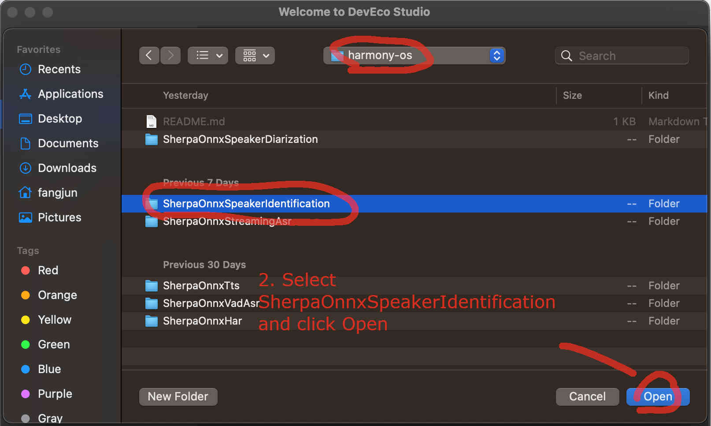

   Step 2: Select SherpaOnnxSpeakerIdentification inside the harmony-os folder and click Open

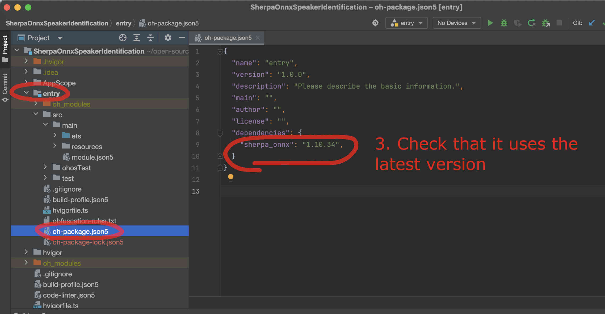

   Step 3: Check that it is using the latest version. You can visit `sherpa_onnx <https://ohpm.openharmony.cn/#/cn/detail/sherpa_onnx>`_ to check available versions.

Select a model
--------------

The code supports many models for extracting speaker embeddings and you have to select
one.

You can find all supported models at

  `<https://github.com/k2-fsa/sherpa-onnx/releases/tag/speaker-recongition-models>`_

We use the following model

  `<https://github.com/k2-fsa/sherpa-onnx/releases/download/speaker-recongition-models/3dspeaker_speech_eres2net_base_200k_sv_zh-cn_16k-common.onnx>`_

as an example in this document.

Use 3dspeaker_speech_eres2net_base_200k_sv_zh-cn_16k-common.onnx
^^^^^^^^^^^^^^^^^^^^^^^^^^^^^^^^^^^^^^^^^^^^^^^^^^^^^^^^^^^^^^^^

First, we download it to the `rawfile <https://github.com/k2-fsa/sherpa-onnx/tree/master/harmony-os/SherpaOnnxSpeakerIdentification/entry/src/main/resources/rawfile>`_ directory.

**Caution**: You MUST place the file inside the `rawfile <https://github.com/k2-fsa/sherpa-onnx/tree/master/harmony-os/SherpaOnnxSpeakerIdentification/entry/src/main/resources/rawfile>`_ directory. Otherwise, you would be ``SAD`` later.

.. code-block:: bash

  cd /Users/fangjun/open-source/sherpa-onnx/harmony-os/SherpaOnnxSpeakerIdentification/entry/src/main/resources/rawfile

  wget https://github.com/k2-fsa/sherpa-onnx/releases/download/speaker-recongition-models/3dspeaker_speech_eres2net_base_200k_sv_zh-cn_16k-common.onnx

Please check that your directory looks ``exactly`` like the following:

.. code-block::

  (py38) fangjuns-MacBook-Pro:rawfile fangjun$ pwd
  /Users/fangjun/open-source/sherpa-onnx/harmony-os/SherpaOnnxSpeakerIdentification/entry/src/main/resources/rawfile

  (py38) fangjuns-MacBook-Pro:rawfile fangjun$ ls -lh
  total 77888
  -rw-r--r--  1 fangjun  staff    38M Oct 14 11:41 3dspeaker_speech_eres2net_base_200k_sv_zh-cn_16k-common.onnx

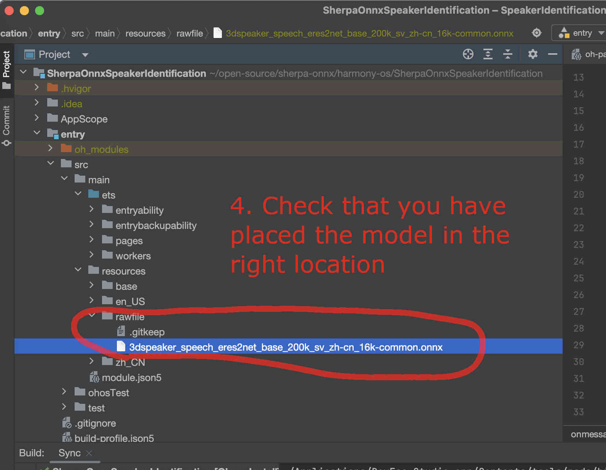

   Step 4: Check that you have placed the model file inside the ``rawfile`` directory.

Now we need to change the code to use our selected model.

We have to change `SpeakerIdentificationWorker.ets <https://github.com/k2-fsa/sherpa-onnx/blob/master/harmony-os/SherpaOnnxSpeakerIdentification/entry/src/main/ets/workers/SpeakerIdentificationWorker.ets>`_. Please see the following
screenshot.

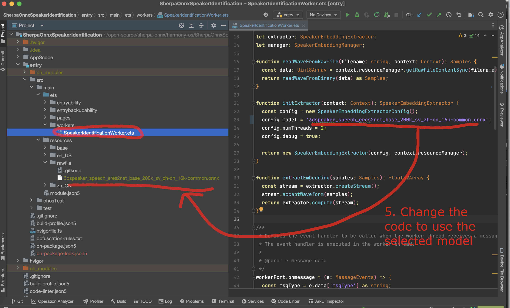

   Step 5: Change the code to use our selected model

Finally, we can build the project. See the screenshot below:

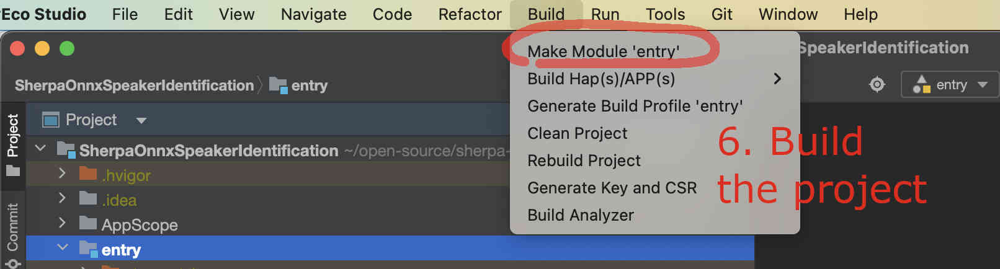

   Step 6: Build the project

If you have an emulator, you can now start it.

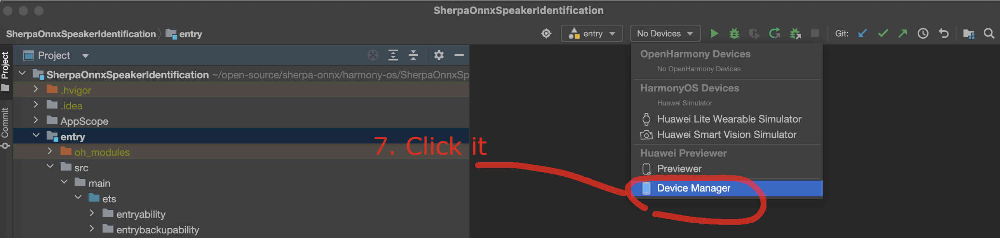

   Step 7: Select the device manager

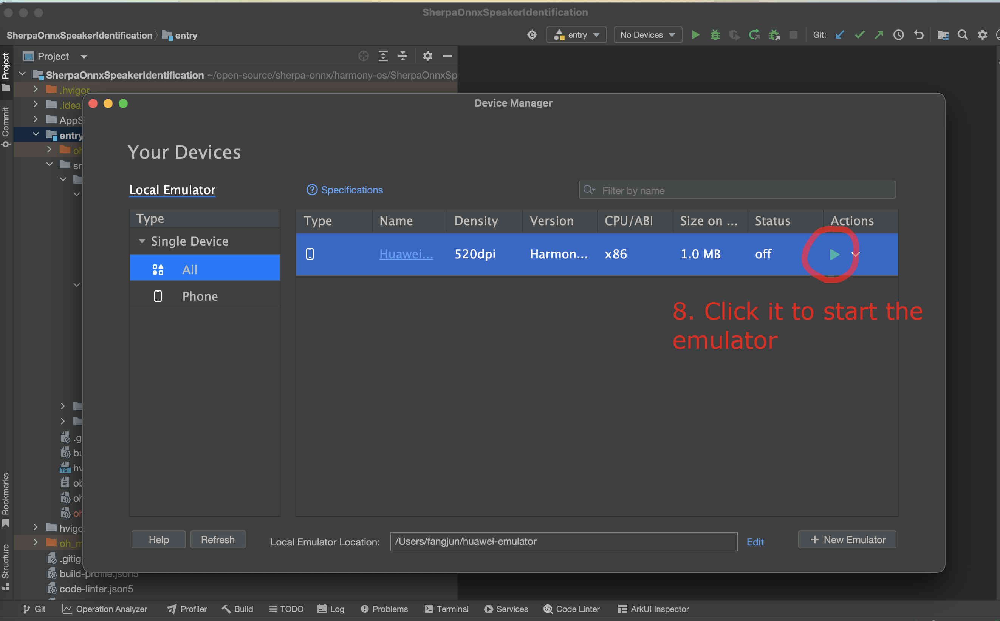

   Step 8: Start the emulator

After the emulator is started, follow the screenshot below to run the app on the
emulator:

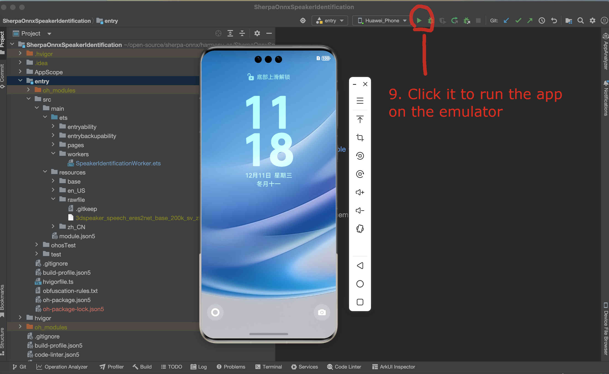

   Step 9: Start the app on the emulator

You should see something like below:

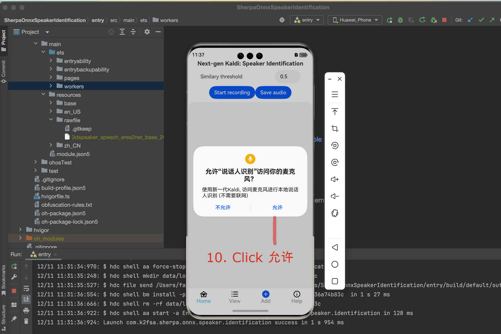

   Step 10: Click Allow to allow the app to access the microphone

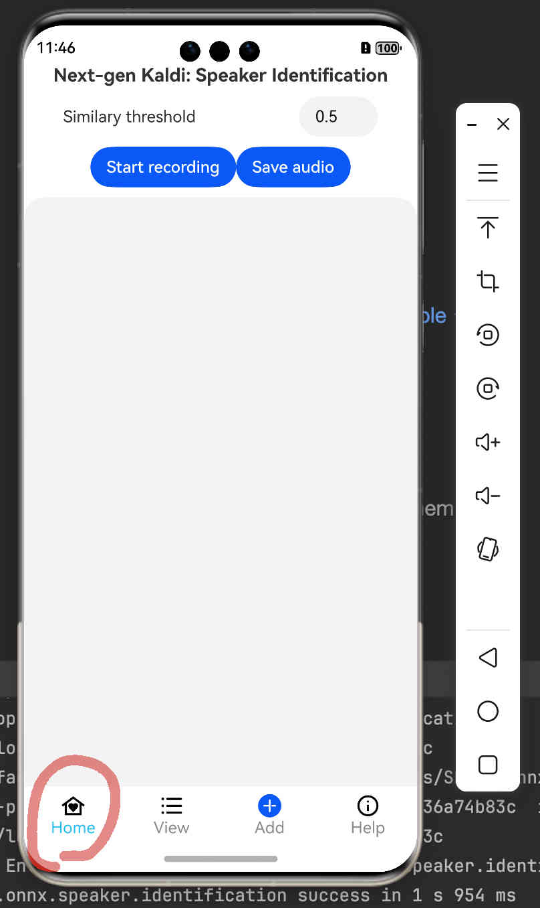

   Step 11: The home screen

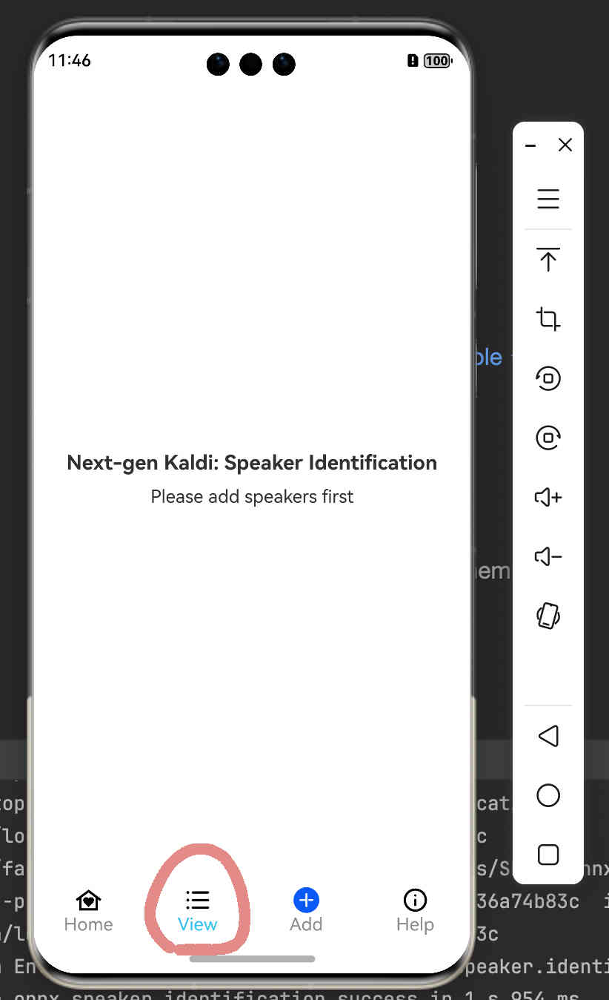

   Step 12: View and manage registered speakers

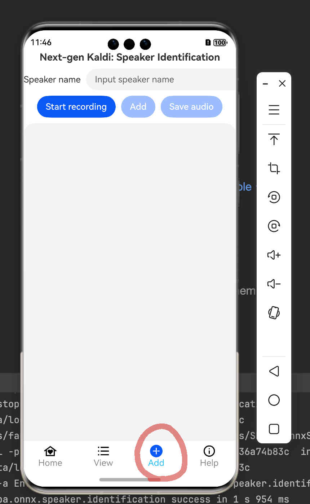

   Step 13: Add new speakers

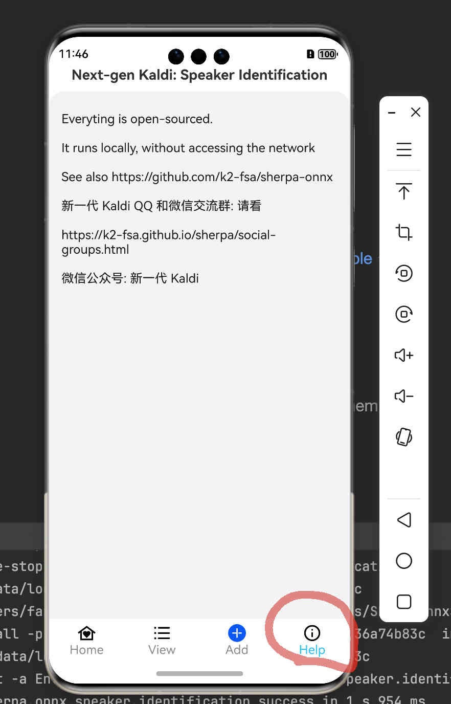

   Step 14: View help information

Congratulations!

You have successfully run a on-device speaker identification APP on HarmonyOS!
