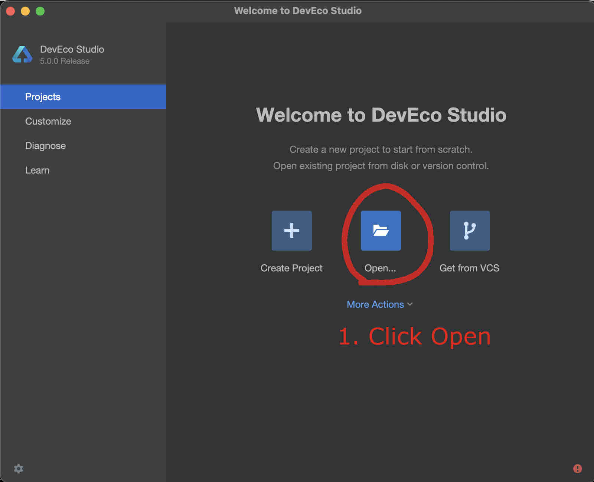
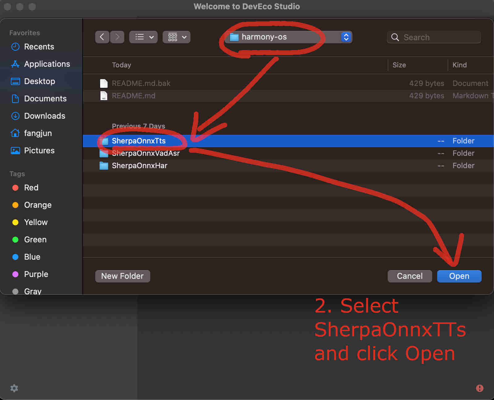
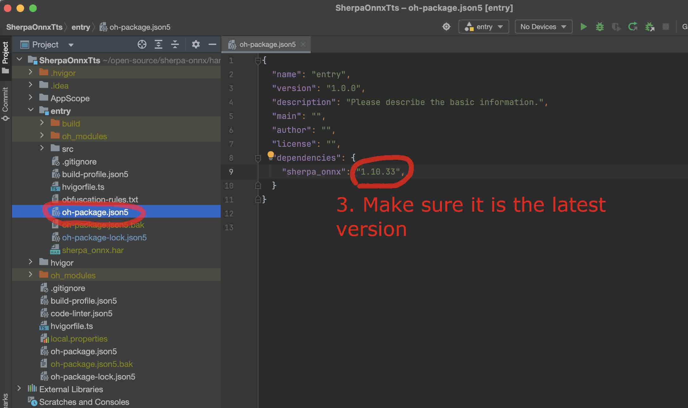
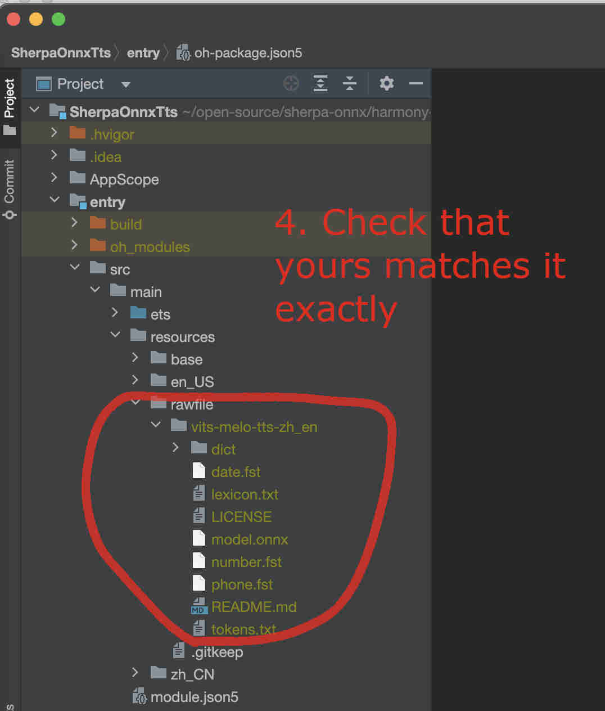
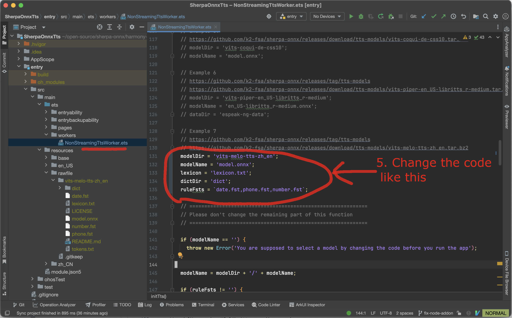
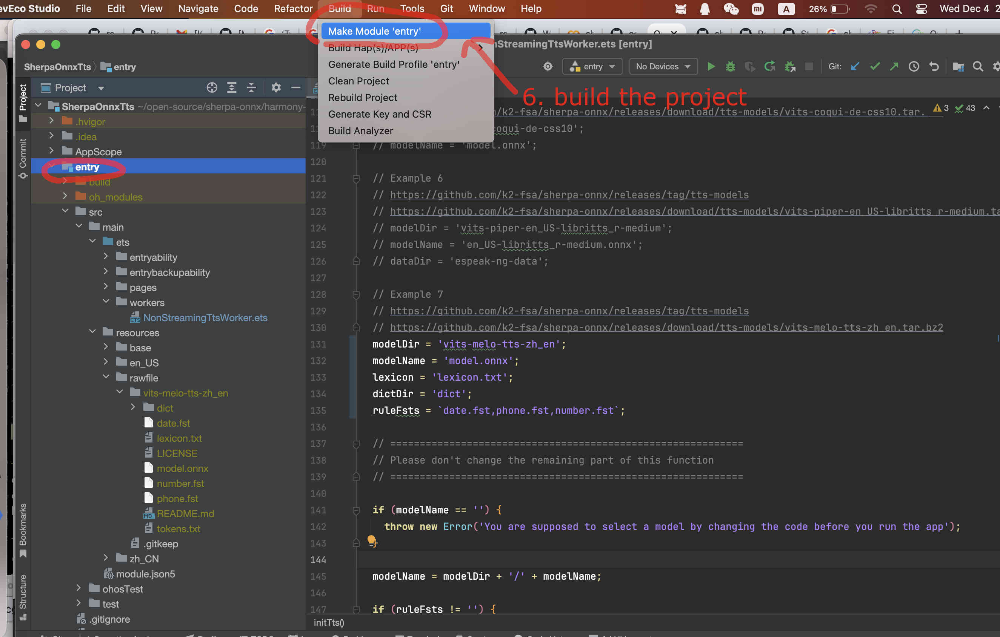
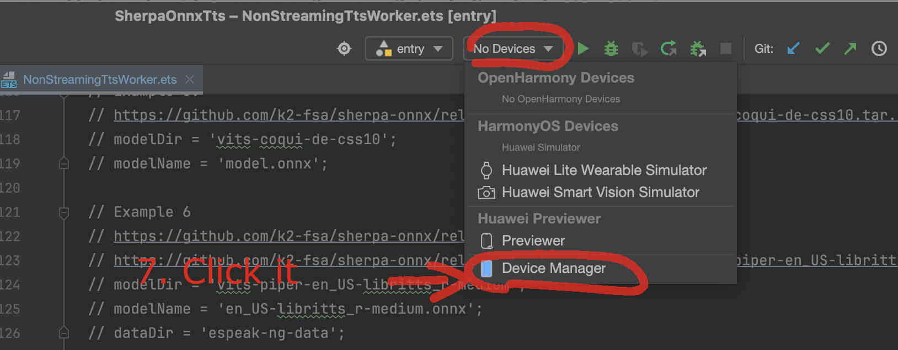
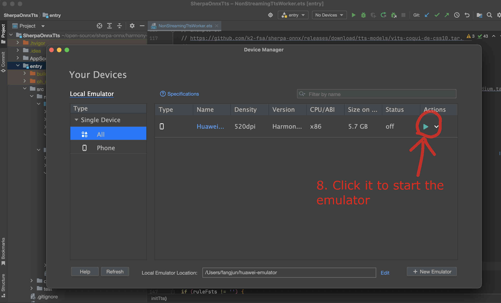
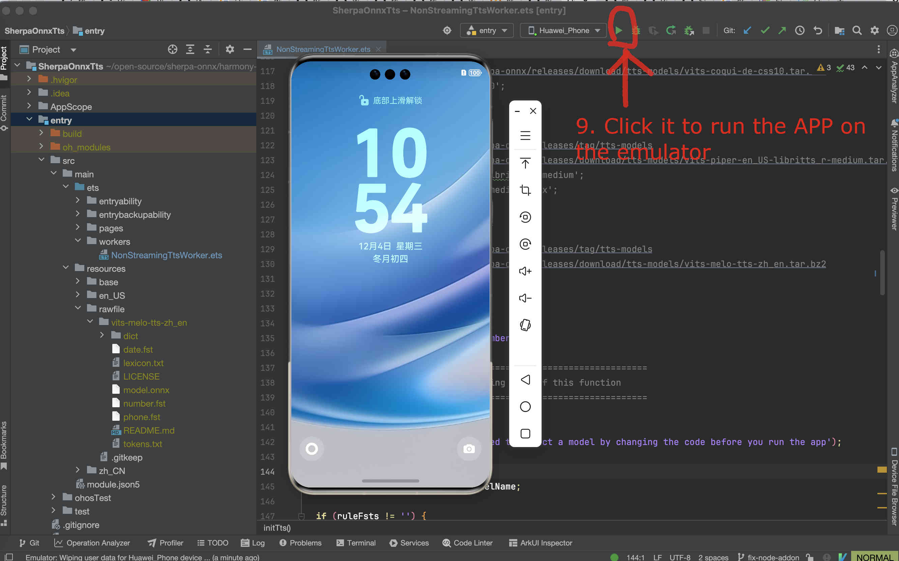
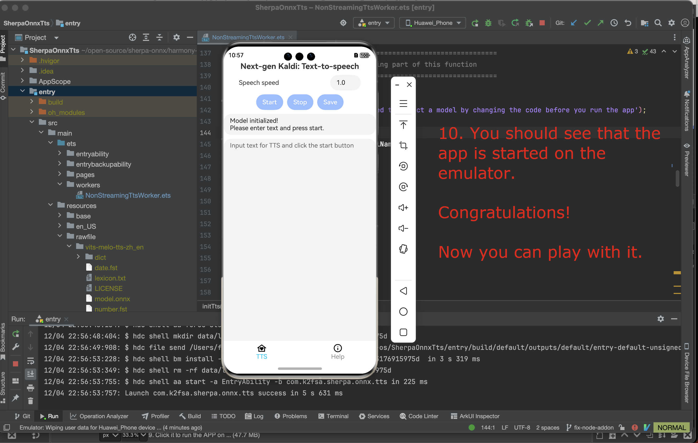

On-device text-to-speech
========================

This page describes how to build `SherpaOnnxTts <https://github.com/k2-fsa/sherpa-onnx/tree/master/harmony-os/SherpaOnnxTts>`_
for on-device text-to-speech that runs on HarmonyOS.

Open the project with DevEco Studio
-----------------------------------

You need to first download the code::

  # Assume we place it inside /Users/fangjun/open-source
  # You can place it anywhere you like.

  cd /Users/fangjun/open-source/

  git clone https://github.com/k2-fsa/sherpa-onnx

Then start DevEco Studio and follow the screenshots below:

   Step 1: Click Open

   Step 2: Select SherpaOnnxTts inside the harmony-os folder and click Open

   Step 3: Check that it is using the latest version. You can visit `sherpa_onnx <https://ohpm.openharmony.cn/#/cn/detail/sherpa_onnx>`_ to check available versions.

Select a text-to-speech model
-----------------------------

The code supports hundreds of text-to-speech models from

  `<https://github.com/k2-fsa/sherpa-onnx/releases/tag/tts-models>`

and we have modify the code to use the model that we choose.

We give two examples below.

Use vits-melo-tts-zh_en
^^^^^^^^^^^^^^^^^^^^^^^

First, we download the unzip the model.

``Caution``: The model MUST be place inside the directory `rawfile <https://github.com/k2-fsa/sherpa-onnx/tree/master/harmony-os/SherpaOnnxTts/entry/src/main/resources/rawfile>`_.

.. code-block:: bash

   cd /Users/fangjun/open-source/sherpa-onnx/harmony-os/SherpaOnnxTts/entry/src/main/resources/rawfile
   wget https://github.com/k2-fsa/sherpa-onnx/releases/download/tts-models/vits-melo-tts-zh_en.tar.bz2
   tar xvf vits-melo-tts-zh_en.tar.bz2
   rm vits-melo-tts-zh_en.tar.bz2

   # Now remove extra files to save space
   rm vits-melo-tts-zh_en/model.int8.onnx
   rm vits-melo-tts-zh_en/new_heteronym.fst

Please check that your directory looks ``exactly`` like the following:

.. code-block:: bash

  (py38) fangjuns-MacBook-Pro:rawfile fangjun$ pwd
  /Users/fangjun/open-source/sherpa-onnx/harmony-os/SherpaOnnxTts/entry/src/main/resources/rawfile
  (py38) fangjuns-MacBook-Pro:rawfile fangjun$ ls
  vits-melo-tts-zh_en
  (py38) fangjuns-MacBook-Pro:rawfile fangjun$ ls -lh vits-melo-tts-zh_en/
  total 346848
  -rw-r--r--  1 fangjun  staff   1.0K Aug  3 11:11 LICENSE
  -rw-r--r--  1 fangjun  staff   156B Aug  3 11:11 README.md
  -rw-r--r--  1 fangjun  staff    58K Aug  3 11:11 date.fst
  drwxr-xr-x  9 fangjun  staff   288B Apr 19  2024 dict
  -rw-r--r--  1 fangjun  staff   6.5M Sep 27 14:19 lexicon.txt
  -rw-r--r--  1 fangjun  staff   163M Aug  3 11:11 model.onnx
  -rw-r--r--  1 fangjun  staff    63K Aug  3 11:11 number.fst
  -rw-r--r--  1 fangjun  staff    87K Aug  3 11:11 phone.fst
  -rw-r--r--  1 fangjun  staff   655B Aug  3 11:11 tokens.txt

Now you should see the following inside DevEco Studio:

   Step 4: Check the model directory inside the ``rawfile`` directory.

Now it is time to modify the code to use our model.

We need to change `NonStreamingTtsWorker.ets <https://github.com/k2-fsa/sherpa-onnx/blob/master/harmony-os/SherpaOnnxTts/entry/src/main/ets/workers/NonStreamingTtsWorker.ets>`_.

   Step 5: Change the code to use our selected model

Finally, we can build the project. See the screenshot below:

   Step 6: Build the project

If you have an emulator, you can now start it.

   Step 7: Select the device manager

   Step 8: Start the emulator

After the emulator is started, follow the screenshot below to run the app on the
emulator:

   Step 9: Start the app on the emulator

You should see something like below:

   Step 10: The app is running on the emulator

Congratulations!

You have successfully run a on-device text-to-speech on HarmonyOS!
