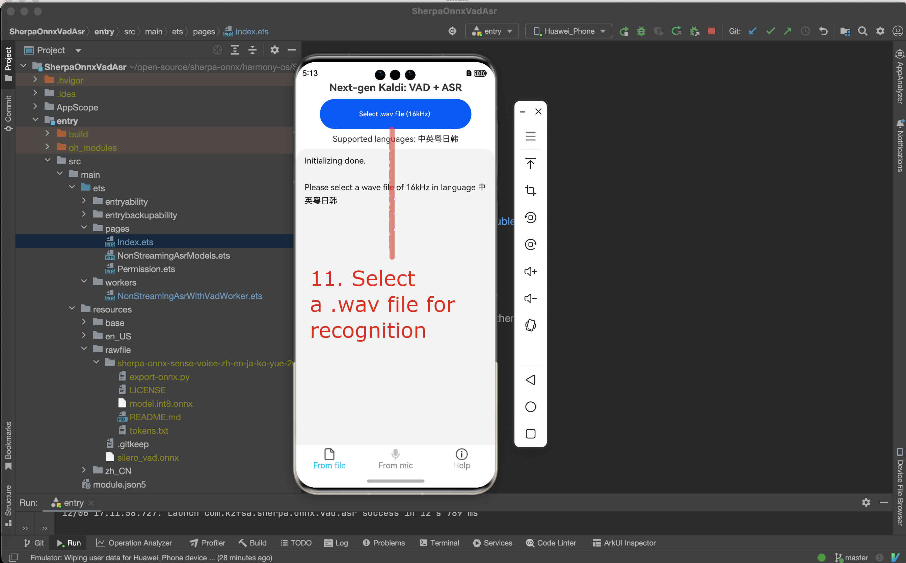

On-device VAD + ASR
===================

This page describes how to build `SherpaOnnxVadAsr <https://github.com/k2-fsa/sherpa-onnx/tree/master/harmony-os/SherpaOnnxVadAsr>`_
for on-device non-streaming speech recognition that runs on HarmonyOS.

.. hint::

   This page is for non-streaming models.

   This page is NOT for streaming models.

Open the project with DevEco Studio
-----------------------------------

You need to first download the code::

  # Assume we place it inside /Users/fangjun/open-source
  # You can place it anywhere you like.

  cd /Users/fangjun/open-source/

  git clone https://github.com/k2-fsa/sherpa-onnx

Then start DevEco Studio and follow the screenshots below:

.. figure:: ./pic/tts/1-open.jpg
   :alt: Screenshot of starting DevEco
   :width: 600

   Step 1: Click Open

.. figure:: ./pic/vad-asr/2-select-and-open.jpg
   :alt: Screenshot of selecting SherpaOnnxVadAsr to open
   :width: 600

   Step 2: Select SherpaOnnxVadAsr inside the harmony-os folder and click Open

.. figure:: ./pic/vad-asr/3-check-version.jpg
   :alt: Screenshot of check version
   :width: 600

   Step 3: Check that it is using the latest version. You can visit `sherpa_onnx <https://ohpm.openharmony.cn/#/cn/detail/sherpa_onnx>`_ to check available versions.

Download a VAD model
--------------------

The first thing we have to do is to download the VAD model and put it inside
the directory `rawfile <https://github.com/k2-fsa/sherpa-onnx/tree/master/harmony-os/SherpaOnnxVadAsr/entry/src/main/resources/rawfile>`_.

``Caution``: The model MUST be placed inside the directory `rawfile <https://github.com/k2-fsa/sherpa-onnx/tree/master/harmony-os/SherpaOnnxVadAsr/entry/src/main/resources/rawfile>`_.

.. code-block:: bash

   cd /Users/fangjun/open-source/sherpa-onnx/harmony-os/SherpaOnnxVadAsr/entry/src/main/resources/rawfile
   wget https://github.com/k2-fsa/sherpa-onnx/releases/download/asr-models/silero_vad.onnx

Select a non-streaming ASR model
--------------------------------

The code supports many non-streaming models from

  `<https://github.com/k2-fsa/sherpa-onnx/releases/tag/asr-models>`_

and we have to modify the code to use the model that we choose.

.. hint::

   You can try the above models at the following huggingface space:

    `<https://huggingface.co/spaces/k2-fsa/automatic-speech-recognition>`_

We give two examples below about how to use the following two models:

  - :ref:`sherpa-onnx-moonshine-tiny-en-int8`
  - :ref:`sherpa-onnx-sense-voice-zh-en-ja-ko-yue-2024-07-17`

Use sherpa-onnx-moonshine-tiny-en-int8
^^^^^^^^^^^^^^^^^^^^^^^^^^^^^^^^^^^^^^

First, we download and unzip the model.

``Caution``: The model MUST be placed inside the directory `rawfile <https://github.com/k2-fsa/sherpa-onnx/tree/master/harmony-os/SherpaOnnxVadAsr/entry/src/main/resources/rawfile>`_.

.. code-block:: bash

   cd /Users/fangjun/open-source/sherpa-onnx/harmony-os/SherpaOnnxVadAsr/entry/src/main/resources/rawfile
   wget https://github.com/k2-fsa/sherpa-onnx/releases/download/asr-models/sherpa-onnx-moonshine-tiny-en-int8.tar.bz2
   tar xvf sherpa-onnx-moonshine-tiny-en-int8.tar.bz2
   rm sherpa-onnx-moonshine-tiny-en-int8.tar.bz2

   # Remove unused files
   rm -rf sherpa-onnx-moonshine-tiny-en-int8/test_wavs

Please check that your directory looks ``exactly`` like the following at this point:

.. code-block::

  (py38) fangjuns-MacBook-Pro:rawfile fangjun$ pwd
  /Users/fangjun/open-source/sherpa-onnx/harmony-os/SherpaOnnxVadAsr/entry/src/main/resources/rawfile

  (py38) fangjuns-MacBook-Pro:rawfile fangjun$ ls -lh
  total 3536
  drwxr-xr-x  9 fangjun  staff   288B Dec  6 15:42 sherpa-onnx-moonshine-tiny-en-int8
  -rw-r--r--  1 fangjun  staff   1.7M Nov 28 18:13 silero_vad.onnx

  (py38) fangjuns-MacBook-Pro:rawfile fangjun$ tree .
  .
  ├── sherpa-onnx-moonshine-tiny-en-int8
  │   ├── LICENSE
  │   ├── README.md
  │   ├── cached_decode.int8.onnx
  │   ├── encode.int8.onnx
  │   ├── preprocess.onnx
  │   ├── tokens.txt
  │   └── uncached_decode.int8.onnx
  └── silero_vad.onnx

  1 directory, 8 files

Now you should see the following inside DevEco Studio:

   Step 4: Check the model directory inside the ``rawfile`` directory.

Now it is time to modify the code to use our model.

We need to change `NonStreamingAsrWithVadWorker.ets <https://github.com/k2-fsa/sherpa-onnx/blob/master/harmony-os/SherpaOnnxVadAsr/entry/src/main/ets/workers/NonStreamingAsrWithVadWorker.ets>`_.

.. figure:: ./pic/vad-asr/5-change-code-for-moonshine.jpg
   :alt: Screenshot of changing code for moonshine
   :width: 600

   Step 5: Change the code to use our selected model

Finally, we can build the project. See the screenshot below:

.. figure:: ./pic/vad-asr/6-build-moonshine.jpg
   :alt: Screenshot of changing code for moonshine
   :width: 600

   Step 6: Build the project

If you have an emulator, you can now start it.

   Step 7: Select the device manager

.. figure:: ./pic/vad-asr/8-start-emulator-for-moonshine.jpg
   :alt: Screenshot of starting the emulator
   :width: 600

   Step 8: Start the emulator

After the emulator is started, follow the screenshot below to run the app on the
emulator:

.. figure:: ./pic/vad-asr/9-start-app-emulator.jpg
   :alt: Screenshot of starting the app on the emulator
   :width: 600

   Step 9: Start the app on the emulator

You should see something like below:

.. figure:: ./pic/vad-asr/10-allow-mic-moonshine.jpg
   :alt: Screenshot of app running on the emulator
   :width: 600

   Step 10: Click Allow to allow the app accessing the microphone

.. figure:: ./pic/vad-asr/11-select-file-moonshine.jpg
   :alt: Screenshot of selecting a file for recognition
   :width: 600

   Step 11: Select a .wav file for recognition

.. figure:: ./pic/vad-asr/12-start-mic-moonshine.jpg
   :alt: Screenshot of starting the microphone
   :width: 600

   Step 12: Start the microphone to record speech for recognition

Congratulations!

You have successfully run a on-device non-streaming speech recognition APP on HarmonyOS!

Use sherpa-onnx-sense-voice-zh-en-ja-ko-yue-2024-07-17
^^^^^^^^^^^^^^^^^^^^^^^^^^^^^^^^^^^^^^^^^^^^^^^^^^^^^^

First, we download and unzip the model.

``Caution``: The model MUST be placed inside the directory `rawfile <https://github.com/k2-fsa/sherpa-onnx/tree/master/harmony-os/SherpaOnnxVadAsr/entry/src/main/resources/rawfile>`_.

.. code-block:: bash

   cd /Users/fangjun/open-source/sherpa-onnx/harmony-os/SherpaOnnxVadAsr/entry/src/main/resources/rawfile
   wget https://github.com/k2-fsa/sherpa-onnx/releases/download/asr-models/sherpa-onnx-sense-voice-zh-en-ja-ko-yue-2024-07-17.tar.bz2
   tar xvf sherpa-onnx-sense-voice-zh-en-ja-ko-yue-2024-07-17.tar.bz2
   rm sherpa-onnx-sense-voice-zh-en-ja-ko-yue-2024-07-17.tar.bz2

   # Remove unused files
   rm -rf sherpa-onnx-sense-voice-zh-en-ja-ko-yue-2024-07-17/test_wavs
   rm sherpa-onnx-sense-voice-zh-en-ja-ko-yue-2024-07-17/model.onnx

Please check that your directory looks ``exactly`` like the following at this point:

.. code-block:: bash

  (py38) fangjuns-MacBook-Pro:rawfile fangjun$ pwd
  /Users/fangjun/open-source/sherpa-onnx/harmony-os/SherpaOnnxVadAsr/entry/src/main/resources/rawfile

  (py38) fangjuns-MacBook-Pro:rawfile fangjun$ ls
  sherpa-onnx-sense-voice-zh-en-ja-ko-yue-2024-07-17 silero_vad.onnx

  (py38) fangjuns-MacBook-Pro:rawfile fangjun$ ls -lh sherpa-onnx-sense-voice-zh-en-ja-ko-yue-2024-07-17/
  total 493616
  -rw-r--r--  1 fangjun  staff    71B Jul 18 21:06 LICENSE
  -rw-r--r--  1 fangjun  staff   104B Jul 18 21:06 README.md
  -rwxr-xr-x  1 fangjun  staff   5.8K Jul 18 21:06 export-onnx.py
  -rw-r--r--  1 fangjun  staff   228M Jul 18 21:06 model.int8.onnx
  -rw-r--r--  1 fangjun  staff   308K Jul 18 21:06 tokens.txt

  (py38) fangjuns-MacBook-Pro:rawfile fangjun$ tree .
  .
  ├── sherpa-onnx-sense-voice-zh-en-ja-ko-yue-2024-07-17
  │   ├── LICENSE
  │   ├── README.md
  │   ├── export-onnx.py
  │   ├── model.int8.onnx
  │   └── tokens.txt
  └── silero_vad.onnx

  1 directory, 6 files

Now you should see the following inside DevEco Studio:

   Step 4: Check the model directory inside the ``rawfile`` directory.

Now it is time to modify the code to use our model.

We need to change `NonStreamingAsrWithVadWorker.ets <https://github.com/k2-fsa/sherpa-onnx/blob/master/harmony-os/SherpaOnnxVadAsr/entry/src/main/ets/workers/NonStreamingAsrWithVadWorker.ets>`_.

   Step 5-1: Change the code to use our selected model

   Step 5-2: Change the code to use our selected model

Finally, we can build the project. See the screenshot below:

.. figure:: ./pic/vad-asr/6-build-moonshine.jpg
   :alt: Screenshot of changing code for moonshine
   :width: 600

   Step 6: Build the project

If you have an emulator, you can now start it.

.. figure:: ./pic/vad-asr/7-select-device-manager-sense-voice.jpg
   :alt: Screenshot of selecting device manager
   :width: 600

   Step 7: Select the device manager

.. figure:: ./pic/vad-asr/8-start-emulator-for-moonshine.jpg
   :alt: Screenshot of starting the emulator
   :width: 600

   Step 8: Start the emulator

After the emulator is started, follow the screenshot below to run the app on the
emulator:

   Step 9: Start the app on the emulator

   Step 10: Click Allow to allow the app accessing the microphone

   Step 11: Select a .wav file for recognition

   Step 12: Start the microphone to record speech for recognition

Congratulations!

You have successfully run a on-device non-streaming speech recognition APP on HarmonyOS!
