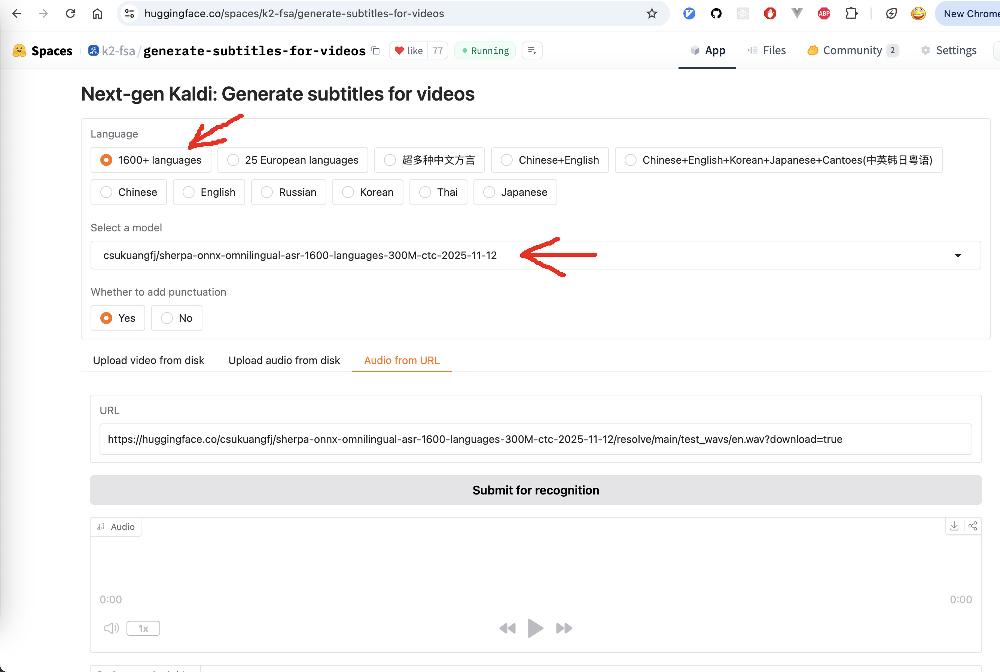

Huggingface space
=================

You can try `Omnilingual ASR`_ in `sherpa-onnx`_ with the following huggingface spaces

  - For short audio: `<https://huggingface.co/spaces/k2-fsa/automatic-speech-recognition>`_
  - For generating subtitles (support very long audio/video files): `<https://huggingface.co/spaces/k2-fsa/generate-subtitles-for-videos>`_

.. hint::

   You don't need to install anything. All you need is a browser.

   You can even run it on your phone or tablet.

.. figure:: ./pic/omni-hf.jpg
   :alt: screenshot of hf space for Omnilingual ASR
   :align: center
   :width: 600

   Try `Omnilingual ASR`_ in our Huggingface space with `sherpa-onnx`_ for short audio

   Try `Omnilingual ASR`_ in our Huggingface space with `sherpa-onnx`_ for generating subtitles
