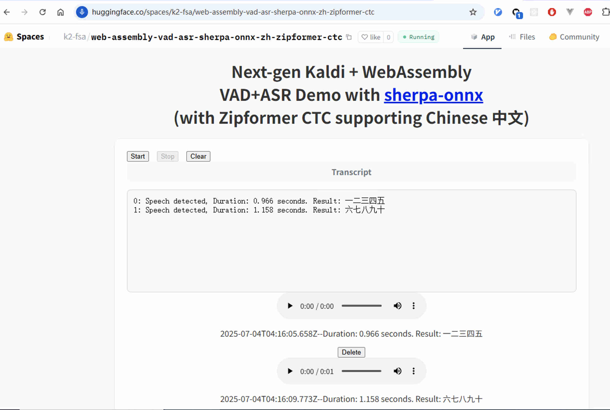
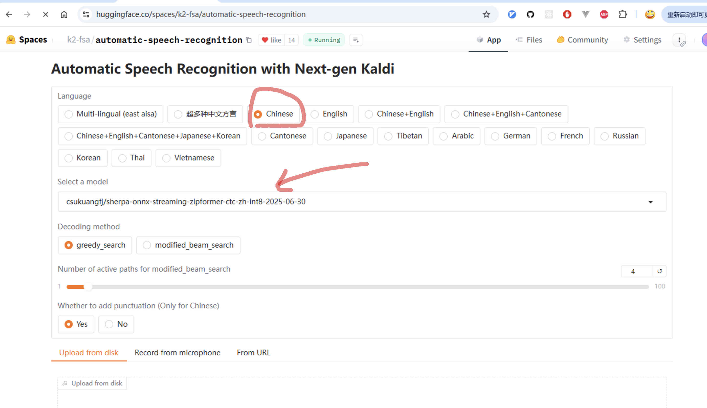

Zipformer CTC models
====================

This page lists non-streaming Zipformer CTC models from `icefall`_.

sherpa-onnx-zipformer-ctc-zh-int8-2025-07-03 (Chinese)
------------------------------------------------------------

This model supports only Chinese. Its word error rate (WER) on aishell and wenetspeech
is given below:

.. list-table::

 * -
   - aishell test
   - wenetspeech test_net
   - wenetspeech test_meeting
 * - Word error rate (%)
   - 1.74
   - 5.92
   - 7.75

In the following, we describe how to download it and use it with `sherpa-onnx`_.

Pre-built Android APK
~~~~~~~~~~~~~~~~~~~~~

.. list-table::

 * - APP
   - Download (arm64-v8a)
   - 国内镜像
   - Source code
 * - Simulated-streaming ASR
   - `URL <https://huggingface.co/csukuangfj/sherpa-onnx-apk/resolve/main/vad-asr-simulated-streaming/1.12.3/sherpa-onnx-1.12.3-arm64-v8a-simulated_streaming_asr-zh-zipformer_2025_07_03.apk>`_
   - `URL <https://hf-mirror.com/csukuangfj/sherpa-onnx-apk/blob/main/vad-asr-simulated-streaming/1.12.3/sherpa-onnx-1.12.3-arm64-v8a-simulated_streaming_asr-zh-zipformer_2025_07_03.apk>`_
   - `URL <https://github.com/k2-fsa/sherpa-onnx/tree/master/android/SherpaOnnxSimulateStreamingAsr>`_
 * - VAD + ASR
   - `URL <https://huggingface.co/csukuangfj/sherpa-onnx-apk/resolve/main/vad-asr/1.12.3/sherpa-onnx-1.12.3-arm64-v8a-vad_asr-zh-zipformer_2025_07_03.apk>`_
   - `URL <https://hf-mirror.com/csukuangfj/sherpa-onnx-apk/blob/main/vad-asr/1.12.3/sherpa-onnx-1.12.3-arm64-v8a-vad_asr-zh-zipformer_2025_07_03.apk>`_
   - `URL <https://github.com/k2-fsa/sherpa-onnx/tree/master/android/SherpaOnnxVadAsr>`_

.. hint::

   Please always download the latest version. We use ``v1.12.3`` in the above table
   as an example.

See :ref:`sherpa-onnx-android-pre-built-apks` for more Android pre-built APKs.

WebAssembly example (ASR from a microphone)
~~~~~~~~~~~~~~~~~~~~~~~~~~~~~~~~~~~~~~~~~~~

.. list-table::

 * -
   - URL
 * - Huggingface space
   - `<https://huggingface.co/spaces/k2-fsa/web-assembly-vad-asr-sherpa-onnx-zh-zipformer-ctc>`_
 * - 国内镜像
   - `<https://hf.qhduan.com/spaces/k2-fsa/web-assembly-vad-asr-sherpa-onnx-zh-zipformer-ctc>`_
 * - ModelScope space
   - `<https://modelscope.cn/studios/csukuangfj/web-assembly-vad-asr-sherpa-onnx-zh-zipformer-ctc/summary>`_

.. hint::

   Source code for the WebAssembly example can be found at

    `<https://github.com/k2-fsa/sherpa-onnx/tree/master/wasm/vad-asr>`_

Huggingface space (Decode a file)
~~~~~~~~~~~~~~~~~~~~~~~~~~~~~~~~~~

.. list-table::

 * -
   - URL
 * - Huggingface space
   - `<https://huggingface.co/spaces/k2-fsa/automatic-speech-recognition>`_
 * - 国内镜像
   - `<https://hf.qhduan.com/spaces/k2-fsa/automatic-speech-recognition>`_

Download the model
~~~~~~~~~~~~~~~~~~

Please use the following commands to download it.

.. code-block:: bash

  cd /path/to/sherpa-onnx

  wget https://github.com/k2-fsa/sherpa-onnx/releases/download/asr-models/sherpa-onnx-zipformer-ctc-zh-int8-2025-07-03.tar.bz2

  tar xvf sherpa-onnx-zipformer-ctc-zh-int8-2025-07-03.tar.bz2
  rm sherpa-onnx-zipformer-ctc-zh-int8-2025-07-03.tar.bz2

  ls -lh sherpa-onnx-zipformer-ctc-zh-int8-2025-07-03

Please check that the file sizes of the pre-trained models are correct. See
the sizes of each file below.

.. code-block::

  total 722384
  -rw-r--r--  1 fangjun  staff   176B Jul  3 14:36 README.md
  -rw-r--r--  1 fangjun  staff   249K Jul  3 14:36 bbpe.model
  -rw-r--r--  1 fangjun  staff   350M Jul  3 14:36 model.int8.onnx
  drwxr-xr-x  5 fangjun  staff   160B Jul  3 14:36 test_wavs
  -rw-r--r--  1 fangjun  staff    13K Jul  3 14:36 tokens.txt

.. note::

   There are also ``fp16`` and ``float32`` models.

    .. list-table::

     * -
       - Download address
       - Comment
     * - ``fp16``
       - `URL <https://github.com/k2-fsa/sherpa-onnx/releases/download/asr-models/sherpa-onnx-zipformer-ctc-zh-fp16-2025-07-03.tar.bz2>`_
       - ``float16`` quantized. Suitable for GPU.
     * - ``float32``
       - `URL <https://github.com/k2-fsa/sherpa-onnx/releases/download/asr-models/sherpa-onnx-zipformer-ctc-zh-2025-07-03.tar.bz2>`_
       - Not quantized.

Decode wave files
~~~~~~~~~~~~~~~~~

.. hint::

   It supports decoding only wave files of a single channel with 16-bit
   encoded samples, while the sampling rate does not need to be 16 kHz.

The following code shows how to use the ``int8`` model to decode wave files.

.. code-block:: bash

  cd /path/to/sherpa-onnx

  ./build/bin/sherpa-onnx-offline \
    --zipformer-ctc-model=./sherpa-onnx-zipformer-ctc-zh-int8-2025-07-03/model.int8.onnx \
    --tokens=./sherpa-onnx-zipformer-ctc-zh-int8-2025-07-03/tokens.txt \
    sherpa-onnx-zipformer-ctc-zh-int8-2025-07-03/test_wavs/0.wav

.. note::

   Please use ``./build/bin/Release/sherpa-onnx-offline.exe`` for Windows.

.. caution::

   If you use Windows and get encoding issues, please run:

      .. code-block:: bash

          CHCP 65001

   in your commandline.

You should see the following output:

.. literalinclude:: ./code-zipformer/2025-07-03-int8.txt

Speech recognition from a microphone
~~~~~~~~~~~~~~~~~~~~~~~~~~~~~~~~~~~~

.. code-block:: bash

  cd /path/to/sherpa-onnx

  ./build/bin/sherpa-onnx-microphone-offline \
    --zipformer-ctc-model=./sherpa-onnx-zipformer-ctc-zh-int8-2025-07-03/model.int8.onnx \
    --tokens=./sherpa-onnx-zipformer-ctc-zh-int8-2025-07-03/tokens.txt

Speech recognition from a microphone with VAD
~~~~~~~~~~~~~~~~~~~~~~~~~~~~~~~~~~~~~~~~~~~~~

.. code-block:: bash

  cd /path/to/sherpa-onnx

  wget https://github.com/k2-fsa/sherpa-onnx/releases/download/asr-models/silero_vad.onnx

  ./build/bin/sherpa-onnx-vad-microphone-offline-asr \
    --silero-vad-model=./silero_vad.onnx \
    --zipformer-ctc-model=./sherpa-onnx-zipformer-ctc-zh-int8-2025-07-03/model.int8.onnx \
    --tokens=./sherpa-onnx-zipformer-ctc-zh-int8-2025-07-03/tokens.txt
