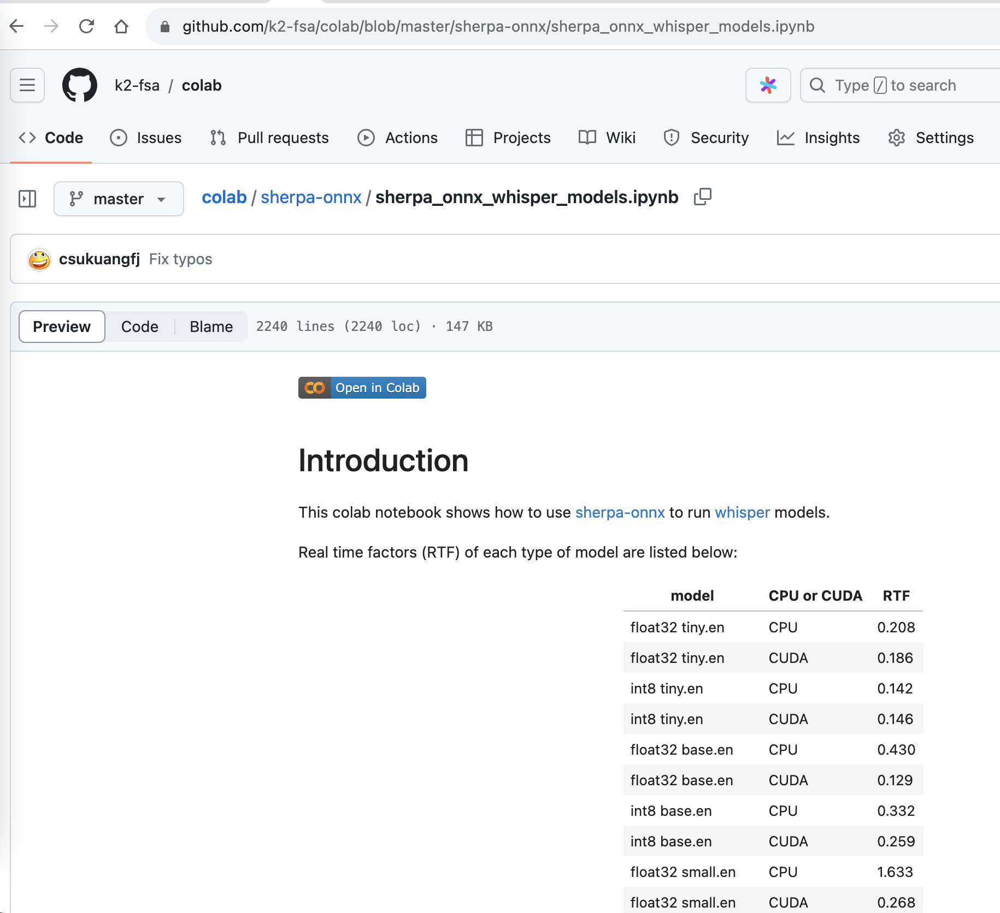

colab
=====

Non-large models
-----------------

We provide a colab notebook
|Sherpa-onnx offline recognition with whisper python api colab notebook|
for you to try `Whisper`_ models with `sherpa-onnx`_ step by step.

.. |Sherpa-onnx offline recognition with whisper python api colab notebook| image:: https://colab.research.google.com/assets/colab-badge.svg
   :target: https://github.com/k2-fsa/colab/blob/master/sherpa-onnx/sherpa_onnx_whisper_models.ipynb

Large models
------------

For ``large`` models of whisper, please see the following colab notebook
|sherpa-onnx with whisper large-v3 colab notebook|.
It walks you step by step to try the exported large-v3 onnx model with `sherpa-onnx`_
on CPU as well as on GPU.

You will find the RTF on GPU (Tesla T4) is less than 1.

.. |sherpa-onnx with whisper large-v3 colab notebook| image:: https://colab.research.google.com/assets/colab-badge.svg
   :target: https://github.com/k2-fsa/colab/blob/master/sherpa-onnx/sherpa_onnx_whisper_large_v3.ipynb

