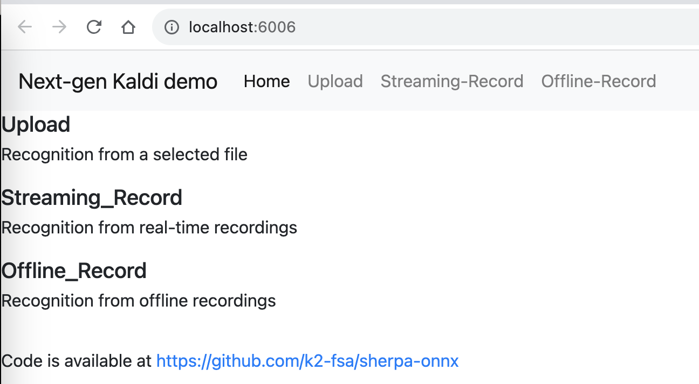
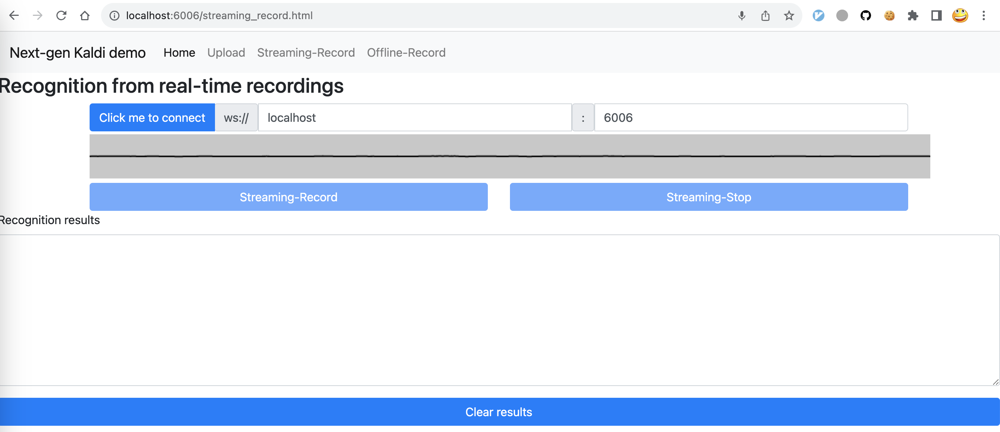

Streaming WebSocket Server
==========================

This section describes how to use the Python streaming WebSocket server
of `sherpa-onnx`_ for speech recognition.

.. hint::

    The server supports multiple clients connecting at the same time.

The code for the streaming server can be found at

  `<https://github.com/k2-fsa/sherpa-onnx/blob/master/python-api-examples/streaming_server.py>`_

Start the server
----------------

.. hint::

   If you don't use a `X.509 <https://en.wikipedia.org/wiki/X.509>`_ certificate,
   due to security reasons imposed by the browser, you are only allowed to
   use the domain ``localhost`` to access the server if you want to access the
   microphone in the browser. That is, you can only use

    `<http://localhost:port>`_

  to access the server. You cannot use `<http://0.0.0.0:port>`_, or
  `<http://127.0.0.1:port>`_, or `<http://public_ip:port>`_.

  You can use the following command to generate a self-signed certificate:

    .. code-block:: bash

       cd python-api-examples/web
       ./generate-certificate.py

  The above commands will generate 3 files. You only need to use the file
  ``cert.pem``. When starting the server, you pass the following argument:

      .. code-block:: bash

          --certificate=./python-api-examples/web/cert.pem

Please refer to :ref:`sherpa-onnx-pre-trained-models` to download a streaming model
before you continue.

We will use :ref:`sherpa-onnx-streaming-zipformer-en-2023-06-26-english` as an example.

First, let us download it:

.. code-block:: bash

  cd /path/to/sherpa-onnx/

  GIT_LFS_SKIP_SMUDGE=1 git clone https://huggingface.co/csukuangfj/sherpa-onnx-streaming-zipformer-en-2023-06-26
  cd sherpa-onnx-streaming-zipformer-en-2023-06-26
  git lfs pull --include "*.onnx"
  cd ..

Now we can use:

.. code-block:: bash

  cd /path/to/sherpa-onnx/

   python3 ./python-api-examples/streaming_server.py \
    --encoder ./sherpa-onnx-streaming-zipformer-en-2023-06-26/encoder-epoch-99-avg-1-chunk-16-left-128.onnx \
    --decoder ./sherpa-onnx-streaming-zipformer-en-2023-06-26/decoder-epoch-99-avg-1-chunk-16-left-128.onnx \
    --joiner ./sherpa-onnx-streaming-zipformer-en-2023-06-26/joiner-epoch-99-avg-1-chunk-16-left-128.onnx \
    --tokens ./sherpa-onnx-streaming-zipformer-en-2023-06-26/tokens.txt \
    --port 6006

It will print the following logs:

.. code-block:: bash

    2023-08-11 16:29:51,522 INFO [streaming_server.py:678] {'encoder': './sherpa-onnx-streaming-zipformer-en-2023-06-26/encoder-epoch-99-avg-1-chunk-16-left-128.onnx', 'decoder': './sherpa-onnx-streaming-zipformer-en-2023-06-26/decoder-epoch-99-avg-1-chunk-16-left-128.onnx', 'joiner': './sherpa-onnx-streaming-zipformer-en-2023-06-26/joiner-epoch-99-avg-1-chunk-16-left-128.onnx', 'tokens': './sherpa-onnx-streaming-zipformer-en-2023-06-26/tokens.txt', 'sample_rate': 16000, 'feat_dim': 80, 'provider': 'cpu', 'decoding_method': 'greedy_search', 'num_active_paths': 4, 'use_endpoint': 1, 'rule1_min_trailing_silence': 2.4, 'rule2_min_trailing_silence': 1.2, 'rule3_min_utterance_length': 20, 'port': 6006, 'nn_pool_size': 1, 'max_batch_size': 50, 'max_wait_ms': 10, 'max_message_size': 1048576, 'max_queue_size': 32, 'max_active_connections': 500, 'num_threads': 2, 'certificate': None, 'doc_root': './python-api-examples/web'}
    2023-08-11 16:29:57,476 INFO [streaming_server.py:520] No certificate provided
    2023-08-11 16:29:57,480 INFO [server.py:707] server listening on 0.0.0.0:6006
    2023-08-11 16:29:57,480 INFO [server.py:707] server listening on [::]:6006
    2023-08-11 16:29:57,480 INFO [streaming_server.py:546] Please visit one of the following addresses:

      http://localhost:6006

    Since you are not providing a certificate, you cannot use your microphone from within the browser using public IP addresses. Only localhost can be used.You also cannot use 0.0.0.0 or 127.0.0.1

We can use the following two methods to interact with the server:

  - Use Python API
  - Use a browser by accessing `<http://localhost:6006>`_

We describe each method below in details.

Use Python API
^^^^^^^^^^^^^^

We provide two Python example files:

.. list-table::

 * - Description
   - URL
 * - Send a file for decoding
   - `<https://github.com/k2-fsa/sherpa-onnx/blob/master/python-api-examples/online-websocket-client-decode-file.py>`_
 * - Send audio samples from a microphone for decoding
   - `<https://github.com/k2-fsa/sherpa-onnx/blob/master/python-api-examples/speech-recognition-from-microphone.py>`_

Send a file for decoding
::::::::::::::::::::::::

.. hint::

   The example file supports only ``*.wav`` files with a single channel
   and the each sample should be of type ``int16_t``. The sample rate
   does not need to be 16000 Hz, e.g., it can be 48000 Hz, 8000 Hz or some
   other value.

We use the following command to send a file for decoding:

.. code-block::

   cd /path/to/sherpa-onnx

   python3 ./python-api-examples/online-websocket-client-decode-file.py \
     --server-addr localhost \
     --server-port 6006 \
     ./sherpa-onnx-streaming-zipformer-en-2023-06-26/test_wavs/0.wav

It should give the following output:

.. code-block:: bash

    2023-08-11 16:37:03,877 INFO [online-websocket-client-decode-file.py:133] Sending ./sherpa-onnx-streaming-zipformer-en-2023-06-26/test_wavs/0.wav
    2023-08-11 16:37:03,931 INFO [online-websocket-client-decode-file.py:115] {"text": "", "segment": 0}
    2023-08-11 16:37:04,012 INFO [online-websocket-client-decode-file.py:115] {"text": "", "segment": 0}
    2023-08-11 16:37:04,128 INFO [online-websocket-client-decode-file.py:115] {"text": "AFTER", "segment": 0}
    2023-08-11 16:37:04,170 INFO [online-websocket-client-decode-file.py:115] {"text": "AFTER EARLY", "segment": 0}
    2023-08-11 16:37:04,228 INFO [online-websocket-client-decode-file.py:115] {"text": "AFTER EARLY", "segment": 0}
    2023-08-11 16:37:04,331 INFO [online-websocket-client-decode-file.py:115] {"text": "AFTER EARLY NIGHTFA", "segment": 0}
    2023-08-11 16:37:04,373 INFO [online-websocket-client-decode-file.py:115] {"text": "AFTER EARLY NIGHTFALL THE", "segment": 0}
    2023-08-11 16:37:04,433 INFO [online-websocket-client-decode-file.py:115] {"text": "AFTER EARLY NIGHTFALL THE YELLOW LA", "segment": 0}
    2023-08-11 16:37:04,535 INFO [online-websocket-client-decode-file.py:115] {"text": "AFTER EARLY NIGHTFALL THE YELLOW LAMPS", "segment": 0}
    2023-08-11 16:37:04,576 INFO [online-websocket-client-decode-file.py:115] {"text": "AFTER EARLY NIGHTFALL THE YELLOW LAMPS WOULD LIGHT", "segment": 0}
    2023-08-11 16:37:04,645 INFO [online-websocket-client-decode-file.py:115] {"text": "AFTER EARLY NIGHTFALL THE YELLOW LAMPS WOULD LIGHT UP", "segment": 0}
    2023-08-11 16:37:04,685 INFO [online-websocket-client-decode-file.py:115] {"text": "AFTER EARLY NIGHTFALL THE YELLOW LAMPS WOULD LIGHT UP HERE", "segment": 0}
    2023-08-11 16:37:04,755 INFO [online-websocket-client-decode-file.py:115] {"text": "AFTER EARLY NIGHTFALL THE YELLOW LAMPS WOULD LIGHT UP HERE AND THERE", "segment": 0}
    2023-08-11 16:37:04,847 INFO [online-websocket-client-decode-file.py:115] {"text": "AFTER EARLY NIGHTFALL THE YELLOW LAMPS WOULD LIGHT UP HERE AND THERE", "segment": 0}
    2023-08-11 16:37:04,887 INFO [online-websocket-client-decode-file.py:115] {"text": "AFTER EARLY NIGHTFALL THE YELLOW LAMPS WOULD LIGHT UP HERE AND THERE THE SQUA", "segment": 0}
    2023-08-11 16:37:04,958 INFO [online-websocket-client-decode-file.py:115] {"text": "AFTER EARLY NIGHTFALL THE YELLOW LAMPS WOULD LIGHT UP HERE AND THERE THE SQUALID", "segment": 0}
    2023-08-11 16:37:05,057 INFO [online-websocket-client-decode-file.py:115] {"text": "AFTER EARLY NIGHTFALL THE YELLOW LAMPS WOULD LIGHT UP HERE AND THERE THE SQUALID QUAR", "segment": 0}
    2023-08-11 16:37:05,095 INFO [online-websocket-client-decode-file.py:115] {"text": "AFTER EARLY NIGHTFALL THE YELLOW LAMPS WOULD LIGHT UP HERE AND THERE THE SQUALID QUARTER OF", "segment": 0}
    2023-08-11 16:37:05,164 INFO [online-websocket-client-decode-file.py:115] {"text": "AFTER EARLY NIGHTFALL THE YELLOW LAMPS WOULD LIGHT UP HERE AND THERE THE SQUALID QUARTER OF THE BRO", "segment": 0}
    2023-08-11 16:37:05,268 INFO [online-websocket-client-decode-file.py:115] {"text": "AFTER EARLY NIGHTFALL THE YELLOW LAMPS WOULD LIGHT UP HERE AND THERE THE SQUALID QUARTER OF THE BROTHEL", "segment": 0}
    2023-08-11 16:37:05,369 INFO [online-websocket-client-decode-file.py:115] {"text": "AFTER EARLY NIGHTFALL THE YELLOW LAMPS WOULD LIGHT UP HERE AND THERE THE SQUALID QUARTER OF THE BROTHELS", "segment": 0}
    2023-08-11 16:37:05,370 INFO [online-websocket-client-decode-file.py:154]
    Final result is:
    {"text": "AFTER EARLY NIGHTFALL THE YELLOW LAMPS WOULD LIGHT UP HERE AND THERE THE SQUALID QUARTER OF THE BROTHELS", "segment": 0}

Send audio samples from a microphone for decoding
:::::::::::::::::::::::::::::::::::::::::::::::::

We use the following command to run the script:

.. code-block::

   cd /path/to/sherpa-onnx

   python3 ./python-api-examples/online-websocket-client-microphone.py \
     --server-addr localhost \
     --server-port 6006

It should give you the following output:

.. code-block:: bash

  {'server_addr': 'localhost', 'server_port': 6006}
  Started! Please Speak
    0 Background Music, Core Audio (2 in, 2 out)
    1 Background Music (UI Sounds), Core Audio (2 in, 2 out)
  > 2 MacBook Pro Microphone, Core Audio (1 in, 0 out)
  < 3 MacBook Pro Speakers, Core Audio (0 in, 2 out)
    4 WeMeet Audio Device, Core Audio (2 in, 2 out)
  Use default device: MacBook Pro Microphone

  Started! Please speak

If you speak, you will see the recognition result returned by the server.

Use a browser
^^^^^^^^^^^^^

Start your browser and visit the following address:

  `<http://localhost:6006/>`_

You should see a page like below:

Click ``Streaming-Record`` and you will see the following page:

Click the button ``Click me to connect`` to connect to the server and then
you can click  the ``Streaming-Record`` button to start recording. You should
see the decoded results as you speak.

colab
-----

We provide a colab notebook
|Sherpa-onnx python streaming websocket example colab notebook|
for you to try the Python streaming websocket server example of `sherpa-onnx`_.

.. |Sherpa-onnx python streaming websocket example colab notebook| image:: https://colab.research.google.com/assets/colab-badge.svg
   :target: https://github.com/k2-fsa/colab/blob/master/sherpa-onnx/sherpa_onnx_python_streaming_websocket_server.ipynb
