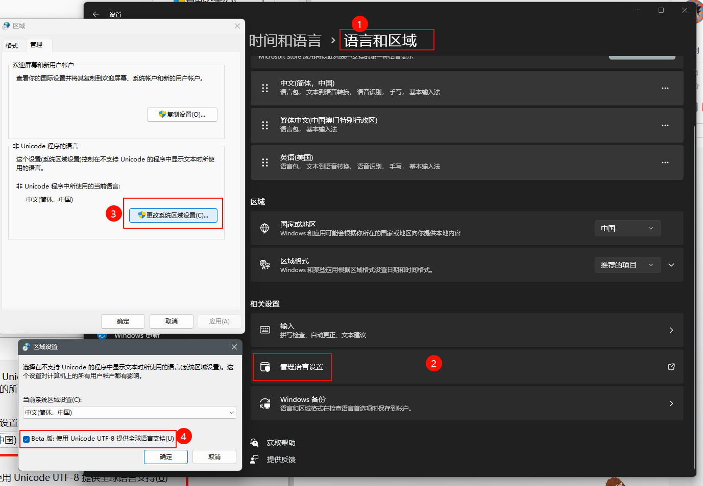

.. _tts_faqs:

Frequently Asked Question (FAQs)
================================

Is there a colab notebook
-------------------------

Yes, we have one. Please see

  `<https://github.com/k2-fsa/colab/blob/master/sherpa-onnx/Text_to_speech_with_sherpa_onnx.ipynb>`_

It shows you

 - How to install `sherpa-onnx`_
 - How to download pre-trained text-to-speech (TTS) models
 - How to use `sherpa-onnx`_ with pre-trained models for TTS

.. _how_to_enable_utf8_on_windows:

How to enable UTF-8 on Windows
------------------------------

For Chinese Users: 如果英文模型正常，中文模型不正常。请看下面的解决方法
和这个 `issue <https://github.com/k2-fsa/sherpa-onnx/issues/468>`_

Please see `win11 下永久设置cmd编码为utf-8 <https://blog.csdn.net/Demonwolfe/article/details/127227808>`_

How to install sherpa-onnx for TTS
----------------------------------

For Python users
^^^^^^^^^^^^^^^^

The fastest way to install `sherpa-onnx`_ for TTS is:

.. code-block:: bash

   pip install sherpa-onnx

The above command does ``NOT`` require you to install a C++ compiler and it
supports a variety of platforms, such as:

  - Linux

    - x64
    - arm, e.g., 32-bit Raspberry Pi
    - arm64, e.g., 64-bit Raspberry Pi

  - Windows

    - x64, e.g., 64-bit Windows
    - x86, e.g., 32-bit Windows

  - macOS

    - x64
    - arm64, e.g., M1 and M2 chips

If you want to build the `sherpa-onnx`_ Python package from source, please
refer to :ref:`install_sherpa_onnx_python`.

After installation, please refer to
`<https://github.com/k2-fsa/sherpa-onnx/blob/master/python-api-examples/offline-tts.py>`_
for example usage.

.. hint::

   ``pip install sherpa-onnx`` also installs an executable ``sherpa-onnx-offline-tts``.
   The directory where it is installed should be already on your ``PATH`` after you
   activate your Python virtual environment.

   You can run

      .. code-block:: bash

        sherpa-onnx-offline-tts --help

   in your terminal to get the help information about it.

Build from source
^^^^^^^^^^^^^^^^^

Please refer to :ref:`install_sherpa_onnx`.

Where to get pre-trained TTS models
-----------------------------------

Please refer to :ref:`onnx-tts-pretrained-models`.

How to handle OOVs
------------------

Please add them to ``lexicon.txt``.
