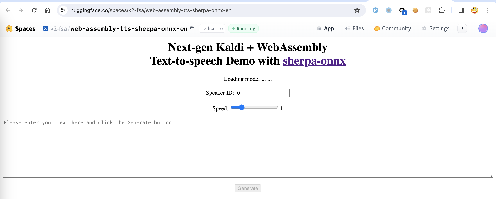
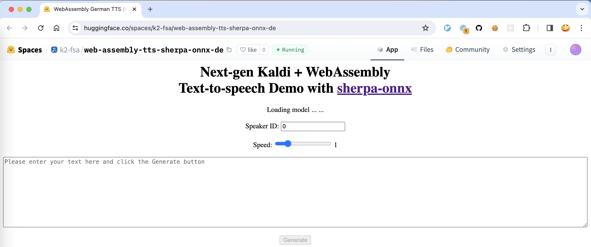

.. _try sherpa onnx wasm with huggingface:

Huggingface Spaces (WebAssembly)
================================

We provide two `Huggingface`_ spaces so that you can try text-to-speech
with `WebAssembly`_ in your browser.

English TTS
-----------

`<https://huggingface.co/spaces/k2-fsa/web-assembly-tts-sherpa-onnx-en>`_

.. hint::

   If you don't have access to `Huggingface`_, please visit the following mirror:

    `<https://modelscope.cn/studios/k2-fsa/web-assembly-tts-sherpa-onnx-en/summary>`_

.. note::

   The script for building this space can be found at
   `<https://github.com/k2-fsa/sherpa-onnx/blob/master/.github/workflows/wasm-simd-hf-space-en-tts.yaml>`_

German TTS
----------

`<https://huggingface.co/spaces/k2-fsa/web-assembly-tts-sherpa-onnx-de>`_

.. hint::

   If you don't have access to `Huggingface`_, please visit the following mirror:

    `<https://modelscope.cn/studios/k2-fsa/web-assembly-tts-sherpa-onnx-de/summary>`_

.. note::

   The script for building this space can be found at
   `<https://github.com/k2-fsa/sherpa-onnx/blob/master/.github/workflows/wasm-simd-hf-space-de-tts.yaml>`_
