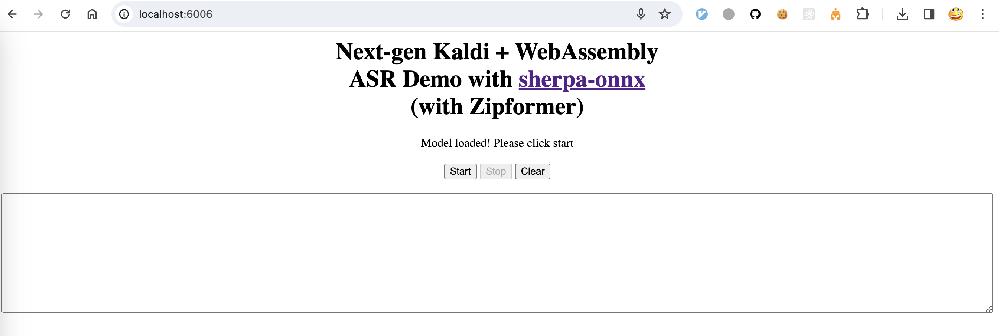
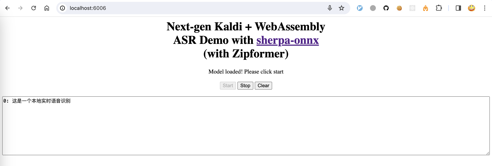

Build
=====

After installing `emscripten`_, we can build `sherpa-onnx`_ for `WebAssembly`_ now.

Please use the following command to build it:

.. code-block:: bash

  git clone https://github.com/k2-fsa/sherpa-onnx
  cd sherpa-onnx

  cd wasm/asr/assets

  wget -q https://github.com/k2-fsa/sherpa-onnx/releases/download/asr-models/sherpa-onnx-streaming-zipformer-bilingual-zh-en-2023-02-20.tar.bz2
  tar xvf sherpa-onnx-streaming-zipformer-bilingual-zh-en-2023-02-20.tar.bz2
  rm sherpa-onnx-streaming-zipformer-bilingual-zh-en-2023-02-20.tar.bz2

  # Note it is not an error that we rename encoder.int8.onnx to encoder.onnx

  mv sherpa-onnx-streaming-zipformer-bilingual-zh-en-2023-02-20/encoder-epoch-99-avg-1.int8.onnx encoder.onnx
  mv sherpa-onnx-streaming-zipformer-bilingual-zh-en-2023-02-20/decoder-epoch-99-avg-1.onnx decoder.onnx
  mv sherpa-onnx-streaming-zipformer-bilingual-zh-en-2023-02-20/joiner-epoch-99-avg-1.int8.onnx joiner.onnx
  mv sherpa-onnx-streaming-zipformer-bilingual-zh-en-2023-02-20/tokens.txt ./
  rm -rf sherpa-onnx-streaming-zipformer-bilingual-zh-en-2023-02-20/

  cd ../../..

  ./build-wasm-simd-asr.sh

.. hint::

   You can visit `<https://github.com/k2-fsa/sherpa-onnx/releases/tag/asr-models>`_
   to download a different model.

   If you want to use a streaming Paraformer model, please see
   `<https://github.com/k2-fsa/sherpa-onnx/blob/master/wasm/asr/assets/README.md#paraformer>`_

After building, you should see the following output:

.. code-block:: bash

  Install the project...
  -- Install configuration: "Release"
  -- Installing: /Users/fangjun/open-source/sherpa-onnx/build-wasm-simd-asr/install/bin/wasm/asr/sherpa-onnx-wasm-asr-main.js
  -- Up-to-date: /Users/fangjun/open-source/sherpa-onnx/build-wasm-simd-asr/install/bin/wasm/asr/sherpa-onnx-wasm-asr-main.js
  -- Installing: /Users/fangjun/open-source/sherpa-onnx/build-wasm-simd-asr/install/bin/wasm/asr/index.html
  -- Installing: /Users/fangjun/open-source/sherpa-onnx/build-wasm-simd-asr/install/bin/wasm/asr/sherpa-onnx.js
  -- Installing: /Users/fangjun/open-source/sherpa-onnx/build-wasm-simd-asr/install/bin/wasm/asr/app.js
  -- Installing: /Users/fangjun/open-source/sherpa-onnx/build-wasm-simd-asr/install/bin/wasm/asr/sherpa-onnx-wasm-asr-main.wasm
  -- Installing: /Users/fangjun/open-source/sherpa-onnx/build-wasm-simd-asr/install/bin/wasm/asr/sherpa-onnx-wasm-asr-main.data
  + ls -lh install/bin/wasm/asr
  total 440080
  -rw-r--r--  1 fangjun  staff   9.0K Feb 23 17:39 app.js
  -rw-r--r--  1 fangjun  staff   978B Feb 23 17:39 index.html
  -rw-r--r--  1 fangjun  staff   199M Feb 23 18:34 sherpa-onnx-wasm-asr-main.data
  -rw-r--r--  1 fangjun  staff    90K Feb 23 18:38 sherpa-onnx-wasm-asr-main.js
  -rw-r--r--  1 fangjun  staff    10M Feb 23 18:38 sherpa-onnx-wasm-asr-main.wasm
  -rw-r--r--  1 fangjun  staff   9.1K Feb 23 17:39 sherpa-onnx.js

Now you can use the following command to run it:

.. code-block:: bash

  cd build-wasm-simd-asr/install/bin/wasm/asr
  python3 -m http.server 6006

Start your browser and visit `<http://localhost:6006/>`_; you should see the following
page:

Now click start and speak! You should see the recognition results in the text box.

.. warning::

   We are using a bilingual model (Chinese + English) in the above example, which means
   you can only speak Chinese or English in this case.

A screenshot is given below:

Congratulations! You have successfully run real-time speech recognition with `WebAssembly`_
in your browser.
