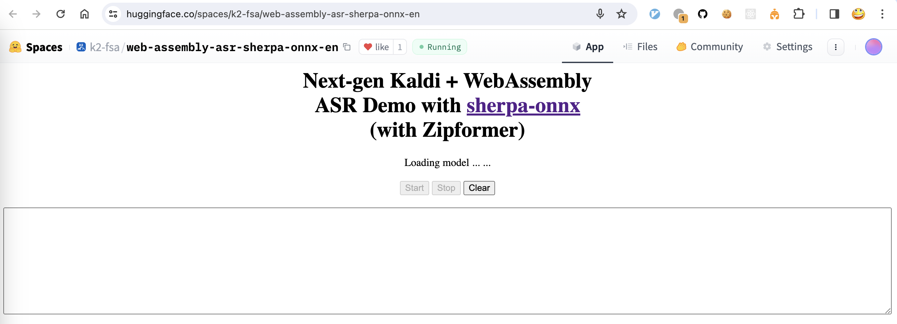
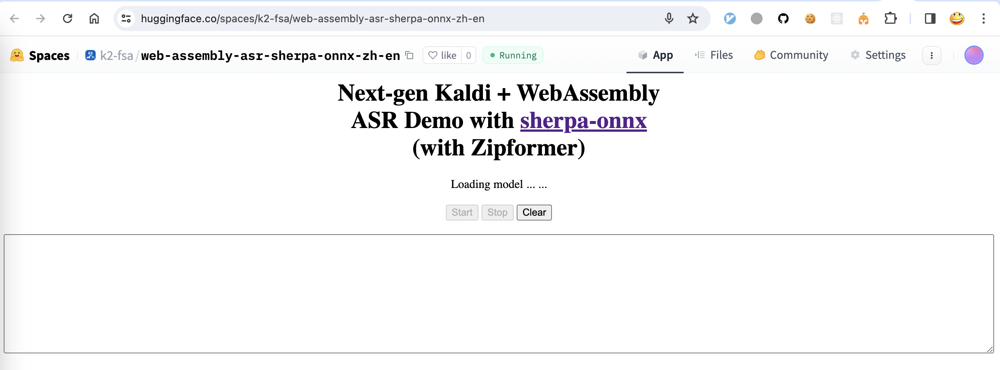

.. _try sherpa ncnn wasm with huggingface:

Huggingface Spaces (WebAssembly)
================================

We provide three `Huggingface`_ spaces so that you can try real-time
speech recognition with `WebAssembly`_ in your browser.

English only (Zipformer)
------------------------

`<https://huggingface.co/spaces/k2-fsa/web-assembly-asr-sherpa-onnx-en>`_

.. hint::

   If you don't have access to `Huggingface`_, please visit the following mirror:

    `<https://modelscope.cn/studios/k2-fsa/web-assembly-asr-sherpa-onnx-en/summary>`_

.. note::

   The script for building this space can be found at
   `<https://github.com/k2-fsa/sherpa-onnx/blob/master/.github/workflows/wasm-simd-hf-space-en-asr-zipformer.yaml>`_

Chinese + English (Zipformer)
-----------------------------

`<https://huggingface.co/spaces/k2-fsa/web-assembly-asr-sherpa-onnx-zh-en>`_

.. hint::

   If you don't have access to `Huggingface`_, please visit the following mirror:

    `<https://modelscope.cn/studios/k2-fsa/web-assembly-asr-sherpa-onnx-zh-en/summary>`_

.. note::

   The script for building this space can be found at
   `<https://github.com/k2-fsa/sherpa-onnx/blob/master/.github/workflows/wasm-simd-hf-space-zh-en-asr-zipformer.yaml>`_

Chinese + English (Paraformer)
------------------------------

`<https://huggingface.co/spaces/k2-fsa/web-assembly-asr-sherpa-onnx-zh-en-paraformer>`_

.. hint::

   If you don't have access to `Huggingface`_, please visit the following mirror:

    `<https://modelscope.cn/studios/k2-fsa/web-assembly-asr-sherpa-onnx-zh-en-paraformer/summary>`_

.. note::

   The script for building this space can be found at
   `<https://github.com/k2-fsa/sherpa-onnx/blob/master/.github/workflows/wasm-simd-hf-space-zh-en-asr-paraformer.yaml>`_
