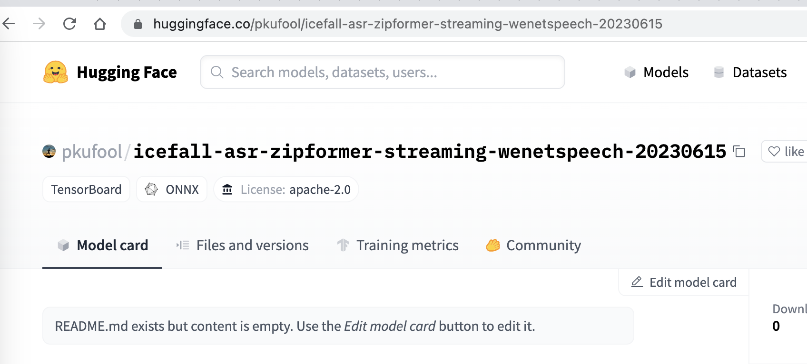
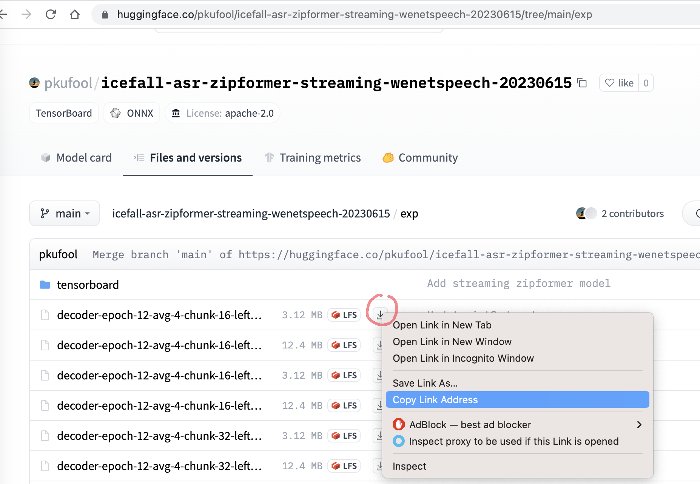

Pre-trained models
==================

Pre-trained models for different projects
-----------------------------------------
.. list-table::

 * - Project
   - Pretrained models
 * - `k2-fsa/sherpa`_
   - :ref:`Click here <k2_fsa_sherpa_pretrained_models>`
 * - `k2-fsa/sherpa-onnx`_
   - :ref:`Click here <sherpa-onnx-pre-trained-models>`
 * - `k2-fsa/sherpa-ncnn`_
   - :ref:`Click here <sherpa-ncnn-pre-trained-models>`

How to download
---------------

We are hosting our pre-trained models on `Huggingface`_ as git repositories
managed by `Git LFS <https://git-lfs.com/>`_.

There are at least two methods for downloading:

  - Using ``git lfs``
  - Using ``wget``

In the following, we use the pre-trained model :ref:`sherpa-onnx-wenetspeech-2023-06-15-streaming`
as an example.

Using git lfs
~~~~~~~~~~~~~

Please first install ``git-lfs`` by following `<https://git-lfs.com/>`_.

.. tabs::

   .. tab:: Linux

      .. code-block:: bash

        # apt/deb
        sudo apt-get install git-lfs

        # yum/rpm
        sudo yum install git-lfs

      Please see `<https://github.com/git-lfs/git-lfs/blob/main/INSTALLING.md>`_
      for details.

   .. tab:: macOS

      .. code-block:: bash

        brew install git-lfs

   .. tab:: Windows

      Please visit `<https://gitforwindows.org/>`_
      to download and install ``git-lfs``.

Then use the following commands to download pre-trained models:

.. tabs::

   .. tab:: Linux/macOS

      .. code-block:: bash

        GIT_LFS_SKIP_SMUDGE=1 git clone https://huggingface.co/pkufool/icefall-asr-zipformer-streaming-wenetspeech-20230615
        cd icefall-asr-zipformer-streaming-wenetspeech-20230615
        git lfs pull --include "exp/*chunk-16-left-128.*onnx"

   .. tab:: Windows (Powershell)

      .. code-block:: bash

        $env:GIT_LFS_SKIP_SMUDGE="1"
        git clone https://huggingface.co/pkufool/icefall-asr-zipformer-streaming-wenetspeech-20230615
        cd icefall-asr-zipformer-streaming-wenetspeech-20230615
        git lfs pull --include "exp/*chunk-16-left-128.*onnx"

   .. tab:: Windows (cmd)

      .. code-block:: bash

        set GIT_LFS_SKIP_SMUDGE="1"
        git clone https://huggingface.co/pkufool/icefall-asr-zipformer-streaming-wenetspeech-20230615
        cd icefall-asr-zipformer-streaming-wenetspeech-20230615
        git lfs pull --include "exp/*chunk-16-left-128.*onnx"

.. note::

   It is very important to set the environment variable ``GIT_LFS_SKIP_SMUDGE`` to ``1``.
   We don't recommend using ``git lfs install`` as it will download many large files that
   we don't need.

Using wget
~~~~~~~~~~

First, let us visit the huggingface `git repository <https://huggingface.co/pkufool/icefall-asr-zipformer-streaming-wenetspeech-20230615>`_ of the pre-trained model:

Click ``Files and versions`` and navigate to the directory containing files
for downloading:

Right click the arrow that indicates downloading and copy the link address.
After that, you can use, for instance, ``wget`` to download the file with the following
command:

.. code-block:: bash

   wget https://huggingface.co/pkufool/icefall-asr-zipformer-streaming-wenetspeech-20230615/resolve/main/exp/decoder-epoch-12-avg-4-chunk-16-left-128.int8.onnx

Repeat the process until you have downloaded all the required files.
