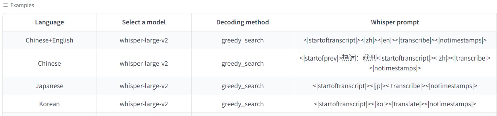

## Triton Inference Serving Best Practice for Whisper TensorRT-LLM

### Build Image
Directly pull the image we prepared for you or build it from scratch. 
```sh
# using the prepared image
docker pull soar97/triton-whisper:24.01.complete

# build from scratch, cd to the parent dir of Dockerfile.server
docker build . -f Dockerfile.server -t soar97/triton-whisper:24.01.complete
```

### Create Docker Container
```sh
your_mount_dir=/mnt:/mnt
docker run -it --name "whisper-server" --gpus all --net host -v $your_mount_dir --shm-size=2g soar97/triton-whisper:24.01.complete
```

### Export Whisper Model to TensorRT-LLM
Inside docker container, we would follow the offcial guide of TensorRT-LLM to build whisper TensorRT-LLM engines. See [here](https://github.com/NVIDIA/TensorRT-LLM/tree/main/examples/whisper).

```sh
# We already have a clone of TensorRT-LLM inside container, so no need to clone it.
cd /workspace/TensorRT-LLM/examples/whisper

# take large-v3 model as an example
wget --directory-prefix=assets https://openaipublic.azureedge.net/main/whisper/models/e5b1a55b89c1367dacf97e3e19bfd829a01529dbfdeefa8caeb59b3f1b81dadb/large-v3.pt

# Build the large-v3 model using a single GPU with plugins.
python3 build.py --output_dir whisper_large_v3 --use_gpt_attention_plugin --use_gemm_plugin  --use_bert_attention_plugin --enable_context_fmha

# prepare the model_repo_whisper_trtllm
cd sherpa/triton/whisper
ln -sv /workspace/TensorRT-LLM/examples/whisper/whisper_large_v3 ./model_repo_whisper_trtllm/whisper/1/
wget --directory-prefix=./model_repo_whisper_trtllm/whisper/1/ https://raw.githubusercontent.com/openai/whisper/main/whisper/assets/multilingual.tiktoken
wget --directory-prefix=./model_repo_whisper_trtllm/whisper/1/ assets/mel_filters.npz https://raw.githubusercontent.com/openai/whisper/main/whisper/assets/mel_filters.npz
```

### Launch Server
Log of directory tree:
```sh
model_repo_whisper_trtllm
└── whisper
    ├── 1
    │   ├── fbank.py
    │   ├── mel_filters.npz
    │   ├── model.py
    │   ├── multilingual.tiktoken
    │   ├── tokenizer.py
    │   ├── whisper_large_v3 -> /workspace/TensorRT-LLM/examples/whisper/whisper_large_v3
    │   └── whisper_trtllm.py
    └── config.pbtxt

3 directories, 7 files
```
```sh
bash launch_server.sh
```

### Launch Gradio WebUI Client
The gradio client supports text as the input, which enables users to prompt the whisper model.

See [Prompting the Hidden Talent of Web-Scale Speech Models for Zero-Shot Task Generalization](https://arxiv.org/abs/2305.11095) for more details.



```sh
git-lfs install
git clone https://huggingface.co/spaces/yuekai/triton-asr-client.git
cd triton-asr-client
pip3 install -r requirement.txt
python3 app.py
```

### Benchmark using Dataset
```sh
git clone https://github.com/yuekaizhang/Triton-ASR-Client.git
cd Triton-ASR-Client
num_task=16
python3 client.py \
    --server-addr localhost \
    --model-name whisper \
    --num-tasks $num_task \
    --whisper-prompt "<|startoftranscript|><|zh|><|transcribe|><|notimestamps|>" \
    --manifest-dir ./datasets/aishell1_test
```

### Benchmark Results
Decoding on a single V100 GPU, audios are padded to 30s, using aishell1 test set files

| Model | Backend   | Concurrency | RTF     |
|-------|-----------|-----------------------|---------|
| Large-v2 | ONNX FP16 (deprecated) | 4                   | 0.14 |
| Large-v3 | TensorRT-LLM FP16 | 4                   | 0.0209 |